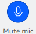

# Muting and unmuting

The following sections explain how to mute and unmute audio during an Amazon Chime meeting. The steps apply to the desktop client and web app.
For information about muting audio with the mobile app, see [Muting and unmuting your audio](mobile-meeting-mute-audio.md "mobile-meeting-mute-audio.md"), later in this
guide.

Expand each section to learn more.

You can mute and unmute your audio at any time during an Amazon Chime meeting.

###### To mute or unmute your audio in the desktop client and web app

- Select the **Mute mic** icon at the bottom of the meeting window.

To unmute yourself, select the icon again.
If you sign in to your Amazon Chime
account before you join the meeting, you can mute and unmute other attendees, including those who the join from mobile devices or in-room conference systems.

###### To mute or unmute other attendees

- On the meeting roster, open the ellipsis menu ( **…** ) next to the attendee's name and choose
  **Mute** or **Unmute**.
  If you join a meeting from an in-room conference system, the mute button on your device overrides any unmute
  requests from Amazon Chime.

###### To mute and unmute

- If your device has a mute button, press it.

—or—

On your device's keypad, press `*7`.
You must be a meeting host, delegate, and moderator to complete these steps. Also, you must first sign in to the Amazon Chime app.

###### To prevent attendees from unmuting

1. In the left control bar, open the **More options** menu
   (

). 2. Choose **Prevent attendees from unmuting**.
