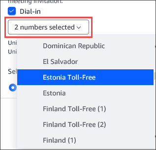

# Scheduling meetings with the Add-In for Outlook

Amazon Chime provides two add-ins for Outlook: the Amazon Chime Add-In for Outlook on Windows
and the Amazon Chime Add-In for Outlook. These add-ins offer the same scheduling features, but
support different types of users.

- Amazon Chime Add-In for Outlook – Recommended for Microsoft Office 365 subscribers, and for Amazon Chime delegates who use macOS.
- Amazon Chime Add-In for Outlook on Windows – If you run Windows and Outlook 2010, you must use this add-in. Also recommended for Amazon Chime
  delegates who use Windows.
  For information about selecting an add-in for you and your organization, see [Choosing the Right Outlook Add-In](https://answers.chime.aws/articles/663/choosing-the-right-outlook-add-in.html "https://answers.chime.aws/articles/663/choosing-the-right-outlook-add-in.html").

For information about installing the add-ins, see
[Amazon Chime Add-in for Outlook Installation Guide for End Users](https://answers.chime.aws/articles/673/amazon-chime-add-in-for-outlook-installation-guide-1.html "https://answers.chime.aws/articles/673/amazon-chime-add-in-for-outlook-installation-guide-1.html").

Both add-ins provide similar methods for scheduling meetings from Outlook, but the add-ins have some differences:

- Amazon Chime Add-In for Outlook
  – Opens in a side panel in Outlook and displays the options in a form.
- Amazon Chime Add-In for Outlook on Windows
  – Opens a new window and prompts you to choose your meeting ID
  type before populating your event.
  The following steps explain how to use both add-ins.

###### To schedule a new meeting using the add-in for Outlook

1. In your Outlook calendar, on the **Home** tab, choose
   **New Meeting**.
2. On the blank meeting that appears, choose **Schedule Chime
   Meeting**.

 3. Select a **Meeting ID type**. For more information about the ID types, see [Choosing a meeting ID](understand-mtg-options.md#choose-type "understand-mtg-options.md#choose-type"). 4. (Optional) Under **Select others who are allowed to join my meeting**, choose one or both options. 5. (Optional) Under **Allow anyone with the meeting ID to join using**, choose one or both options.

If you choose **Dial-in**, you can keep the default phone numbers or open the list and choose different numbers, including international phone numbers.

 6. Choose **Add to invite**. 7. (Optional) Do any of the following:

    * Edit the meeting instructions.
    * If you're a delegate, make sure the email of the Amazon Chime user that you schedule for
     matches the calendar that you select in Outlook. For example, if you schedule a meeting on behalf of Martha Rivera, make sure you select her calendar.
    * If you create a moderated meeting with a passcode, you must send the moderator passcode to the attendees who will act as moderators. Moderator information is
     not included in the Amazon Chime meeting invite. You must send it to the moderators separately. For more information, see [Scheduling moderated meetings](moderate-meeting.md "moderate-meeting.md").

###### To add Amazon Chime to an existing meeting using the add-in for Outlook

1. Open a meeting on your Outlook calendar.
2. In the meeting's window, choose **Schedule Chime
   Meeting**.
3. (Optional) If you are a delegate, make sure the email of the Amazon Chime user
   you are scheduling for matches the calendar you select in Outlook. For example, if you schedule a meeting on behalf of Martha Rivera, make sure you select her calendar.
4. Select the **Meeting ID type**. For more information about the ID types, see [Choosing a meeting ID](understand-mtg-options.md#choose-type "understand-mtg-options.md#choose-type").
5. (Optional) Include international phone numbers by selecting them from the
   dropdown menu under **Invitation additions** in the Outlook
   side panel.
6. The system populates the invite with **meet@chime.aws**, instructions for joining, a link to the meeting, dial-in info, and the meeting ID.
7. Edit the auto-populated instructions as necessary, choose
   **Save**, then **Send the update to
   all**.

###### To schedule a meeting using the add-in for Outlook on Windows

1. In your Outlook calendar, choose **Schedule Amazon Chime
   meeting**, then **Schedule Meeting**.

###### Note

On first use, the add-in prompts you to sign in to Amazon Chime. Enter the credentials that you use to sign in to your other Amazon Chime clients, then choose **Sign in / Sign up**. 2. (Optional) If you're a delegate, a dialog box appears and asks you to
select an account. Select one from the list, then choose **OK**. 3. Set the meeting options, then choose **Schedule**. 4. An Outlook invite appears and displays meeting instructions, plus **meet@chime.aws**. That enables
auto-calling and automatically starts the meeting for registered attendees at the scheduled start
time. 5. Enter the date, time, additional attendees, and recurrence (if any). 6. Send the invite.
