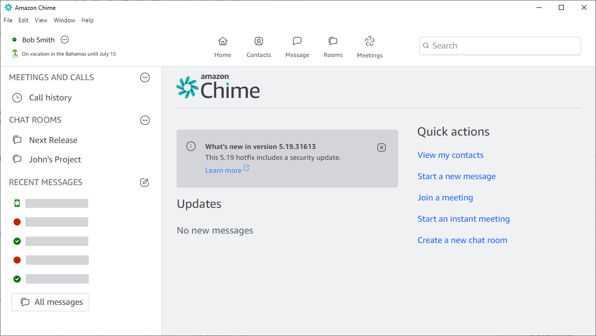
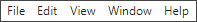
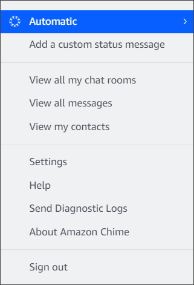
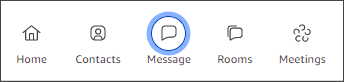
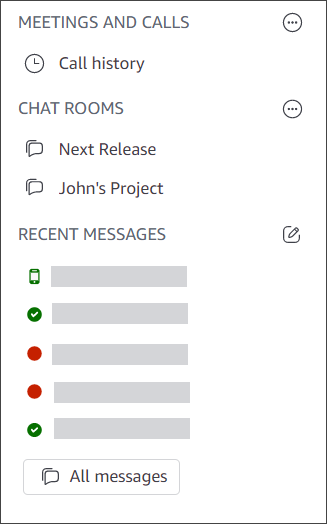
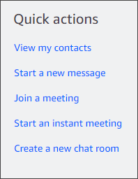

# 4. Get to know the desktop client and web app

The following sections introduce you to the Amazon Chime desktop client and web app. Amazon Chime tries to provide the same features and tools in both clients.
However, they have the following differences:

- Only the desktop client provides headset call controls. The controls allow you to interact with the Amazon Chime application during meetings
  using physical buttons on supported headsets and speakerphones For more about supported headsets, see [Supported headset brands](headset.md "headset.md").
- The desktop client and web app use different keyboard shortcuts. To view the keyboard shortcuts on Windows devices, press Ctrl+/. To view the
  shortcuts on macOS devices, press Command+/.
- The web app does not support undocking video, and you can't message an attendee directly from
  the meeting roster. The app doesn't support a floating control bar, selected
  content being shared is not highlighted, and some settings are not available.
  For example, you can't mirror your video self view or choose to show your self
  view uncropped, you cannot prevent keyboard focus for incoming calls, you cannot
  suppress notifications during screen share, and the app doesn't provide a top
  level menu.
- The desktop client and web app have slightly different user screens. We note any differences in
  the following topics. Expand them to learn more.

###### Note

These topics only introduce the desktop client and web app. For information about the Amazon Chime
mobile app, see [Using the Amazon Chime mobile app](chime-mobile-app.md "chime-mobile-app.md"),
later in this guide.

When you start either of the Amazon Chime clients, you see the Home section of the
Main window. This image shows the window in the desktop client.

Starting from the upper-left corner, the Home window displays the following items:

**Menu bar (desktop client only)**
Use these menu options to change program settings, edit text, change the size of the Amazon Chime
program window, and get help.

**Your name and status**

Both clients display your name, along with an icon that shows your
status, such as **Available** or
**Busy**. You can also add a custom status
message.

In either client, choose your name to open the following
menu:

The following list describes the menu commands:

- **Automatic** – (default setting) Choose the command to
  set your availability status. The text in the menu matches
  your choice.
- **Add a custom status message** – Create a custom status
  message with an optional emoji.
- **View all my chat rooms** – Lists all the chat rooms that
  you belong to.
- **View all messages** – Lists all the messages that you've
  sent and received. Data retention policies may control how
  many messages you see.
- **View my contacts** – Opens your
  **Contacts** list.
- **Settings** – Opens the **Settings**
  window, where you change global program settings.
- **Help Center** – Takes you to the Amazon Chime Help
  Center.
- **Send diagnostic logs** – If something goes wrong
  with Amazon Chime you can send diagnostic logs that help troubleshoot the problem. A reference ID is created and you can send that to your
  administrator when you are troubleshooting a problem.
- **About Amazon Chime** – Displays the client's version and build number. Support technicians
  often ask for that information.
- **Sign out** – Signs you out of Amazon Chime

**The navigation bar (desktop client only)**
The navigation bar in the desktop client provides icons for returning to Home,
opening your contacts list, creating a 1:1 or group message, opening
your list of chat rooms, joining a meeting, starting an instant meeting, scheduling a meeting, and seeing
your meeting bridge information.

**The sidebar**
Both clients display the left navigation on the Main window. The sidebar lists your call
history, chat rooms, favorites, and the people you've messaged
recently.

**Quick actions links**
These links provide the same functionality as the navigation bar in the desktop client. The
desktop client displays these links in the Main window. The web app
displays these links all the time.

You use the chat window to chat with other Amazon Chime users. In the desktop client,
the window appears when you do any of the following:

- Select **Messages** on the navigation bar.
- Select **Message a contact** next to the **Recent Messages** header.
- Select a 1:1 message or group conversation under **Favorites** or **Recent Messages**
  in the sidebar.
  In the web app, the window appears when you do any of the following:

- Select a 1:1 message or group chat under **Favorites** or **Recent Messages** in the sidebar.
- Select the plus sign (**+**) next to the **Recent Messages** header.
- select **Start a new message** under **Quick actions**.
  For more information about using chat, see [Collaborating using Amazon Chime chat](chime-using-chat.md "chime-using-chat.md"),
  later in this guide.

The meetings window appears when you join a meeting, answer a call, or start
an instant meeting. When you and other attendees turn on webcams, those feeds appear in a set of _video tiles_. Meetings
can display up to 25 tiles, and they appear on a first come, first served basis.

Amazon Chime also makes some content, such as screen shares, more prominent during meetings. We
refer to that content as _featured content_. As needed, you can promote two video tiles
to featured status, and demote any tile from featured status. What's more, you can hide attendee video tiles that you don't want to see, and display
attendee video tiles above or below the featured content. For more information about using video, tiles, and
sharing your screen during meetings, see [Using video during meetings](use-video.md "use-video.md").

These topics explain how to use the meetings window, and how to
participate in meetings and calls.

- [Joining scheduled meetings](join-scheduled-meetings.md "join-scheduled-meetings.md")
- [Participating in meetings](participate-meetings.md "participate-meetings.md")
- [Starting instant meetings and calls](start-call.md "start-call.md")
