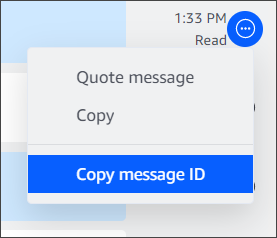

# Deleting sent messages

By design, Amazon Chime prevents you from deleting chat messages after you send them. This applies to messages sent in conversations, groups, and chat rooms.
Amazon Chime does this in order to comply with data retention policies.

If you need to delete a chat message, you must copy the ID of the message, and the ID of the conversation or chat room, and send those values to your
Amazon Chime system administrator.

The following steps explain how to find and copy the IDs needed to have a message deleted.

###### To copy message IDs

1. In a conversation, group, or chat room, open the ellipsis menu next to the message that you want to delete.
2. Choose **Copy message ID**.

Amazon Chime copies the ID of the message and the ID of the conversation or the chat room, depending on the message's location.
The administrator needs both values. 3. Send the IDs to your Amazon Chime administrator and request to have the message deleted.
