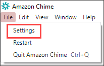

# Desktop client settings

Expand the following sections as needed to enable or disable settings for the Amazon Chime desktop client.

Follow these steps to open the Amazon Chime **Settings** pane.

###### To open the Settings pane

- In the desktop app, choose **File**, then **Settings**.

—OR—

Choose your name, and on the menu that appears, choose **Settings**.
The **General** tab provides these settings:

**Sync with OS setting**
Syncs Amazon Chime's visual mode with your operating system's visual mode. For example, when you switch your operating system to dark mode, Amazon Chime
also switches to dark mode.

**Light mode**
Keeps Amazon Chime in light mode regardless of your operating system's mode.

**Dark mode**
Keeps Amazon Chime in dark mode regardless of your operating system's mode.

**Start Amazon Chime when computer starts up**
When selected, starts Amazon Chime automatically when you start your computer.

**Animate application icon continuously when messages are received**
When selected, the Amazon Chime icon on the Windows taskbar or Macintosh carousel flashes.

**Play sound for notifications**
When selected, Amazon Chime plays a sound when it receives a notification.

The **Audio and video** tab provides the following settings.

**Video settings**

**Blur background**
Starts or stops background blur during meetings. Also sets a default blur strength. During meetings, you can
turn background blur on and off and change the blur strength.

**Mirror my self view**
Starts or stops mirroring. When on, you see a mirror image of yourself. For example, with mirroring on, your left hand appears on the
left side of your screen.

**Show me my self view uncropped**
When selected, keeps your video tile in the 16:9 format.

**Hide the undocked video when sharing my screen**
When selected, hides any undocked video tiles while you share your screen.

**Audio settings**

**Join muted**
When selected, automatically mutes your microphone whenever you join a meeting.

**Voice Focus (noise suppression)**
When selected, starts or stops Voice Focus, which helps reduce background noise during meetings.

**Auto-adjust audio levels**
When selected, prevents the audio from becoming too loud or soft. When off, you need to adjust
levels manually.

**Auto-detect microphone problems**
Automatically detects microphone problems and displays a message with
information about troubleshooting steps.

**Mute detection**
When selected, displays an alert when you speak into a muted microphone.

**Push to talk**
When selected, allows you to mute and unmute your microphone by pushing the space bar on your keyboard.

**Auto-correct system audio settings.**
When selected, automatically adjusts your system audio to its previous settings.

**Headset call control device interactions**

**Mute and unmute microphone**
When selected, allows you to use your headset controls to mute and unmute your microphone.

**Answer and leave meetings and calls.**
When selected, allows you to use your headset controls to answer calls and join meetings.

**Device preview**

**Skip device preview dialog when joining meetings and calls**
When selected, hides the Device preview dialog box and joins you directly to a meeting or call. Use this setting when you have stable audio and video inputs. For example, when you always join meetings
in a conference room or on your laptop.

The **Meetings** tab provides these settings:

## Auto-call settings

**Auto-call**

**Play ringtone for incoming calls and meetings**
When selected, Amazon Chime plays a ring tone when calls and meetings start.

**Call this device for scheduled meetings**
Amazon Chime calls the device on which you choose this setting. For example, if you use a tablet to choose this setting, Amazon Chime always calls that tablet.

**Take keyboard focus for incoming call and meeting dialogs**
When selected, enables you to use keyboard shortcuts when joining a meeting.

**Large meetings**

**Mute new attendees, turn off join and leave tones, and suppress roster notifications**
When selected, during large meetings, Amazon Chime automatically mutes all attendees, turns off the join and leave tones, and turns off roster notifications. For more information, see
[Using the large meeting settings](large-meeting-settings.md "large-meeting-settings.md").

**Notifications**

**Suppress all Amazon Chime notifications while screen sharing**
When selected, turns off notifications from Amazon Chime while you share your screen.

**Feedback**

**Prompt for feedback**
When selected, a message appears at the end of each meeting and asks for your feedback.

**Layout**

**Hide my own screenshare view when I am sharing.**
When selected, this setting prevents you and others from seeing an infinite number of Amazon Chime meeting windows if you select the meeting window while
you share.

**Show floating meeting control bar when in background**
When selected, the meeting control bar remains visible when you switch to another program window.

**Video row location**

**Above featured content**
When selected, places any video tiles above the screen share window.

**Below featured content**
When selected, places any video tiles below the screen share window.

For more information, see [Using video during meetings](use-video.md "use-video.md").

The **Chat** tab provides these settings:

**Automatic markdown**

**Use markdown for all messages**
When selected, you don't need to enter `/md` to add markdown syntax to
your text messages. For more information, see [Collaborating using Amazon Chime chat](chime-using-chat.md "chime-using-chat.md") and [Participating in meetings](participate-meetings.md "participate-meetings.md").

**Emoji**

**Convert emoji shortcut to emoji**
When selected, automatically converts emoji shortcuts, such as `:-)` to emojis. For more information, see [Collaborating using Amazon Chime chat](chime-using-chat.md "chime-using-chat.md") and
[Adding emojis to in-meeting chat messages](add-meeting-emojis.md "add-meeting-emojis.md").

The **Accessibility** tab provides these settings:

**Machine generated captions**

**Use machine generated captions for all my meetings**
When on, Amazon Chime automatically generates closed captions during meetings.

**Language for my meetings**
Open the list to choose the language for closed captions.

**Caption type size**
Open the list to change the size of the closed-caption text.

**Caption type color**
Open the list to change the color of the closed-caption font.

**Chat type size**

Controls the size of the text in the meeting chat window. You have the following choices:

- **Smallest**
- **Small**
- **Standard**
- **Large** (default)
- **Larger**
- **Largest**
  **Optimize text entry for screen reader**

**Alternate text entry**
When selected, optimizes screen reader performance.

The **Delegates** tab provides these settings:

**Add delegates**
Choose the button to add one or more contacts to your list of meeting delegates. For more information, refer to [Creating delegates](delegates.md "delegates.md") in this guide.
