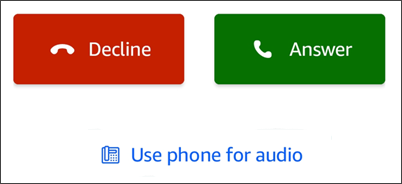
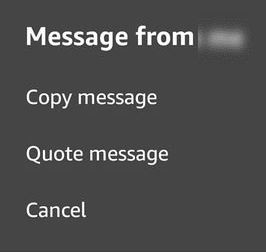

# Quick start guide

The following tutorial explains how to navigate in the Amazon Chime mobile app.

**The navigation bar**

Use the navigation bar at the bottom of the Amazon Chime mobile app window to move around the
app.

You can join meetings, view your call history, send instant messages, and manage your
chat rooms and contacts.

Choosing an item on the navigation bar opens its corresponding _view_.
Each view contains _pages_. For example, when you choose the
**Calls** view, the **Call history** page appears. The app
displays the **Meetings** view by default.

###### Note

On certain pages in the app, the navigation bar won't be visible. For example, the
navigation bar disappears when you message someone. To see the navigation bar, choose the
Back button on your device.

**The Answer control**
When a meeting or person calls you on Amazon Chime, the **Answer** control appears.

The control appears in any view within the app. On iOS devices, the control can also
appear on the lock screen. To use the Answer control from the lock screen on iOS devices, see
[Meeting and call settings](app-options.md#mobile-meetings-settings "app-options.md#mobile-meetings-settings")

**Actions menus**
You can take multiple actions on your contacts, messages, and chat rooms. To see the actions
you can take on a given item, tap the item to open its actions menu. For example, a
**Message from** action menu appears when you tap any chat message:

The commands on the menu vary depending on the item that you tap. When you tap to open
the **Message from** action menu, you can copy or quote a message, or cancel
to close the menu.

**Ellipsis menus**

When you join a meeting, a vertical ellipsis icon appears in the upper-right corner of
the app window.

When you chat with someone or enter a chat room, a horizontal ellipsis icon appears in
the upper-right corner.

Choosing either type of ellipsis opens a menu of options for meetings and chats. To
learn more about these options, see [Additional meeting actions](mobile-mtg-options.md "mobile-mtg-options.md").
