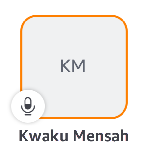
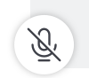

# Using the meeting roster

By default, the meeting roster appears when you first join a meeting. The roster displays
tiles with the name and initials of each meeting attendee. A colored border indicates the
active speaker.

A crown icon,

, represents the meeting organizer or host.

The microphone indicates whether an attendee is muted.

To see other pages, such as a shared screen or other attendee's video tiles, just swipe left
or right.
