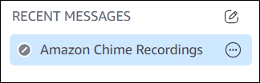

# Recording meetings

A meeting host, moderator, or delegate can record meetings. When you record a meeting,
Amazon Chime records the audio and, if you share media during the meeting, the content of any media
tiles. The host, moderator, or delegate who turns on recording receives the recording in a
chat message once the meeting ends.

###### Note

- Amazon Chime only records video when someone shares their screen. Any parts of a meeting without a
  screen share are blank during playback. Meeting recordings don't include attendee video
  tiles.
- Recording files appear in the regular Amazon Chime chat window, not the meeting window. The recording
  files appear in the navigation pane under **Recent Messages**. This
  image shows a typical recording message.

###### To start or stop meeting recording

1.  To start recording, do one of the following:
    - In the left control bar, choose the **Record meeting** icon
      (

    

    ).
    - In the left control bar, choose the **More options** menu
      (

    

    ), then choose **Record meeting**.
    - If you joined the meeting from a phone or in-room conference system, press
      .

2.  To stop recording, do one of the following:

        * In the left control bar, choose the **Record meeting** icon,
         located at the bottom of the bar.
        * Open the **More options** menu (

         

         ) and choose **Record meeting**.
        * From a phone or in-room video system, press \*2.

    When meeting attendees join a meeting that you record, Amazon Chime notifies them that you've
    started recording. When you stop recording, the attendees receive an update that you've
    stopped recording. Recording automatically stops when the meeting ends.

The meeting host, moderator, or delegate that started the recording receives the recording
in a regular Amazon Chime chat message, not the meeting window. However, if a moderator or delegate starts the meeting from their
phone or a conference system, only the host receives the recording. The host also receives the
recording if the moderator or delegate who started recording isn't signed in to Amazon Chime.

Amazon Chime sends M4A files for recordings that only include audio. If a presenter uses screen
share during a recorded meeting, Amazon Chime sends an MP4 file. Any portions of the meeting that
don't include screen sharing are blank during video playback.

###### Note

Recorded meeting files can be large. To share them with attendees, we recommend that you
upload them to a file-sharing service. Once uploaded, you can share the file
link with attendees.
