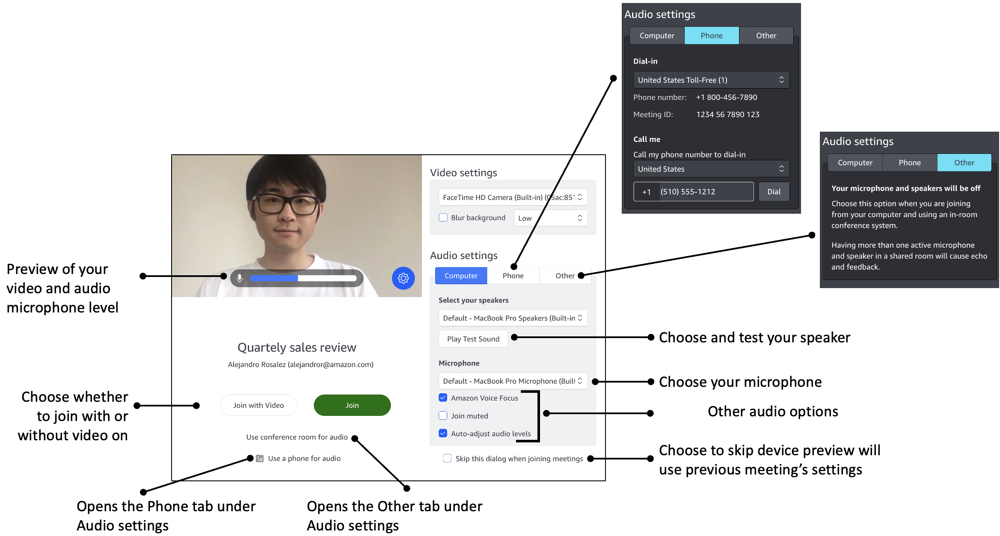

# Setting video and audio sources

In the desktop client and web app, you can set your video and audio sources before
you join an Amazon Chime meeting. If you know that your current video and audio sources work, you can
[join the meeting](join-meetings.md "join-meetings.md").

When you accept a call from a meeting, or you choose a link to a meeting, the
**Device preview** dialog box appears. You can use the dialog box
to change your audio and video sources before you join.

This image shows the **Device preview** dialog box.

###### Note

If the Device preview dialog box doesn't appear, you can change your audio and
video sources while in the meeting. For more information, see [Using audio during meetings](using-audio.md "using-audio.md") and [Using video during meetings](use-video.md "use-video.md").

If you see the Device preview dialog box, but you don't see your video or
audio sources, choose the Settings icon.

If you chose to hide the Device preview dialog box, and you want to show again, change the global setting. For more information, see
[Amazon Chime global program settings](chm-settings.md "chm-settings.md").

The following topics explain how to use the options shown in the image above.

###### Topics

- [Setting video sources](#set-video "#set-video")
- [Setting audio sources](#set-audio "#set-audio")
- [Setting phone numbers](#set-phone-numbers "#set-phone-numbers")

## Setting video sources

If you have more than one video device available, such as an external and
built-in camera, you can choose between them. You can also enable or disable
background blurring and set the blur strength.

###### To set video sources

1. Answer the call from a meeting, or select the link the link in the meeting invitation.

The **Device preview** dialog box appears. 2. Under **Video settings**, from the dropdown list of
available cameras, select the one that you want to use. 3. (Optional) Select or clear the **Blur background**
check box. 4. (Optional) If you turn on **Blur background**, open
the dropdown list and choose the blur strength.

## Setting audio sources

If you have more than one set of speakers or microphones available, you can
choose between them. You can also enable or disable Voice Focus noise reduction,
choose to join a meeting with your audio muted, and enable or disable automatic
sound leveling.

###### To change audio settings

1. Answer the call from a meeting, or select the link the link in the meeting invitation.

The **Device preview** dialog box appears. 2. Under **Audio settings**, choose the
**Computer** tab. 3. Under **Select your speakers**, choose a device from
the dropdown menu. 4. Under **Microphone**, choose a device from the
dropdown menu 5. (Optional) To turn on Amazon Voice Focus, select the **Amazon
Voice Focus** checkbox. To turn this feature off, clear the
checkbox. 6. (Optional) To mute your microphone when you first join the call,
select the **Join muted** checkbox. To join the call
with your microphone turned on, clear the checkbox.

###### Note

Meeting organizers can mute all attendees until after they join.
When this feature is turned on, the **Join muted**
checkbox is turned on and becomes unavailable to change. 7. (Optional) To turn on automatic adjustment of audio levels during a
call, select the Auto-adjust audio levels checkbox. To turn this feature
off, clear the checkbox.

###### Note

If you turn off automatic adjustment of audio levels, you will
need to adjust your microphone and speaker volume manually.

## Setting phone numbers

In addition to setting video and audio sources, you can configure phone numbers
for dialing in to a meeting from a phone.

###### Note

If you don't need to configure additional dial-in phone numbers, you can skip
this section and [join the meeting](join-meetings.md "join-meetings.md").

###### To change your dial-in settings

1. Answer the call from a meeting, or select the link the link in the meeting invitation.

The **Device preview** dialog box appears. 2. Under **Audio settings**, choose the
**Phone** tab. 3. Under **Dial-in**, select a phone number from the
dropdown list. Amazon Chime provides a range of default phone numbers, but you may see additional numbers specific to your
organization. 4. Choose **Dial**.
