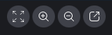

# Using the screen share control bar

When a meeting host or attendee shares their screen, the screen share control bar appears:

Moving from left to right:

- **Hide all video** – Hides all attendee video tiles, including yours.
- **Zoom in** – Zooms in on the shared screen.
- **Zoom out** – Zooms out of the shared screen.
- **Undock screen to share in a new window** – Moves the shared screen to a separate window. Other attendees continue to see
  the undocked window. To re-dock, close the undocked window. The shared screen appears in its original location.
