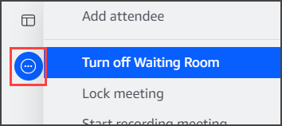

# Turning the Waiting Room off or on

The steps in this section explain how to turn the Waiting Room off and on during a meeting. You can also turn the waiting room off for external attendees. For more information about doing that,
see [Setting meeting options](understand-mtg-options.md "understand-mtg-options.md"), in this guide.

###### Important

- You must be a meeting host, delegate, or moderator to turn the Waiting Room off or on.
- When you turn the Waiting Room off, all current and future anonymous attendees can join the meeting directly.
- If you subsequently turn the waiting room on, new anonymous or restricted users must wait to be admitted
  Hosts, moderators, and delegates can also lock meetings to prevent unauthorized attendees from joining. When you lock a meeting, only current and invited attendees can join.
  For more information, see [Locking a meeting](lock-actions.md "lock-actions.md"), in this guide.

###### Note

You must have at least one person in the waiting room in order to turn it off.

###### To turn off the Waiting Room

1. On the left control bar, open the More menu (**...**).
2. Choose **Turn off Waiting Room**.

To turn the Waiting Room on, repeat the steps listed above.
