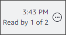

# Understanding the chat window

If you're new to Amazon Chime this section introduces you to Amazon Chime's chat features. Expand each section to learn more.

In the chat window, the following statuses indicate whether a user is available to chat.

- Automatic
- Available
- Busy
- Do not disturb
- Private
  If you create a custom status message, you can also use these statuses.

- Be right back
- Commuting
- On call
- Out sick
- Vacationing
  For more information about setting your status and using custom statuses, see [Using status messages](status-message.md "status-message.md").

The home and chat windows display the sidebar on the left. The sidebar organizes
your calls, chat rooms, and contacts into the following sections.

**Meetings and calls**

This section displays any ongoing meetings and calls until they end.
Open the ellipsis menu (**...**) on the
right to join a meeting, start an instant meeting, schedule a
meeting, and view your meeting bridge information.

Choose **Call history** to view a list of your incoming, missed, and outgoing past calls.

**Chat rooms**
Lists your chat rooms. Select a chat room to open it and send messages. Use the ellipsis menu (**...**) on the right to hide a room from the side bar,
leave the chat room, and change your notification settings.

**Recent messages**

Lists the contacts that you've chatted with during the past seven calendar days. The section can list 25 contacts. Choose a contact to send a message and see any past messages.

**All messages**

Displays past messages from all the contacts that you've chatted with during the data-retention period set by your company.

The messages you exchange with a contact or a group appear to the right of the sidebar. The name of the contact appears above the messages.
For a group chat, the names of everyone in the group appears above the messages. When you use a chat room, the room name appears above the
messages. This image shows a group chat:

A set of icons appears to the right of the names. Use them to call the contact or
group, change your notification settings, and open the actions menu,
respectively.

Another set of controls appears to the right of each message. They show you when the message was sent, plus another actions menu. You use the menu to quote a message, copy a message, or
copy a message's ID. For group chats, you also see the number of group members who've read the message. That number changes as more group members open the chat thread.

