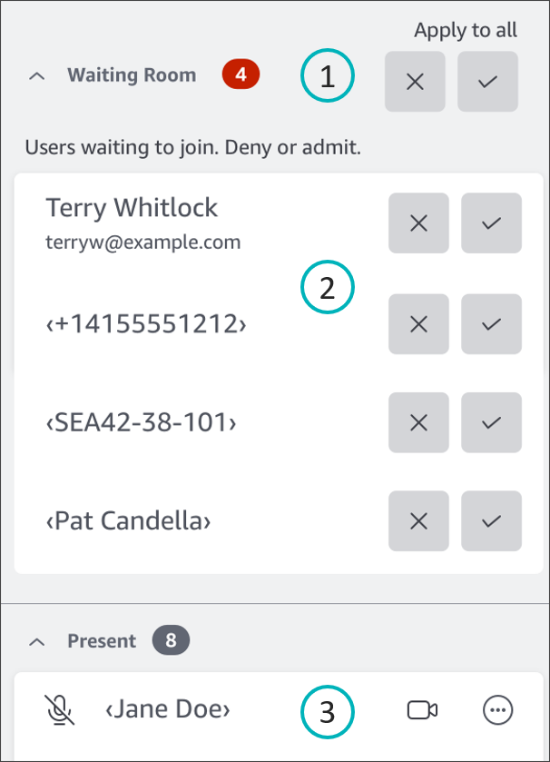

# Visual quick start guide

When anonymous users try to join a meeting, the **Waiting Room** section
appears in the **Attendees** panel. The following image shows the section.
Numbers in the image correspond to the numbered text below.

In the image:

1. The red oval displays the number of users in the Waiting Room. Under **Apply to all**, choose the **X** to deny all users, or select the checkmark to admit
   all users.
2. To deny or admit individual users, select the **X** or checkmark next to that user's name, phone number, or conference room ID.
3. Users that you admit to the meeting appear in the **Present** section. The brackets (**< >**) indicate anonymous users.
