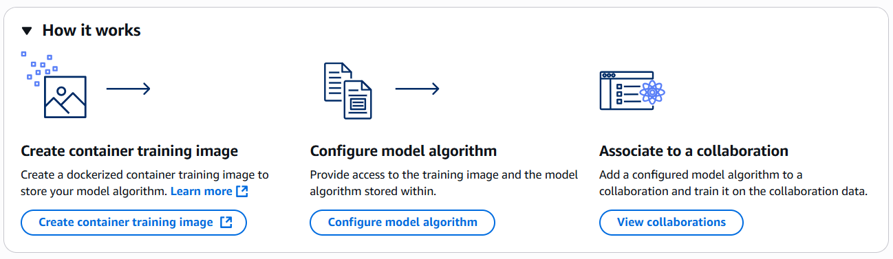

# Associating the configured model algorithm

in AWS Clean Rooms ML

After you have configured the model algorithm, you are ready to associate the model
algorithm to a collaboration. Associating a model algorithm makes the model algorithm
available to all members of the collaboration.

The following image shows associating the configured model algorithm as the last step,
after creating the container training image and configuring a model algorithm.



Console

###### Note

After the model algorithm is associated, it can't be edited. To make
changes, you can delete the associated model algorithm and associate a
new one.

###### To associate a custom ML model algorithm (console)

1. Sign in to the AWS Management Console and open the AWS Clean Rooms console at [https://console.aws.amazon.com/cleanrooms](https://console.aws.amazon.com/cleanrooms/home "https://console.aws.amazon.com/cleanrooms/home").
2. In the left navigation pane, choose **Custom ML
   models**.
3. On the **Custom ML models** page, choose the
   configured model algorithm that you want to associate to a
   collaboration and then choose **Associate to
   collaboration**.
4. In the **Associate configured model algorithm**
   window, choose the **Collaboration** that you want
   to associate to.
5. Choose **Choose collaboration**.
6. On the **Associate model algorithm** page, for
   **Model algorithm association details**, enter
   a **Name** and optional
   **Description**.
7. For **Model algorithm**, choose a
   **Configured model algorithm**.
8. For **Trained model export privacy
   configurations**,
   1. To export model files, select the **Model
      files** checkbox.
   2. To export output files, select the **Output
      files** checkbox.
   3. Enter a **Max size value** for the
      exported data. The value must be between 0.01 and 10.

9. (Optional) If you want to send either full error logs or shorter
   error summaries to members, under **Trained model inference
   job privacy configuration**,
   1. Under **Full logs**, select one or more
      **Account IDs** from the dropdown
      list.
   2. (Optional) If you want to send logs that match a filter
      pattern, enter a **Filter pattern**.
   3. (Optional) If you want to add another account and optional
      filter pattern, choose **Add log
      policy**.
   4. Under **Error summaries**, select one or
      more **Account IDs** from the dropdown
      list.
   5. (Optional) Select one or more **Entities to
      redact** to specify which entities will be
      redacted from the error log or error summaries.
      - **PII** – redact
        Personally Identifiable Information
      - **Numbers** – redact
        numbers
      - **Custom** – redact based
        on the custom redaction pattern
      1. If you chose **Custom** in the
         previous step, enter a **Custom redaction
         pattern**. This logs information that
         matches this pattern.
      2. (Optional) If you want to add another custom
         redaction pattern, choose **Add another
         custom pattern**.

10. (Optional) If you want to configure trained model metrics, under
    **Trained model metrics configuration**, select
    a **Noise level** from the dropdown list.

You can choose **None**,
**Low**, **Medium** and
**High**. 11. (Optional) If you want to set the maximum artifacts size, under
**Artifacts configuration**, enter the
**Max artifacts size value**. The value must be
between 0.01 and 10. 12. (Optional) If you want to enable **Tags**, choose
**Add new tag** and then enter the
**Key** and **Value**
pair. 13. Choose **Associate**.

API
**To associate a custom ML model algorithm
(API)**

Run the following code with your specific parameters.

You also provide a privacy policy that defines who has access to the
different logs, allows customers to define regex, and how much data can be
exported from the training model outputs or inference results.

###### Note

Configured model algorithm associations are immutable.

```
`import boto3
acr_ml_client= boto3.client('cleanroomsml')

acr_ml_client.create_configured_model_algorithm_association(
 name='`configured_model_algorithm_association_name`',
 description='`purpose of the association`',
 configuredModelAlgorithmArn='arn:aws:cleanrooms-ml:`region`:`account`:`membership`/membershipIdentifier/`configured-model-algorithm`/`identifier`',
 privacyConfiguration={
 "policies": {
 "trainedModelExports": {
 "filesToExport": ['`files to export`'],
 "containerLogs": [
 {
 "allowedAccountIds": ['`member_account_id`'],
 "filterPattern": ['`filter pattern`'],
 "logRedactionConfiguration": {
 "entitiesToRedact": [
 '`ALL_PERSONALLY_IDENTIFIABLE_INFORMATION`',
 '`NUMBERS`',
 '`CUSTOM`'
 ],
 "customEntityConfig": {
 "customDataIdentifiers": [
 '`custom_regex_1`',
 '`custom_regex_2`'
 ]
 }
 }
 }
 ],
 "containerMetrics": {
 "noiseLevel": '`noise value`'
 },
 "maxArtifactSize": {
 "unit": '`unit`',
 "value": '`number`'
 }
 },
 "trainedModelInferenceJobs": {
 "containerLogs": [
 {
 "allowedAccountIds": ['`member_account_id`'],
 "filterPattern": ['`filter pattern`'],
 "logRedactionConfiguration": {
 "entitiesToRedact": [
 '`ALL_PERSONALLY_IDENTIFIABLE_INFORMATION`',
 '`NUMBERS`',
 '`CUSTOM`'
 ],
 "customEntityConfig": {
 "customDataIdentifiers": [
 '`custom_regex_1`',
 '`custom_regex_2`'
 ]
 }
 }
 }
 ],
 "maxOutputSize": {
 "unit": '`unit`',
 "value": '`number`'
 }
 }
 }
 },
 tags={
 '`tag`': '`tag`'
 }
)`
```

After the configured model algorithm is associated to the collaboration,
training data providers must add a collaboration analysis rule to their
table. This rule allows the configured model algorithm association to access
their configured table. All contributing training data providers must run
the following code:

```
`import boto3
acr_client= boto3.client('cleanrooms')

acr_client.create_configured_table_association_analysis_rule(
 membershipIdentifier= '`membership_id`',
 configuredTableAssociationIdentifier= '`configured_table_association_id`',
 analysisRuleType= 'CUSTOM',
 analysisRulePolicy = {
 'v1': {
 'custom': {
 'allowedAdditionalAnalyses': ['arn:aws:cleanrooms-ml:`region`:*:`membership`/*/configured-model-algorithm-association/*''],
 'allowedResultReceivers': []
 }
 }
 }
)`
```

###### Note

Because configured model algorithm associations are immutable, we
recommend that training data providers who wants to allowlist models for
use to use wild cards in `allowedAdditionalAnalyses` during
the first few iterations of custom model configuration. This allows
model providers to iterate on their code without requiring other
training providers to re-associate before training their updated model
code with data.
