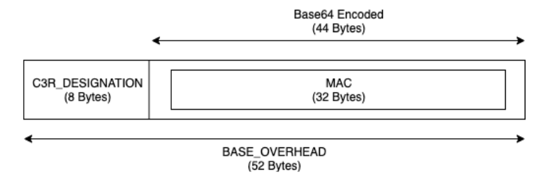
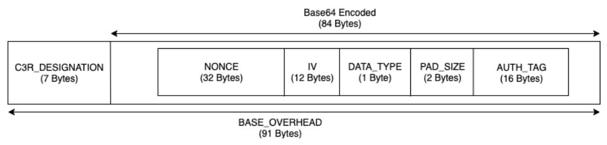

# Guidelines for the C3R encryption client

The C3R encryption client is a tool that enables organizations to bring sensitive data together to
derive new insights from data analytics. The tool cryptographically limits what can be learned
by any party and AWS in the process. Although this is vitally important, the process of
securing data cryptographically can add significant overhead both in terms of compute and
storage resources. Therefore, it is important to understand the tradeoffs of using each setting
and how to optimize settings while still maintaining the desired cryptographic assurances. This
topic focuses on the performance implications of different settings in the C3R encryption client and
schemas.

All C3R encryption client encryption settings provide different cryptographic assurances. The
collaboration-level settings are most secure by default. Enabling additional functionality while
creating a collaboration weakens privacy guarantees, allowing activities like frequency analysis
to be conducted on the ciphertext. For more information about how these settings are used and
what their implications are, see [Cryptographic Computing for Clean Rooms](crypto-computing.md "crypto-computing.md").

###### Topics

- [Performance implications for column types](#performance-implications "#performance-implications")
- [Troubleshooting unanticipated increases in
  ciphertext size](#troubleshooting-ciphertext-size "#troubleshooting-ciphertext-size")

## Performance implications for column types

C3R uses three column types: cleartext,
fingerprint, and sealed. Each of these column types provide
different cryptographic assurances and have different intended uses. In the following
sections, the performance implications of the column type are discussed and the performance
impact of each setting.

###### Topics

- [Cleartext columns](#cleartext-columns "#cleartext-columns")
- [Fingerprint columns](#guidelines-fingerprint-columns "#guidelines-fingerprint-columns")
- [Sealed columns](#guidelines-sealed-columns "#guidelines-sealed-columns")

### Cleartext columns

Cleartext columns are not changed from their original format and not
cryptographically processed in any way. This column type can't be configured and does not
impact storage or compute performance.

### Fingerprint columns

Fingerprint columns are meant to be used for joining data across multiple
tables. To this end, the resulting ciphertext size must always be the same. However, these
columns are impacted by the collaboration-level settings. Fingerprint columns
might have varying degrees of impact on the output file size depending on the
cleartext contained in the input.

###### Topics

- [Base overhead for
  fingerprint columns](#fingerprint-columns-base-overhead "#fingerprint-columns-base-overhead")
- [Collaboration settings for
  fingerprint columns](#fingerprint-columns-collab-settings "#fingerprint-columns-collab-settings")
- [Example data for a fingerprint
  column](#collab-set-sample-data "#collab-set-sample-data")
- [Troubleshooting
  fingerprint columns](#fingerprint-columns-troubleshooting "#fingerprint-columns-troubleshooting")

#### Base overhead for

fingerprint columns

There is a base overhead for fingerprint columns. This overhead is
constant and in place of the size of the cleartext bytes.

Data in the fingerprint columns is cryptographically processed through
a Hash-based Message Authentication Code (HMAC) function, which turns the data into a 32
byte message authentication code (MAC). This data is then processed through a base64
encoder, adding roughly 33 percent to the byte size. It is pre-pended with an 8 byte
C3R designation to designate the type of column that the data belongs to and
the client version that produced it. The final result is 52 bytes. This result is then
multiplied by the row count to get the total base overhead (use the number of total
non-`null` values if `preserveNulls` is set to true).

The following image shows how _`BASE_OVERHEAD =`**`C3R_DESIGNATION +`**`(MAC _ 1.33)`\*

The output ciphertext in the fingerprint columns will always be 52
bytes. This can be a significant storage decrease if the input cleartext
data averages more than 52 bytes (for example, full street addresses). This can be a
significant storage increase if the input cleartext data averages less than
52 bytes (for example, customer ages).

#### Collaboration settings for

fingerprint columns

##### `preserveNulls` setting

When the collaboration-level setting `preserveNulls` is
`false` (default), each `null` value is substituted with a unique, random 32
bytes and processed as if it were not `null`. The result is that each `null` value is now 52
bytes. This can add significant storage requirements for tables that contain very sparse
data compared to when this setting is `true` and `null` values are passed
through as
`null`.

If you don't need the privacy assurances of this setting and prefer to retain
`null` values within your datasets, enable the `preserveNulls`
setting at the time the collaboration is created. The `preserveNulls` setting
can't be changed after the collaboration is created.

#### Example data for a fingerprint

column

The following is an example set of input and output data for a
fingerprint column
with
settings to reproduce. Other collaboration-level settings like
`allowCleartext` and `allowDuplicates` don't impact the results
and can be set as `true` or `false` if trying to reproduce
locally.

**Example shared secret**:
`wJalrXUtnFEMI/K7MDENG/bPxRfiCYEXAMPLEKEY`

**Example collaboration ID**:
`a1b2c3d4-5678-90ab-cdef-EXAMPLE11111`

**allowJoinsOnColumnsWithDifferentNames**:
`True` This setting doesn't impact performance or storage requirements.
However, this setting makes column name choice irrelevant when reproducing the values
shown in the following tables.

Example 1| Input | `null` |
| `preserveNulls` | `TRUE` |
| Output | `null` |
| Deterministic | `Yes` |
| Input bytes | 0 |
| Output bytes | 0 |

Example 2| Input | `null` |
| `preserveNulls` | `FALSE` |
| Output | `01:hmac:3lkFjthvV3IUu6mMvFc1a+XAHwgw/ElmOq4p3Yg25kk=` |
| Deterministic | `No` |
| Input bytes | 0 |
| Output bytes | 52 |

Example 3| Input | `empty string` |
| `preserveNulls` | - |
| Output | `01:hmac:oKTgi3Gba+eUb3JteSz2EMgXUkF1WgM77UP0Ydw5kPQ=` |
| Deterministic | `Yes` |
| Input bytes | 0 |
| Output bytes | 52 |

Example 4| Input | `abcdefghijklmnopqrstuvwxyz` |
| `preserveNulls` | - |
| Output | `01:hmac:kU/IqwG7FMmzzshr0B9scomE0UJUEE7j9keTctplGww=` |
| Deterministic | `Yes` |
| Input bytes | 26 |
| Output bytes | 52 |

Example 5| Input | `abcdefghijklmnopqrstuvwxyzABCDEFGHIJKLMNOPQRSTUVWXYZ0123456789` |
| `preserveNulls` | - |
| Output | `01:hmac:ks3htnQbw2vdhCRFF6JNzW5LMndJaHG57uvE26mBtSs=` |
| Deterministic | `Yes` |
| Input bytes | 62 |
| Output bytes | 52 |

#### Troubleshooting

fingerprint columns

**Why is the ciphertext in my fingerprint columns
several times greater than the size of the cleartext that went into
it?**

Ciphertext in a fingerprint column is always 52 bytes in length. If
your input data were small (for example, the ages of customers), it will show a
significant increase in size. This can also happen if the `preserveNulls`
setting is set to `false`.

**Why is the ciphertext in my fingerprint columns
several times smaller than the size of the cleartext that went into
it?**

Ciphertext in a fingerprint column is always 52 bytes in length. If
your input data were large (for example, the full street addresses of customers), it will
show a significant decrease in size.

**How do I know if I need the cryptographic assurances provided by
`preserveNulls`?**

Unfortunately, the answer is that it depends. At a minimum, the [Cryptographic computing parameters](crypto-computing-parameters.md "crypto-computing-parameters.md") should be reviewed for how the
`preserveNulls` setting is protecting your data. However, we recommend that
you reference your organization's data handling requirements and any contracts applicable
to the respective collaboration.

**Why do I have to incur the overhead of base64?**

To allow for compatibility with tabular file formats such as CSV, base64-encoding is
necessary. Although some file formats like Parquet might support binary
representations of data, it’s important that all participants in a collaboration represent
data in the same way to ensure proper query results.

### Sealed columns

Sealed columns are meant to be used for transferring data between members
of a collaboration. The ciphertext in these columns is non-deterministic and has significant
impact on both performance and storage based on how the columns are configured. These
columns can be configured individually and often have the greatest impact on the performance
of the C3R encryption client and the resulting output file size.

###### Topics

- [Base overhead for sealed
  columns](#sealed-columns-base-overhead "#sealed-columns-base-overhead")
- [Collaboration settings for
  sealed columns](#sealed-columns-collab-settings "#sealed-columns-collab-settings")
- [Schema settings sealed columns:
  padding types](#sealed-collab-pad-type "#sealed-collab-pad-type")
- [Example data for a sealed
  column](#sealed-collab-sample-data "#sealed-collab-sample-data")
- [Troubleshooting sealed
  columns](#troubleshooting-sealed-columns "#troubleshooting-sealed-columns")

#### Base overhead for sealed

columns

There is a base overhead for sealed columns. This overhead is constant
and in addition to the size of the cleartext and padding (if any)
bytes.

Before any encryption, data in the sealed columns is pre-pended with a
1 byte character designating what type of data is contained. If padding is selected, the
data is then padded and appended with 2 bytes stating the pad size. After these bytes are
added, data is cryptographically processed by using AES-GCM and stored with the
IV (12 bytes), nonce (32 bytes), and Auth
Tag (16 bytes). This data is then processed through a base64 encoder, adding
roughly 33 percent to the byte size. The data is pre-pended with a 7 byte C3R
designation to designate what type of column the data belongs to and the client version
used to produce it. The result is a final base overhead of 91 bytes. This result can then
be multiplied by the row count to get the total base overhead (use the number of total
non-null values if `preserveNulls` is set to true).

The following image shows how \*`BASE_OVERHEAD = C3R_DESIGNATION + ((NONCE + IV + DATA_TYPE + PAD_SIZE + AUTH_TAG)

- 1.33)`\*

#### Collaboration settings for

sealed columns

##### `preserveNulls`

setting

When the collaboration-level setting `preserveNulls` is
`false` (default), each `null` value is unique, random 32 bytes
and processed as if it were not `null`. The result is that each
`null` value is now 91 bytes (more if padded). This can add significant
storage requirements for tables that contain very sparse data compared to when this
setting is `true` and `null` values are passed through as
`null`.

If you don't need the privacy assurances of this setting and prefer to retain
`null` values within your datasets, enable the `preserveNulls`
setting at the time the collaboration is created. The `preserveNulls` setting
can't be changed after the collaboration is created.

#### Schema settings sealed columns:

padding types

###### Topics

- [Pad type of none](#pad-type-none "#pad-type-none")
- [Pad type of fixed](#pad-type-fixed "#pad-type-fixed")
- [Pad type of max](#pad-type-max "#pad-type-max")

##### Pad type of `none`

Selecting a pad type of `none` doesn't add any padding to the
cleartext and adds no additional overhead to the base overhead
described earlier. No padding results in the most space-efficient output size. However,
it doesn't provide the same privacy assurances as the `fixed` and
`max` padding types. This is because the size of the underlying
cleartext is discernible from the size of the ciphertext.

##### Pad type of `fixed`

Selecting a pad type of `fixed` is a privacy-preserving measure to hide
the lengths of the data contained within a column. This is done by padding all the
cleartext to the provided `pad_length` before it is
encrypted. Any data exceeding that size causes the C3R encryption client to fail.

Given that the padding is added to the cleartext before it is
encrypted, AES-GCM has a 1-to-1 mapping of cleartext to ciphertext bytes.
The base64 encoding will add 33 percent. The additional storage overhead of the padding
can be calculated by subtracting the average length of the cleartext from
the value of the `pad_length` and multiplying it by 1.33. The result is the
average overhead of padding per record. This result can then be multiplied by the number
of rows to get the total padding overhead (use the number of total non-`null`
values if `preserveNulls` is set to `true`).

`*PADDING\_OVERHEAD = (PAD\_LENGTH - AVG\_CLEARTEXT\_LENGTH) \*
 1.33 \* ROW\_COUNT*`

We recommend that you select the minimum `pad_length` that encompasses
the largest value in a column. For example, if the largest value is 50 bytes, a
`pad_length` of 50 is sufficient. A value larger than that will only add
additional storage overhead.

Fixed padding does not add any significant compute overhead.

##### Pad type of `max`

Selecting a pad type of `max` is a privacy-preserving measure to hide the
lengths of the data contained within a column. This is done by padding all the
cleartext to the largest value in the column plus the additional
`pad_length` before it is encrypted. Generally, `max` padding
provides the same assurances as `fixed` padding for a single dataset while
allowing for not knowing the largest cleartext value in the column.
However, `max` padding might not provide the same privacy assurances as
`fixed` padding across updates because the largest value in the individual
datasets might differ.

We recommend that you select an additional `pad_length` of 0 when using
`max` padding. This length pads all values to be the same size as the
largest value in the column. A value larger than that will only add additional storage
overhead.

If the largest cleartext value is known for a given column, we
recommend that you use the `fixed` pad type instead. Using `fixed`
padding creates consistency across updated datasets. Using `max` padding
results in each subset of data being padded to the largest value that was in the
subset.

#### Example data for a sealed

column

The following is an example set of input and output data for a sealed
column with settings to reproduce. Other collaboration-level settings like
`allowCleartext`, `allowJoinsOnColumnsWithDifferentNames`, and
`allowDuplicates` don't impact the results and can be set as
`true` or `false` if trying to reproduce locally. Although these
are the basic settings to reproduce, the sealed column is non-deterministic
and values will change every time. The goal is to show the bytes in as compared to the
bytes out. The example `pad_length` values were chosen intentionally. They show
that `fixed` padding results in the same values as `max` padding
with the recommended minimum `pad_length` settings or when additional padding
is desired.

**Example shared secret**:
`wJalrXUtnFEMI/K7MDENG/bPxRfiCYEXAMPLEKEY`

**Example collaboration ID**:
`a1b2c3d4-5678-90ab-cdef-EXAMPLE11111`

###### Topics

- [Pad type of none](#sealed-pad-type-none "#sealed-pad-type-none")
- [Pad type of fixed (Example 1)](#sealed-pad-type-fixed "#sealed-pad-type-fixed")
- [Pad type of fixed (Example 2)](#sealed-pad-type-fixed-2 "#sealed-pad-type-fixed-2")
- [Pad type of max (Example 1)](#sealed-pad-type-max "#sealed-pad-type-max")
- [Pad type of max (Example 2)](#sealed-pad-type-max-2 "#sealed-pad-type-max-2")

##### Pad type of `none`

Example 1| Input | `null` |
| `preserveNulls` | `TRUE` |
| Output | `null` |
| Deterministic | `Yes` |
| Input bytes | 0 |
| Output bytes | 0 |

Example 2| Input | `null` |
| `preserveNulls` | `FALSE` |
| Output | `01:enc:bm9uY2UwMTIzNDU2Nzg5MG5vbmNlMDEyMzQ1Njc4OTBqfRYZ98t5KU6aWfssGSPbNIJfG3iXmu6cbCUrizuV` |
| Deterministic | `No` |
| Input bytes | 0 |
| Output bytes | 91 |

Example 3| Input | `empty string` |
| `preserveNulls` | - |
| Output | `01:enc:bm9uY2UwMTIzNDU2Nzg5MG5vbmNlMDEyMzQ1Njc4OTBqfRYZ98t5KU6aWfstGSPEM6qR8DWC2PB2GMlX41YK` |
| Deterministic | `No` |
| Input bytes | 0 |
| Output bytes | 91 |

Example 4| Input | `abcdefghijklmnopqrstuvwxyz` |
| `preserveNulls` | - |
| Output | `01:enc:bm9uY2UwMTIzNDU2Nzg5MG5vbmNlMDEyMzQ1Njc4OTBqfRYZ98t5KU6aWfsteEE1GKEPiRzyh0h7t6OmWMLTWCvO2ckr6pkx9sGL5VLDQeHzh6DmPpyWNuI=` |
| Deterministic | `No` |
| Input bytes | 26 |
| Output bytes | 127 |

Example 5| Input | `abcdefghijklmnopqrstuvwxyzABCDEFGHIJKLMNOPQRSTUVWXYZ0123456789` |
| `preserveNulls` | - |
| Output | `01:enc:bm9uY2UwMTIzNDU2Nzg5MG5vbmNlMDEyMzQ1Njc4OTBqfRYZ98t5KU6aWfsteEE1GKEPiRzyh0h7t6OmWMLTWCvO2ckr6plwtH/8tRFnn2rF91bcB9G4+n8GiRfJNmqdP4/QOQ3cXb/pbvPcnnohrHIGSX54ua+1/JfcVjc=` |
| Deterministic | `No` |
| Input bytes | 62 |
| Output bytes | 175 |

##### Pad type of `fixed` (Example

1.

In this example, `pad_length` is 62 and largest input is 62 bytes.

Example 1| Input | `null` |
| `preserveNulls` | `TRUE` |
| Output | `null` |
| Deterministic | `Yes` |
| Input bytes | 0 |
| Output bytes | 0 |

Example 2| Input | `null` |
| `preserveNulls` | `FALSE` |
| Output | `01:enc:bm9uY2UwMTIzNDU2Nzg5MG5vbmNlMDEyMzQ1Njc4OTBqfRYZ98t5KU6aWfssGSNWfMRp7nSb7SMX2s3JKLOhK1+7r75Tk+Mx9jy48Fcg1yOPvBqRSZ7oqy1V3UKfYTLEZb/hCz7oaIneVsrcoNpATs0GzbnLkor4L+/aSuA=` |
| Deterministic | `No` |
| Input bytes | 0 |
| Output bytes | 175 |

Example 3| Input | `empty string` |
| `preserveNulls` | - |
| Output | `01:enc:bm9uY2UwMTIzNDU2Nzg5MG5vbmNlMDEyMzQ1Njc4OTBqfRYZ98t5KU6aWfstGSNWfMRp7nSb7SMX2s3JKLOhK1+7r75Tk+Mx9jy48Fcg1yOPvBqRSZ7oqy1V3UKfYTLEZb/hCz7oaIneVsrcoLB53l07VZpA6OwkuXu29CA=` |
| Deterministic | `No` |
| Input bytes | 0 |
| Output bytes | 175 |

Example 4| Input | `abcdefghijklmnopqrstuvwxyz` |
| `preserveNulls` | - |
| Output | `01:enc:bm9uY2UwMTIzNDU2Nzg5MG5vbmNlMDEyMzQ1Njc4OTBqfRYZ98t5KU6aWfsteEE1GKEPiRzyh0h7t6OmWMLTWCvO2ckr6pkx9jy48Fcg1yOPvBqRSZ7oqy1V3UKfYTLEZb/hCz7oaIneVsrcutBAcO+Mb9tuU2KIHH31AWg=` |
| Deterministic | `No` |
| Input bytes | 26 |
| Output bytes | 175 |

Example 5| Input | `abcdefghijklmnopqrstuvwxyzABCDEFGHIJKLMNOPQRSTUVWXYZ0123456789` |
| `preserveNulls` | - |
| Output | `01:enc:bm9uY2UwMTIzNDU2Nzg5MG5vbmNlMDEyMzQ1Njc4OTBqfRYZ98t5KU6aWfsteEE1GKEPiRzyh0h7t6OmWMLTWCvO2ckr6plwtH/8tRFnn2rF91bcB9G4+n8GiRfJNmqdP4/QOQ3cXb/pbvPcnnohrHIGSX54ua+1/JfcVjc=` |
| Deterministic | `No` |
| Input bytes | 62 |
| Output bytes | 175 |

##### Pad type of `fixed` (Example

2.

In this example, `pad_length` is 162 and largest input is 62
bytes.

Example 1| Input | `null` |
| `preserveNulls` | `TRUE` |
| Output | `null` |
| Deterministic | `Yes` |
| Input bytes | 0 |
| Output bytes | 0 |

Example 2| Input | `null` |
| `preserveNulls` | `FALSE` |
| Output | `01:enc:bm9uY2UwMTIzNDU2Nzg5MG5vbmNlMDEyMzQ1Njc4OTBqfRYZ98t5KU6aWfssGSNWfMRp7nSb7SMX2s3JKLOhK1+7r75Tk+Mx9jy48Fcg1yOPvBqRSZ7oqy1V3UKfYTLEZb/hCz7oaIneVsrcnkB0xbLWD7zNdAqQGR0rXoSESdW0I0vpNoGcBfv4cJbG0A3h1DvtkSSVc2B80OOGppzdDqhrUVN5wFNyn8vgfPMqDaeJk5bn+8o4WtG/ClipNcjDXvXVtK4vfCohcCA6uwrmwv/xAySX+xcntotL703aBTBb` |
| Deterministic | `No` |
| Input bytes | 0 |
| Output bytes | 307 |

Example 3| Input | `empty string` |
| `preserveNulls` | - |
| Output | `01:enc:bm9uY2UwMTIzNDU2Nzg5MG5vbmNlMDEyMzQ1Njc4OTBqfRYZ98t5KU6aWfstGSNWfMRp7nSb7SMX2s3JKLOhK1+7r75Tk+Mx9jy48Fcg1yOPvBqRSZ7oqy1V3UKfYTLEZb/hCz7oaIneVsrcnkB0xbLWD7zNdAqQGR0rXoSESdW0I0vpNoGcBfv4cJbG0A3h1DvtkSSVc2B80OOGppzdDqhrUVN5wFNyn8vgfPMqDaeJk5bn+8o4WtG/ClipNcjDXvXVtK4vfCohcCA6uwrmwv84lVaT9Yd+6oQx65/+gdVT` |
| Deterministic | `No` |
| Input bytes | 0 |
| Output bytes | 307 |

Example 4| Input | `abcdefghijklmnopqrstuvwxyz` |
| `preserveNulls` | - |
| Output | `01:enc:bm9uY2UwMTIzNDU2Nzg5MG5vbmNlMDEyMzQ1Njc4OTBqfRYZ98t5KU6aWfsteEE1GKEPiRzyh0h7t6OmWMLTWCvO2ckr6pkx9jy48Fcg1yOPvBqRSZ7oqy1V3UKfYTLEZb/hCz7oaIneVsrcnkB0xbLWD7zNdAqQGR0rXoSESdW0I0vpNoGcBfv4cJbG0A3h1DvtkSSVc2B80OOGppzdDqhrUVN5wFNyn8vgfPMqDaeJk5bn+8o4WtG/ClipNcjDXvXVtK4vfCohcCA6uwrmwtX5Hnl+WyfO6ks3QMaRDGSf` |
| Deterministic | `No` |
| Input bytes | 26 |
| Output bytes | 307 |

Example 5| Input | `abcdefghijklmnopqrstuvwxyzABCDEFGHIJKLMNOPQRSTUVWXYZ0123456789` |
| `preserveNulls` | - |
| Output | `01:enc:bm9uY2UwMTIzNDU2Nzg5MG5vbmNlMDEyMzQ1Njc4OTBqfRYZ98t5KU6aWfsteEE1GKEPiRzyh0h7t6OmWMLTWCvO2ckr6plwtH/8tRFnn2rF91bcB9G4+n8GiRfJNmqdP4/QOQ3cXb/pbvPcnkB0xbLWD7zNdAqQGR0rXoSESdW0I0vpNoGcBfv4cJbG0A3h1DvtkSSVc2B80OOGppzdDqhrUVN5wFNyn8vgfPMqDaeJk5bn+8o4WtG/ClipNcjDXvXVtK4vfCohcCA6uwrmwjkJXQZOgPdeFX9Yr/8alV5i` |
| Deterministic | `No` |
| Input bytes | 62 |
| Output bytes | 307 |

##### Pad type of `max` (Example 1)

In this example, `pad_length` is 0 and largest input is 62 bytes.

Example 1| Input | `null` |
| `preserveNulls` | `TRUE` |
| Output | `null` |
| Deterministic | `Yes` |
| Input Bytes | 0 |
| Output Bytes | 0 |

Example 2| Input | `null` |
| `preserveNulls` | `FALSE` |
| Output | `01:enc:bm9uY2UwMTIzNDU2Nzg5MG5vbmNlMDEyMzQ1Njc4OTBqfRYZ98t5KU6aWfssGSNWfMRp7nSb7SMX2s3JKLOhK1+7r75Tk+Mx9jy48Fcg1yOPvBqRSZ7oqy1V3UKfYTLEZb/hCz7oaIneVsrcoNpATs0GzbnLkor4L+/aSuA=` |
| Deterministic | `No` |
| Input bytes | 0 |
| Output bytes | 175 |

Example 3| Input | `empty string` |
| `preserveNulls` | - |
| Output | `01:enc:bm9uY2UwMTIzNDU2Nzg5MG5vbmNlMDEyMzQ1Njc4OTBqfRYZ98t5KU6aWfstGSNWfMRp7nSb7SMX2s3JKLOhK1+7r75Tk+Mx9jy48Fcg1yOPvBqRSZ7oqy1V3UKfYTLEZb/hCz7oaIneVsrcoLB53l07VZpA6OwkuXu29CA=` |
| Deterministic | `No` |
| Input bytes | 0 |
| Output bytes | 175 |

Example 4| Input | `abcdefghijklmnopqrstuvwxyz` |
| `preserveNulls` | - |
| Output | `01:enc:bm9uY2UwMTIzNDU2Nzg5MG5vbmNlMDEyMzQ1Njc4OTBqfRYZ98t5KU6aWfsteEE1GKEPiRzyh0h7t6OmWMLTWCvO2ckr6pkx9jy48Fcg1yOPvBqRSZ7oqy1V3UKfYTLEZb/hCz7oaIneVsrcutBAcO+Mb9tuU2KIHH31AWg=` |
| Deterministic | `No` |
| Input bytes | 26 |
| Output bytes | 175 |

Example 5| Input | `abcdefghijklmnopqrstuvwxyzABCDEFGHIJKLMNOPQRSTUVWXYZ0123456789` |
| `preserveNulls` | - |
| Output | `01:enc:bm9uY2UwMTIzNDU2Nzg5MG5vbmNlMDEyMzQ1Njc4OTBqfRYZ98t5KU6aWfsteEE1GKEPiRzyh0h7t6OmWMLTWCvO2ckr6plwtH/8tRFnn2rF91bcB9G4+n8GiRfJNmqdP4/QOQ3cXb/pbvPcnnohrHIGSX54ua+1/JfcVjc=` |
| Deterministic | `No` |
| Input bytes | 62 |
| Output bytes | 175 |

##### Pad type of `max` (Example 2)

In this example, `pad_length` is 100 and largest input is 62
bytes.

Example 1| Input | `null` |
| `preserveNulls` | `TRUE` |
| Output | `null` |
| Deterministic | `Yes` |
| Input bytes | 0 |
| Output bytes | 0 |

Example 2| Input | `null` |
| `preserveNulls` | `FALSE` |
| Output | `01:enc:bm9uY2UwMTIzNDU2Nzg5MG5vbmNlMDEyMzQ1Njc4OTBqfRYZ98t5KU6aWfssGSNWfMRp7nSb7SMX2s3JKLOhK1+7r75Tk+Mx9jy48Fcg1yOPvBqRSZ7oqy1V3UKfYTLEZb/hCz7oaIneVsrcnkB0xbLWD7zNdAqQGR0rXoSESdW0I0vpNoGcBfv4cJbG0A3h1DvtkSSVc2B80OOGppzdDqhrUVN5wFNyn8vgfPMqDaeJk5bn+8o4WtG/ClipNcjDXvXVtK4vfCohcCA6uwrmwv/xAySX+xcntotL703aBTBb` |
| Deterministic | `No` |
| Input bytes | 0 |
| Output bytes | 307 |

Example 3| Input | `empty string` |
| `preserveNulls` | - |
| Output | `01:enc:bm9uY2UwMTIzNDU2Nzg5MG5vbmNlMDEyMzQ1Njc4OTBqfRYZ98t5KU6aWfstGSNWfMRp7nSb7SMX2s3JKLOhK1+7r75Tk+Mx9jy48Fcg1yOPvBqRSZ7oqy1V3UKfYTLEZb/hCz7oaIneVsrcnkB0xbLWD7zNdAqQGR0rXoSESdW0I0vpNoGcBfv4cJbG0A3h1DvtkSSVc2B80OOGppzdDqhrUVN5wFNyn8vgfPMqDaeJk5bn+8o4WtG/ClipNcjDXvXVtK4vfCohcCA6uwrmwv84lVaT9Yd+6oQx65/+gdVT` |
| Deterministic | `No` |
| Input bytes | 0 |
| Output bytes | 307 |

Example 4| Input | `abcdefghijklmnopqrstuvwxyz` |
| `preserveNulls` | - |
| Output | `01:enc:bm9uY2UwMTIzNDU2Nzg5MG5vbmNlMDEyMzQ1Njc4OTBqfRYZ98t5KU6aWfsteEE1GKEPiRzyh0h7t6OmWMLTWCvO2ckr6pkx9jy48Fcg1yOPvBqRSZ7oqy1V3UKfYTLEZb/hCz7oaIneVsrcnkB0xbLWD7zNdAqQGR0rXoSESdW0I0vpNoGcBfv4cJbG0A3h1DvtkSSVc2B80OOGppzdDqhrUVN5wFNyn8vgfPMqDaeJk5bn+8o4WtG/ClipNcjDXvXVtK4vfCohcCA6uwrmwtX5Hnl+WyfO6ks3QMaRDGSf` |
| Deterministic | `No` |
| Input bytes | 26 |
| Output bytes | 307 |

Example 5| Input | `abcdefghijklmnopqrstuvwxyzABCDEFGHIJKLMNOPQRSTUVWXYZ0123456789` |
| `preserveNulls` | - |
| Output | `01:enc:bm9uY2UwMTIzNDU2Nzg5MG5vbmNlMDEyMzQ1Njc4OTBqfRYZ98t5KU6aWfsteEE1GKEPiRzyh0h7t6OmWMLTWCvO2ckr6plwtH/8tRFnn2rF91bcB9G4+n8GiRfJNmqdP4/QOQ3cXb/pbvPcnkB0xbLWD7zNdAqQGR0rXoSESdW0I0vpNoGcBfv4cJbG0A3h1DvtkSSVc2B80OOGppzdDqhrUVN5wFNyn8vgfPMqDaeJk5bn+8o4WtG/ClipNcjDXvXVtK4vfCohcCA6uwrmwjkJXQZOgPdeFX9Yr/8alV5i` |
| Deterministic | `No` |
| Input bytes | 62 |
| Output bytes | 307 |

#### Troubleshooting sealed

columns

**Why is the ciphertext in my sealed columns
several times greater than the size of the cleartext that went into
it?**

This depends on several factors. For one, ciphertext in a Cleartext
column is always at least 91 bytes in length. If your input data were small (for example,
the ages of customers), it will show a significant increase in size. Second, if
`preserveNulls` were set to `false` and your input data contained
a lot of `null` values, each of those `null` values will have been
turned into 91 bytes of ciphertext. Finally, if you use padding, by definition bytes are
added to the cleartext data before it is encrypted.

**Most of my data in a sealed column is really
small, and I need to use padding. Can I just remove the big values and process them
separately to save space?**

We don't recommend that you remove large values and process them separately. Doing so
changes the privacy assurances that the C3R encryption client is providing. As a threat model,
assume that an observer can see both encrypted datasets. If the observer sees that one
subset of data has a column padded significantly more or less than another subset, they
can make inferences on the size of the data in each subset. For example, assume a
`fullName` column is padded to a total of 40 bytes in one file and is padded
to 800 bytes in another file. An observer might be able to assume that one dataset
contains the world’s longest name747 bytes).

**Do I need to provide extra padding when using the
`max` padding type?**

No. When using `max` padding, we recommend that the
`pad_length`, also known as the additional padding _beyond_ the largest value in the column, is set to 0.

**Can I just pick a large `pad_length` when using
`fixed` padding to avoid worrying if the largest value will
fit?**

Yes, but the large pad length is inefficient and uses more storage than necessary. We
recommend that you to check to see how large the largest value is and set the
`pad_length` to that value.

**How do I know if I need the cryptographic assurances provided by
`preserveNulls`?**

Unfortunately, the answer is that it depends. At a minimum, the [Cryptographic Computing for Clean Rooms](crypto-computing.md "crypto-computing.md") should be reviewed for how
the `preserveNulls` setting is protecting your data. However, we recommend that
you reference your organization's data handling requirements and any contracts applicable
to the respective collaboration.

**Why do I have to incur the overhead of base64?**

To allow for compatibility with tabular file formats such as CSV, base64 encoding is
necessary. Although some file formats like Parquet might support binary
representations of data, it’s important that all participants in a collaboration represent
data in the same way to ensure proper query results.

## Troubleshooting unanticipated increases in

ciphertext size

Let’s say that you encrypted your data, and the size of the resulting data is surprisingly
large. The following steps can help you identify where the size increase occurred and what, if
any, actions you can take.

### Identifying where the size increase

occurred

Before you can troubleshoot why your encrypted data is significantly larger than your
cleartext data, you must first identify where the increase in size is.
Cleartext columns can safely be ignored because they are unchanged. Look at
the remaining fingerprint and sealed columns, and choose one
that appears significant.

### Identifying the reason the size increase

occurred

A fingerprint column or a sealed column might contribute
to the size increase.

###### Topics

- [Is the size increase coming from a
  fingerprint column?](#size-increase-from-fingerprint "#size-increase-from-fingerprint")
- [Is the size increase coming from a
  sealed column?](#size-increase-from-sealed "#size-increase-from-sealed")

#### Is the size increase coming from a

fingerprint column?

If the column that’s most contributing to the increase in storage is a
fingerprint column, this is likely because the cleartext
data is small (for example, customer age). Each resulting fingerprint
ciphertext is 52 bytes in length. Unfortunately, nothing can be done about this issue on a
column-by-column basis. For more information, see [Base overhead for
fingerprint columns](#fingerprint-columns-base-overhead "#fingerprint-columns-base-overhead") for details about this column,
including how it impacts storage requirements.

The other possible cause of size increase in a fingerprint column is
the collaboration setting, `preserveNulls`. If the collaboration setting for
`preserveNulls` is disabled (the default setting), all `null` values in
fingerprint columns will have become 52 bytes of ciphertext. There is
nothing that can be done for this in the current collaboration. The
`preserveNulls` setting is set at the time a collaboration is created and all
collaborators must use the same setting to ensure correct query results. For more
information about the `preserveNulls` setting and how enabling it impacts the
privacy assurances of your data, see [Cryptographic Computing for Clean Rooms](crypto-computing.md "crypto-computing.md").

#### Is the size increase coming from a

sealed column?

If the column that’s most contributing to the increase in storage is a
sealed column, there are a few details that could contribute to the size
increase.

If the cleartext data is small (for example, customer age), each
resulting sealed ciphertext is at least 91 bytes in length. Unfortunately,
nothing can be done about this issue. For more information, see [Base overhead for sealed
columns](#sealed-columns-base-overhead "#sealed-columns-base-overhead")
for details about this column, including how it impacts storage requirements.

The second primary cause for storage increase in sealed columns is
padding. Padding adds extra bytes to the cleartext before it’s encrypted to
hide the size of individual values in a dataset. We recommend that you set padding to the
minimum possible value for your dataset. At a minimum, `pad_length` for
`fixed` padding must be set to encompass the largest possible value in the
column. Any higher setting than that doesn't add additional privacy assurances. For
example, if you know the largest possible value in a column can be 50 bytes, we recommend
that you set the `pad_length` to 50 bytes. However, if the
sealed column is using `max` padding, we recommend that you
set the `pad_length` to 0 bytes. This is because `max` padding is
referring to the _additional_ padding beyond the largest
value in the column.

The final possible cause of size increase in a sealed column is the
collaboration setting, `preserveNulls`. If the collaboration setting for
`preserveNulls` is disabled (the default setting), all `null` values in
sealed columns will have become 91 bytes of ciphertext. There is nothing
that can be done for this in the current collaboration. The `preserveNulls`
setting is set at the time a collaboration is created, and all collaborators must use the
same setting to ensure correct query results. For more information about this setting does
and how enabling it impacts the privacy assurances of your data, see [Cryptographic Computing for Clean Rooms](crypto-computing.md "crypto-computing.md").
