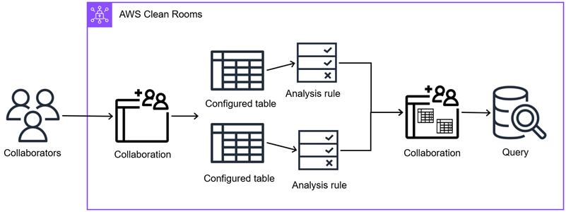

# Configured tables in AWS Clean Rooms

A _configured table_ is a reference to an existing table in
a data source. It contains an analysis rule that determines how the data can be queried in AWS Clean Rooms
and can include a data access budget to control table usage. Configured tables can be associated
to one or more collaborations.

With AWS Clean Rooms, you can perform aggregation analysis on event data, such as number of purchases
compared to number of purchases. You can also perform list analysis on event data, such as
enriching overlapping customer data from segment data to CRM data. You can also perform custom
queries and set differential privacy on event data, such as viewership data and segment
attributes. For any of these analysis types, you can set data access budgets to monitor and
control how much of your data is accessed through queries.

First, you create a collaboration in AWS Clean Rooms and add the AWS accounts you want to invite, or
join a collaboration you're invited to by creating a membership. Next, you and the other member
in the collaboration create configured tables. You both add an analysis rule to the configured
tables (aggregation, list, or custom) and optionally set data access budgets. Then, you
associate the configured tables to the collaboration. Finally, the member who can query runs a
query across the two data tables, consuming the data access budget as queries are
executed.

The following diagram summarizes how to work with event data in AWS Clean Rooms.

###### Topics

- [Creating a configured table in
  AWS Clean Rooms](create-configured-table.md "create-configured-table.md")
- [Adding an analysis rule to a configured table](add-analysis-rule.md "add-analysis-rule.md")
- [Associating a configured table to a
  collaboration](associate-configured-table.md "associate-configured-table.md")
- [Configuring a data access budget](configure-data-access-budget.md "configure-data-access-budget.md")
- [Adding a collaboration analysis rule to a
  configured table](add-collaboration-analysis-rule.md "add-collaboration-analysis-rule.md")
- [Configuring differential privacy policy
  (optional)](configure-differential-privacy.md "configure-differential-privacy.md")
- [Viewing tables and analysis rules](view-tables.md "view-tables.md")
- [Editing a configured table](edit-configured-table.md "edit-configured-table.md")
- [Editing configured table tags](edit-config-table-tags.md "edit-config-table-tags.md")
- [Editing the configured table analysis
  rule](edit-config-table-analysis-rule.md "edit-config-table-analysis-rule.md")
- [Deleting the configured table analysis
  rule](delete-config-table-analysis-rule.md "delete-config-table-analysis-rule.md")
- [Configured table disallowed columns](disallowed-columns.md "disallowed-columns.md")
- [Editing configured table associations](edit-config-table-assoc.md "edit-config-table-assoc.md")
- [Disassociating configured tables](disassociate-config-table.md "disassociate-config-table.md")
