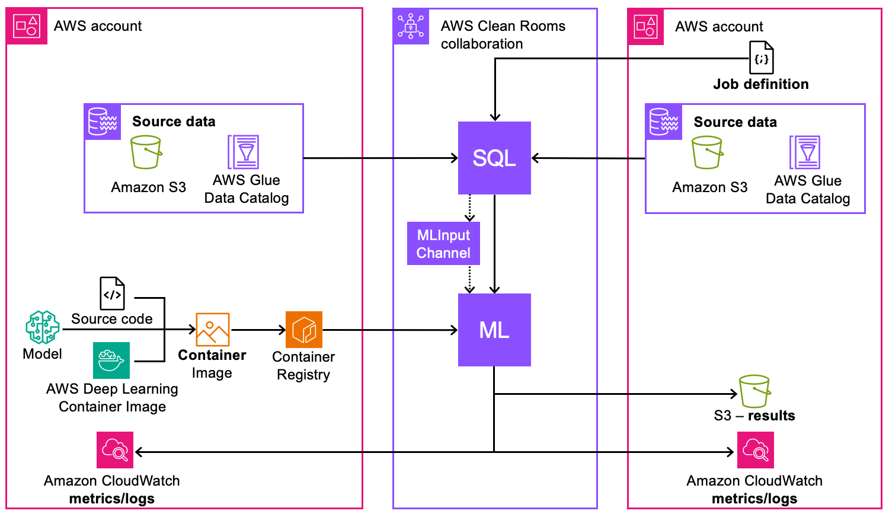

# Custom modeling in AWS Clean Rooms ML

From a technical standpoint, the following diagram describes how custom ML modeling works
in AWS Clean Rooms ML.

Here's how custom ML modeling works in Clean Rooms ML:

1.  Data Source Configuration
    - Source data can be stored in Amazon S3 catalog, in the AWS Glue Data Catalog, or
      Snowflake
    - AWS Glue Data Catalog is used to organize and catalog
    - Data from multiple AWS accounts can be used within the same
      collaboration

2.  SQL Query and Data Processing
    - SQL queries are used to access and process the source data
    - The queries run within the AWS Clean Rooms collaboration boundaries
    - Processed data feeds into ML Input Channels for model training

3.  ML Model Development
    - Source code for the model can be developed using AWS Deep Learning
      Container Images
    - Custom container images must be created and stored in Amazon Elastic Container Registry

4.  Infrastructure Components
    - Amazon Elastic Container Registry stores and manages the ML model containers
    - ML processing occurs within the secure AWS Clean Rooms collaboration
      environment

5.  Monitoring and Logging
    - Amazon CloudWatch provides metrics and logs for both collaborating parties
    - Monitoring is available across AWS accounts involved in the
      collaboration
    - Performance metrics and operational logs are accessible to relevant
      parties

6.  Results Management

        * Access to results is controlled according to collaboration
         permissions

    Before you get started, see the [Custom ML modeling
    prerequisites](custom-model-prerequisites.md "custom-model-prerequisites.md") and [Model authoring guidelines for the
    training container](custom-model-guidelines.md "custom-model-guidelines.md") for more information.

###### Topics

- [Creating and joining the collaboration
  in AWS Clean Rooms ML](create-custom-ml-collaboration.md "create-custom-ml-collaboration.md")
- [Contributing training data in
  AWS Clean Rooms ML](custom-model-training-data.md "custom-model-training-data.md")
- [Configuring a model algorithm in
  AWS Clean Rooms ML](configure-model-algorithm.md "configure-model-algorithm.md")
- [Associating the configured model algorithm
  in AWS Clean Rooms ML](associate-model-algorithm.md "associate-model-algorithm.md")
- [Creating an ML input channel in
  AWS Clean Rooms ML](create-ml-input-channel.md "create-ml-input-channel.md")
- [Creating a trained model in AWS Clean Rooms ML](create-trained-model.md "create-trained-model.md")
- [Exporting model artifacts from
  AWS Clean Rooms ML](export-model-artifacts.md "export-model-artifacts.md")
- [Running inference on a trained model in
  AWS Clean Rooms ML](run-inference-jobs.md "run-inference-jobs.md")
