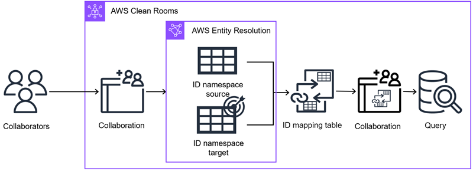

# AWS Entity Resolution in AWS Clean Rooms

With AWS Entity Resolution in AWS Clean Rooms, you can translate data from a source to a target, populate an ID mapping
table with the translated data, and query the data.

First, you create a collaboration in AWS Clean Rooms and add the AWS accounts you want to invite, or
join a collaboration you're invited to by creating a membership. Next, you perform ID mapping on
two data tables. You do this by either associating an existing ID namespace source or creating a
new one in AWS Entity Resolution. The other member of the collaboration associates an existing ID namespace
target or creates a new ID namespace target. Then, you create and populate an ID mapping table
from the two associated ID namespaces. Finally, the member who can query runs a query across the
two data tables by joining on the ID mapping table.

The following diagram summarizes how to work with AWS Entity Resolution in AWS Clean Rooms.

###### Note

The currently supported transcoding service provider is LiveRamp, which is available in
the following AWS Regions: US East (N. Virginia), US East (Ohio), and
US West (Oregon).

###### Topics

- [ID namespaces in AWS Clean Rooms](working-with-id-namespaces.md "working-with-id-namespaces.md")
- [ID mapping tables in AWS Clean Rooms](working-with-id-mapping-tables.md "working-with-id-mapping-tables.md")
