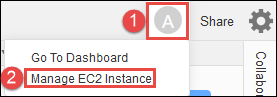

AWS Cloud9 is no longer available to new customers. Existing customers of
AWS Cloud9 can continue to use the service as normal.
[Learn more](https://aws.amazon.com/blogs/devops/how-to-migrate-from-aws-cloud9-to-aws-ide-toolkits-or-aws-cloudshell/ "https://aws.amazon.com/blogs/devops/how-to-migrate-from-aws-cloud9-to-aws-ide-toolkits-or-aws-cloudshell/")

# Share a running application over the internet

After you preview your running application, you can make it available to others over the
internet.

If an Amazon EC2 instance is connected to your environment, follow these steps. Otherwise, consult
your server's documentation.

###### Topics

- [Step 1: Get the ID and the IP address
  of the instance](#app-preview-share-get-metadata "#app-preview-share-get-metadata")
- [Step 2: Set up the security group for
  the instance](#app-preview-share-security-group "#app-preview-share-security-group")
- [Step 3: Set up the subnet for the
  instance](#app-preview-share-subnet "#app-preview-share-subnet")
- [Step 4: Share your running application's
  URL](#app-preview-share-url "#app-preview-share-url")

## Step 1: Get the ID and the IP address

of the instance

In this step, you note the instance ID and public IP address for the Amazon EC2 instance
that's connected to the environment. You need the instance ID in a later step to allow
incoming application requests. Then, share the public IP address to others so that they
can access the running application.

1. Get the Amazon EC2 instance's ID. To get this, do one of the following:
   - In a terminal session in the AWS Cloud9 IDE for the environment, run the following
     command to get the Amazon EC2 instance's ID.

   ```
   curl http://169.254.169.254/latest/meta-data/instance-id
   ```

   The instance ID is in the following format:
   `i-12a3b456c789d0123`. Make a note of this instance ID.
   - In the IDE for the environment, on the menu bar, choose your user icon, and
     then choose **Manage EC2 Instance**.

   

   In the Amazon EC2 console that displays, make a note of the instance ID that
   displays in the **Instance ID** column. The instance ID is
   in this format: `i-12a3b456c789d0123`.

2. Get the Amazon EC2 instance's public IP address. To get this, do one of the
   following:
   - In the IDE for the environment, on the menu bar, choose
     **Share**. In the **Share this
     environment** dialog box, make a note of the public IP address
     in the **Application** box. The public IP address is in
     this format: `192.0.2.0`.
   - In a terminal session in the IDE for the environment, run the following
     command to get the Amazon EC2 instance's public IP address.

   ```
   curl http://169.254.169.254/latest/meta-data/public-ipv4
   ```

   The public IP address is in this format: `192.0.2.0`. Make a
   note of this public IP address.
   - In the IDE for the environment, on the menu bar, choose your user icon, and
     then choose **Manage EC2 Instance**. In the Amazon EC2 console
     that displays, on the **Description** tab, make a note of
     the public IP address for the **IPv4 Public IP** field. The
     public IP address is in this format: `192.0.2.0`.

###### Note

Your application's public IP address might change anytime the instance for
your application restarts. To prevent your IP address from changing, allocate
an Elastic IP address. Then, assign that address to the running instance. For
instructions, see [Allocating an Elastic IP Address](../../../AWSEC2/latest/UserGuide/elastic-ip-addresses-eip.md#using-instance-addressing-eips-allocating "../../../AWSEC2/latest/UserGuide/elastic-ip-addresses-eip.md#using-instance-addressing-eips-allocating") and [Associating an Elastic IP Address with a Running Instance](../../../AWSEC2/latest/UserGuide/elastic-ip-addresses-eip.md#using-instance-addressing-eips-associating "../../../AWSEC2/latest/UserGuide/elastic-ip-addresses-eip.md#using-instance-addressing-eips-associating") in the
_Amazon EC2 User Guide_. Allocating an Elastic IP address
might cause your AWS account to incur charges. For more information, see
[Amazon EC2 Pricing](https://aws.amazon.com/ec2/pricing/ "https://aws.amazon.com/ec2/pricing/").

## Step 2: Set up the security group for

the instance

In this step, on the Amazon EC2 console, set up the Amazon EC2 security group for the instance
that's connected to the environment. Set it up to allow incoming HTTP requests over port 8080,
8081, or 8082.

###### Note

You aren't required run using HTTP over port `8080`, `8081`,
or `8082`. If you don't do this, you can't preview your running
application from within the IDE. For more information, see [Preview a running application](app-preview.md#app-preview-preview-app "app-preview.md#app-preview-preview-app").
Otherwise, if you're running on a different protocol or port, substitute it in this
step.

For an additional layer of security, set up a network access control list (ACL)
for a subnet in a VPC that the instance can use. For more information about security
groups and network ACLs, see the following:

- [Step 3: Set up the subnet for the
  instance](#app-preview-share-subnet "#app-preview-share-subnet")
- [Security](../../../vpc/latest/userguide/VPC_Security.md "../../../vpc/latest/userguide/VPC_Security.md") in the
  _Amazon VPC User Guide_
- [Security Groups for Your
  VPC](../../../vpc/latest/userguide/vpc-security-groups.md "../../../vpc/latest/userguide/vpc-security-groups.md") in the _Amazon VPC User Guide_
- [Network ACLs](../../../vpc/latest/userguide/what-is-amazon-vpc.md "../../../vpc/latest/userguide/what-is-amazon-vpc.md") in the
  _Amazon VPC User Guide_

1. In the IDE for the environment, on the menu bar, choose your user icon, and then
   choose **Manage EC2 Instance**. Then skip ahead to step 3 in this
   procedure.
2. If choosing **Manage EC2 Instance** or other steps in this
   procedure returns in errors, sign in to the Amazon EC2 console using the credentials
   for an administrator in your AWS account. Then, complete the following
   instructions. If you can't do this, check with your AWS account
   administrator.
   1. Sign in to the AWS Management Console at [https://console.aws.amazon.com/](https://console.aws.amazon.com/ "https://console.aws.amazon.com/") if you're not already signed in.
   2. Open the Amazon EC2 console. To do this, in the navigation bar, choose
      **Services**. Then, choose
      **EC2**.
   3. In the navigation bar, choose the AWS Region where your environment is
      located.
   4. If the **EC2 Dashboard** is displayed, choose
      **Running Instances**. Otherwise, in the service
      navigation pane, expand **Instances** if it isn't already
      expanded and choose **Instances**.
   5. In the list of instances, select the instance with an **Instance
      ID** that matches the instance ID that you noted earlier.

3. In the **Description** tab for the instance, choose the
   security group link that's next to **Security groups**.
4. With the security group displayed, look on the **Inbound**
   tab. If there's a rule with **Type** set to **Custom TCP
   Rule** and **Port Range** set to
   **8080**, **8081**, or
   **8082**, choose **Cancel**, and skip ahead
   to [Step 3: Set up the subnet for the
   instance](#app-preview-share-subnet "#app-preview-share-subnet"). Otherwise, choose
   **Edit**.
5. In the **Edit inbound rules** dialog box, choose **Add
   Rule**.
6. For **Type**, choose **Custom TCP
   Rule**.
7. For **Port Range**, enter `8080`,
   `8081`, or `8082`.
8. For **Source**, choose **Anywhere**.

###### Note

By choosing **Anywhere** for **Source**,
you're allowing incoming requests from any IP address. To restrict this to
specific IP addresses, choose **Custom** and then enter the IP
address range. Alternatively, choose **My IP** to restrict
requests to be only from your IP address. 9. Choose **Save**.

## Step 3: Set up the subnet for the

instance

Use the Amazon EC2 and Amazon VPC consoles to set up a subnet for the Amazon EC2 instance that's
connected to the environment. Then, allow incoming HTTP requests over port 8080, 8081, or 8082.

###### Note

You aren't required to run using HTTP over port `8080`,
`8081`, or `8082`. However, if you don't, you can't preview
your running application from within the IDE. For more information, see [Preview a running application](app-preview.md#app-preview-preview-app "app-preview.md#app-preview-preview-app").
Otherwise, if you're running on a different protocol or port, substitute it in this
step.

This step describes how to set up a network ACL for a subnet in an Amazon VPC that the
instance can use. This isn't required but is recommended. Setting up a network ACL
adds an additional layer of security. For more information about network ACLs, see
the following:

- [Security](../../../vpc/latest/userguide/VPC_Security.md "../../../vpc/latest/userguide/VPC_Security.md") in the
  _Amazon VPC User Guide_
- [Network ACLs](../../../vpc/latest/userguide/vpc-network-acls.md "../../../vpc/latest/userguide/vpc-network-acls.md") in the
  _Amazon VPC User Guide_

1. On the Amazon EC2 console, in the service navigation pane, expand
   **Instances** if it isn't already expanded, and choose
   **Instances**.
2. In the list of instances, select the instance with an **Instance
   ID** that matches the instance ID that you noted earlier.
3. In the **Description** tab for the instance, note the value of
   **Subnet ID**. The subnet ID is in the following format:
   `subnet-1fab8aEX`.
4. Open the Amazon VPC console. To do this, in the AWS navigation bar, choose
   **Services** and then choose **VPC**.

For this step, we recommend that you sign in to the Amazon VPC console using an
administrator's credentials in your AWS account. If you can't do this, check
with your AWS account administrator. 5. If the **VPC Dashboard** is displayed, choose
**Subnets**. Otherwise, in the service navigation pane, choose
**Subnets**. 6. In the list of subnets, select the subnet with a **Subnet ID**
value that matches the one that you noted earlier. 7. On the **Summary** tab, choose the network ACL link that's
next to **Network ACL**. 8. In the list of network ACLs, select the network ACL. (There is only one network
ACL.) 9. Look on the **Inbound Rules** tab for the network ACL. If a
rule already exists where **Type** is set to **HTTP\*
(8080)**, **HTTP\* (8081)**, or **HTTP\*
(8082)**, skip ahead to [Step 4: Share your running application's
URL](#app-preview-share-url "#app-preview-share-url"). Otherwise, choose
**Edit**. 10. Choose **Add another rule**. 11. For **Rule #**, enter a number for the rule (for example,
`200`). 12. For **Type**, choose **Custom TCP
Rule**. 13. For **Port Range**, type `8080`, `8081`,
or `8082`. 14. For **Source**, type the range of IP addresses to allow
incoming requests from. For example, to allow incoming requests from any IP
address, enter `0.0.0.0/0`. 15. With **Allow / Deny** set to **ALLOW**,
choose **Save**.

## Step 4: Share your running application's

URL

After your application is running, you can share your application with others by
providing your application's URL. For this, you need the public IP address that you
noted earlier. To write your application's full URL, make sure to start your
application's public IP address with the correct protocol. Next, if your application
port isn't the default port for the protocol that it uses, add the port number
information. The following is an example application URL:
`http://192.0.2.0:8080/index.html` using HTTP over port 8080.

If the resulting web browser tab displays an error, or the tab is blank, follow the
troubleshooting steps in [Can't display your running application
outside of the IDE](troubleshooting.md#troubleshooting-app-sharing "troubleshooting.md#troubleshooting-app-sharing").

###### Note

Your application's public IP address might change anytime the instance for your
application restarts. To prevent your IP address from changing, allocate an Elastic
IP address, and then assign that address to the running instance. For instructions,
see [Allocating an Elastic IP Address](../../../AWSEC2/latest/UserGuide/elastic-ip-addresses-eip.md#using-instance-addressing-eips-allocating "../../../AWSEC2/latest/UserGuide/elastic-ip-addresses-eip.md#using-instance-addressing-eips-allocating") and [Associating an Elastic IP Address with a Running Instance](../../../AWSEC2/latest/UserGuide/elastic-ip-addresses-eip.md#using-instance-addressing-eips-associating "../../../AWSEC2/latest/UserGuide/elastic-ip-addresses-eip.md#using-instance-addressing-eips-associating") in the
_Amazon EC2 User Guide_. Allocating an Elastic IP address might
cause your AWS account to incur charges. For more information, see [Amazon EC2 Pricing](https://aws.amazon.com/ec2/pricing/ "https://aws.amazon.com/ec2/pricing/").

You're not required to run your application using HTTP over port
`8080`, `8081`, or `8082`. However, if you don't,
you can't preview your running application from within the IDE. For more
information, see [Preview a running application](app-preview.md#app-preview-preview-app "app-preview.md#app-preview-preview-app").

Suppose that, for example, requests that originate from a VPN that blocks traffic
over the requested protocol or port. Then, those requests to access your
application's URL might fail. Request must be made from a different network that
allows traffic over the requested protocol and port. For more information, contact
your network administrator.

We don't recommend sharing the URL in your application preview tab in the IDE
with others. (This URL is in the following format:
`https://12a34567b8cd9012345ef67abcd890e1.vfs.cloud9.us-east-2.amazonaws.com/`.
In this format, `12a34567b8cd9012345ef67abcd890e1` is the ID that AWS Cloud9
assigns to the environment. `us-east-2` is the ID of the AWS Region for the
environment.) This URL works only when the IDE for the environment is open and the application
is running in the same web browser.
