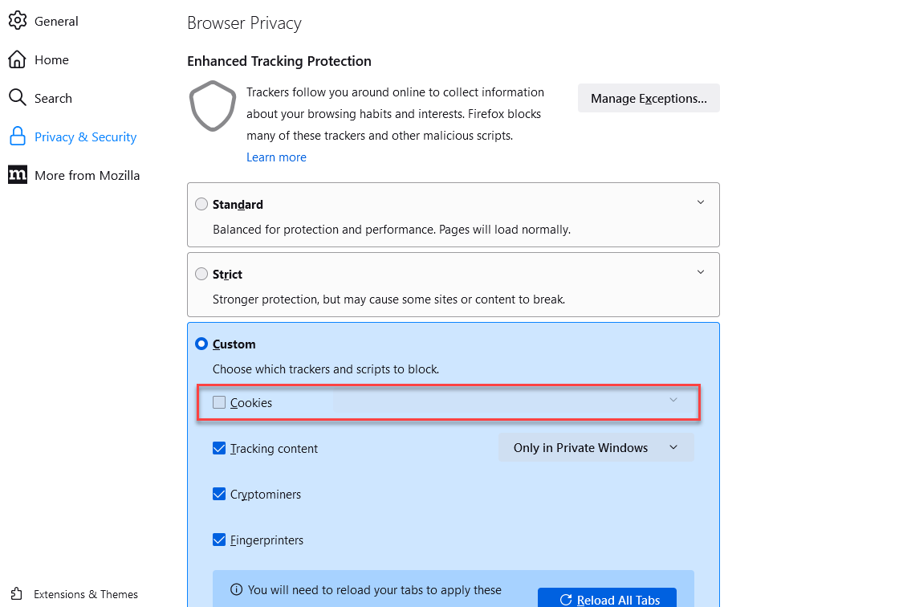

AWS Cloud9 is no longer available to new customers. Existing customers of
AWS Cloud9 can continue to use the service as normal.
[Learn more](https://aws.amazon.com/blogs/devops/how-to-migrate-from-aws-cloud9-to-aws-ide-toolkits-or-aws-cloudshell/ "https://aws.amazon.com/blogs/devops/how-to-migrate-from-aws-cloud9-to-aws-ide-toolkits-or-aws-cloudshell/")

# Supported browsers for AWS Cloud9

The following table lists the supported browsers for AWS Cloud9.

| **Browser**            | **Versions**          |
| ---------------------- | --------------------- | ------------------------------------------------------------------------------------------------------------------------------------------------------------------------------------------------------------------------------------------------------------------------------------------------------------------------------------------------------------------------------------------------------------------------------------------------------------------------------------------- |
| Google Chrome          | Latest three versions |
| Mozilla Firefox        | Latest three versions |
| Microsoft Edge         | Latest three versions |
| Apple Safari for macOS | Latest two versions   | ###### Warning If you are using Mozilla Firefox as your preferred browser with AWS Cloud9 IDE, there is a 3rd party cookie setting which prevents AWS Cloud9 webview and AWS Toolkits from working correctly in the browser. As a workaround to this issue, you must ensure that you have not blocked _Cookies_ in the _Privacy & Security_ section of your browser settings, as displayed in the image below.  |
