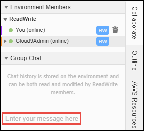

AWS Cloud9 is no longer available to new customers. Existing customers of 
 AWS Cloud9 can continue to use the service as normal. 
 [Learn more](https://aws.amazon.com/blogs/devops/how-to-migrate-from-aws-cloud9-to-aws-ide-toolkits-or-aws-cloudshell/ "https://aws.amazon.com/blogs/devops/how-to-migrate-from-aws-cloud9-to-aws-ide-toolkits-or-aws-cloudshell/")

# Manage chat in a shared Environment

This topic shows how you can chat with other environment members, view chat messages in a shared Environment, and delete them from a shared Environment.

## Chat with other environment members

With the shared environment open, at the bottom of the **Collaborate**
 window, for **Enter your message here**, enter your chat message, and then
 press `Enter`.

## View chat messages in a shared
 Environment

With the shared environment open, in the **Collaborate** window, expand
 **Group Chat**, if the list of chat messages isn't visible.

## Delete chat messages from a shared
 Environment

With the shared environment open, in the **Collaborate** window, open the
 context (right-click) menu for the chat message in **Group Chat**. Then,
 choose **Delete Message**.

###### Note

When you delete a chat message, it is deleted from the environment for all members.

## Delete all chat messages from a shared
 Environment

With the shared environment open, in the **Collaborate** window, open a
 context (right-click) menu anywhere in **Group Chat**. Then, choose
 **Clear history**.

###### Note

When you delete all chat messages, they're deleted from the environment for all
 members.
