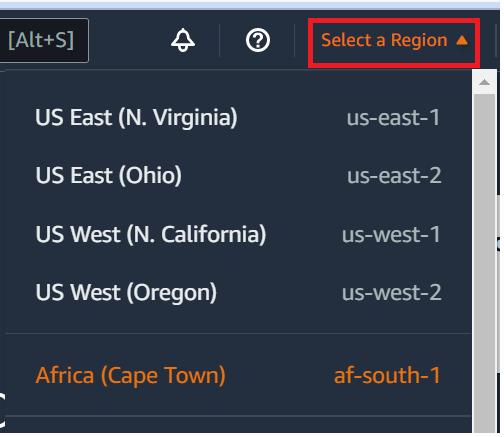
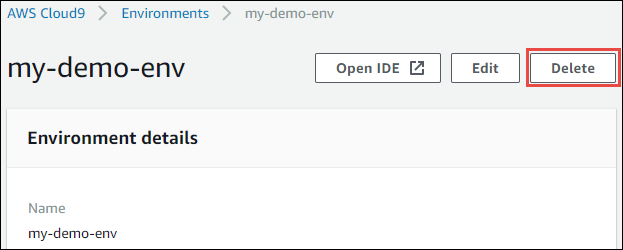
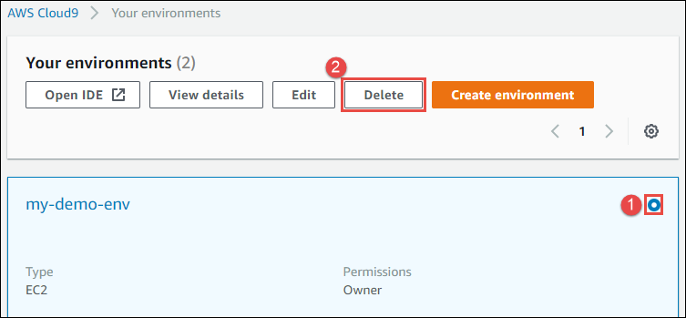

AWS Cloud9 is no longer available to new customers. Existing customers of
AWS Cloud9 can continue to use the service as normal.
[Learn more](https://aws.amazon.com/blogs/devops/how-to-migrate-from-aws-cloud9-to-aws-ide-toolkits-or-aws-cloudshell/ "https://aws.amazon.com/blogs/devops/how-to-migrate-from-aws-cloud9-to-aws-ide-toolkits-or-aws-cloudshell/")

# Deleting an environment in AWS Cloud9

To prevent any ongoing charges to your AWS account related to an AWS Cloud9 development environment that you're
no longer using, delete the environment.

- [Deleting an Environment with the
  Console](#delete-environment-console "#delete-environment-console")
- [Deleting an Environment with Code](#delete-environment-code "#delete-environment-code")

## Deleting an Environment with the

console

###### Warning

When you delete an environment, AWS Cloud9 deletes the environment permanently. This includes
permanently deleting all related settings, user data, and uncommitted code. Deleted
environments can't be recovered.

1. Sign in to the AWS Cloud9 console:
   - If you're the only one using your AWS account or you're an IAM user in a
     single AWS account, go to [https://console.aws.amazon.com/cloud9/](https://console.aws.amazon.com/cloud9/ "https://console.aws.amazon.com/cloud9/").
   - If your organization uses AWS IAM Identity Center, ask your AWS account administrator
     for sign-in instructions.

2. In the top navigation bar, choose the AWS Region where the environment is
   located.

 3. In the list of environments, for the environment that you want to delete, do one of the
following actions.

    * Choose the title of the card for the environment. Then, choose
     **Delete** on the next page.

    
    * Select the card for the environment, and then choose the
     **Delete** button.

    

4. In the **Delete** dialog box, type `Delete`, and then
   choose **Delete**.
   - **EC2 environment**

   AWS Cloud9 also terminates the Amazon EC2 instance that was connected to that
   environment.

   ###### Note

   If account deletion fails, a banner is displayed at the top of the
   console webpage. Additionally, the card for the environment, if it exists,
   indicates that environment deletion failed.
   - **SSH environment**

   If the environment was connected to an Amazon EC2 instance, AWS Cloud9 doesn't terminate
   that instance. If you don't terminate that instance later, your AWS account
   might continue to have ongoing charges for Amazon EC2 related to that
   instance.

5. If the environment was an SSH environment, AWS Cloud9 leaves behind a hidden subdirectory on the
   cloud compute instance or your own server that was connected to that environment. If you
   want to delete it, you can now safely delete that subdirectory. The subdirectory is
   named `.c9`. The subdirectory is located in the
   **Environment path** directory that you specified when you
   created the environment.

If your environment isn't displayed in the console, try doing one or more of the following
actions to have it be displayed.

    * In the dropdown menu bar on the **Environments** page, choose one or
     more of the following.

    	+ Choose **My environments** to display all environments that your
    	 AWS entity owns within the selected AWS Region and AWS account.
    	+ Choose **Shared with me** to display all environments your
    	 AWS entity was invited to within the selected AWS Region and
    	 AWS account.
    	+ Choose **All account environments** to display all environments
    	 within the selected AWS Region and AWS account that your AWS entity has
    	 permissions to display.
    * If you think you are a member of an environment, but the environment isn't displayed in the
     **Shared with you** list, check with the environment owner.
    * In the top navigation bar, choose a different AWS Region.

## Deleting an Environment with code

###### Warning

When you delete an environment, AWS Cloud9 deletes the environment permanently. This includes
permanently deleting all related settings, user data, and uncommitted code. Deleted
environments can't be recovered.

To use code to delete an environment in AWS Cloud9, call the AWS Cloud9 delete environment operation, as
follows.

|                                  |                                                                                                                                                                                                                                                                                                                                                                                                                                                                                                                                                |
| -------------------------------- | ---------------------------------------------------------------------------------------------------------------------------------------------------------------------------------------------------------------------------------------------------------------------------------------------------------------------------------------------------------------------------------------------------------------------------------------------------------------------------------------------------------------------------------------------- |
| AWS CLI                          | [delete-environment](../../../cli/latest/reference/cloud9/delete-environment.md "../../../cli/latest/reference/cloud9/delete-environment.md")                                                                                                                                                                                                                                                                                                                                                                                                  |
| AWS SDK for C++                  | [DeleteEnvironmentRequest](https://sdk.amazonaws.com/cpp/api/LATEST/class_aws_1_1_cloud9_1_1_model_1_1_delete_environment_request.html "https://sdk.amazonaws.com/cpp/api/LATEST/class_aws_1_1_cloud9_1_1_model_1_1_delete_environment_request.html"), [DeleteEnvironmentResult](https://sdk.amazonaws.com/cpp/api/LATEST/class_aws_1_1_cloud9_1_1_model_1_1_delete_environment_result.html "https://sdk.amazonaws.com/cpp/api/LATEST/class_aws_1_1_cloud9_1_1_model_1_1_delete_environment_result.html")                                      |
| AWS SDK for Go                   | [DeleteEnvironment](../../../sdk-for-go/api/service/cloud9.md#Cloud9.DeleteEnvironment "../../../sdk-for-go/api/service/cloud9.md#Cloud9.DeleteEnvironment"), [DeleteEnvironmentRequest](../../../sdk-for-go/api/service/cloud9.md#Cloud9.DeleteEnvironmentRequest "../../../sdk-for-go/api/service/cloud9.md#Cloud9.DeleteEnvironmentRequest"), [DeleteEnvironmentWithContext](../../../sdk-for-go/api/service/cloud9.md#Cloud9.DeleteEnvironmentWithContext "../../../sdk-for-go/api/service/cloud9.md#Cloud9.DeleteEnvironmentWithContext") |
| AWS SDK for Java                 | [DeleteEnvironmentRequest](../../../AWSJavaSDK/latest/javadoc/com/amazonaws/services/cloud9/model/DeleteEnvironmentRequest.md "../../../AWSJavaSDK/latest/javadoc/com/amazonaws/services/cloud9/model/DeleteEnvironmentRequest.md"), [DeleteEnvironmentResult](../../../AWSJavaSDK/latest/javadoc/com/amazonaws/services/cloud9/model/DeleteEnvironmentResult.md "../../../AWSJavaSDK/latest/javadoc/com/amazonaws/services/cloud9/model/DeleteEnvironmentResult.md")                                                                          |
| AWS SDK for JavaScript           | [deleteEnvironment](../../../AWSJavaScriptSDK/latest/AWS/Cloud9.md#deleteEnvironment-property "../../../AWSJavaScriptSDK/latest/AWS/Cloud9.md#deleteEnvironment-property")                                                                                                                                                                                                                                                                                                                                                                     |
| AWS SDK for .NET                 | [DeleteEnvironmentRequest](../../../sdkfornet/v3/apidocs/items/Cloud9/TDeleteEnvironmentRequest.md "../../../sdkfornet/v3/apidocs/items/Cloud9/TDeleteEnvironmentRequest.md"), [DeleteEnvironmentResponse](../../../sdkfornet/v3/apidocs/items/Cloud9/TDeleteEnvironmentResponse.md "../../../sdkfornet/v3/apidocs/items/Cloud9/TDeleteEnvironmentResponse.md")                                                                                                                                                                                |
| AWS SDK for PHP                  | [deleteEnvironment](../../../aws-sdk-php/v3/api/api-cloud9-2017-09-23.md#deleteenvironment "../../../aws-sdk-php/v3/api/api-cloud9-2017-09-23.md#deleteenvironment")                                                                                                                                                                                                                                                                                                                                                                           |
| AWS SDK for Python (Boto)        | [delete_environment](https://boto3.readthedocs.io/en/latest/reference/services/cloud9.html#Cloud9.Client.delete_environment "https://boto3.readthedocs.io/en/latest/reference/services/cloud9.html#Cloud9.Client.delete_environment")                                                                                                                                                                                                                                                                                                          |
| AWS SDK for Ruby                 | [delete_environment](../../../sdk-for-ruby/v3/api/Aws/Cloud9/Client.md#delete_environment-instance_method "../../../sdk-for-ruby/v3/api/Aws/Cloud9/Client.md#delete_environment-instance_method")                                                                                                                                                                                                                                                                                                                                              |
| AWS Tools for Windows PowerShell | [Remove-C9Environment](../../../powershell/latest/reference/items/Remove-C9Environment.md "../../../powershell/latest/reference/items/Remove-C9Environment.md")                                                                                                                                                                                                                                                                                                                                                                                |
| AWS Cloud9 API                   | [DeleteEnvironment](../APIReference/API_DeleteEnvironment.md "../APIReference/API_DeleteEnvironment.md")                                                                                                                                                                                                                                                                                                                                                                                                                                       |
