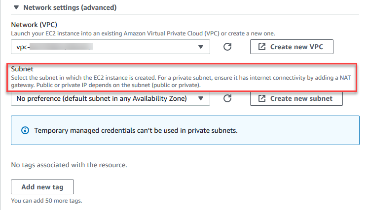

AWS Cloud9 is no longer available to new customers. Existing customers of 
 AWS Cloud9 can continue to use the service as normal. 
 [Learn more](https://aws.amazon.com/blogs/devops/how-to-migrate-from-aws-cloud9-to-aws-ide-toolkits-or-aws-cloudshell/ "https://aws.amazon.com/blogs/devops/how-to-migrate-from-aws-cloud9-to-aws-ide-toolkits-or-aws-cloudshell/")

# Accessing no-ingress EC2 instances with AWS Systems Manager

A "no-ingress EC2 instance" that's created for an EC2 environment enables AWS Cloud9 to connect to its
 Amazon EC2 instance without the need to open any inbound ports on that instance. You can select
 the no-ingress option when creating an EC2 environment using the console, the command line
 interface, or a [AWS CloudFormation stack](#cfn-role-and-permissions "#cfn-role-and-permissions"). For more
 information about how to create an
 environment using the
 console or command line interface, see [Step 1: Create an environment](tutorials-basic.md#tutorial-create-environment "tutorials-basic.md#tutorial-create-environment").

###### Important

There are no additional charges for using Systems Manager Session Manager to manage connections to your
 EC2 instance.

When selecting an environment type in the **Create environment** page of
 the console, you can choose
 a new EC2 instance that requires inbound connectivity or a new no-ingress EC2 instance that
 doesn't require the following:


* **[New EC2
 instance](create-environment-main.md#create-environment-console "create-environment-main.md#create-environment-console")** – With this setup, the security group for the
 instance has a rule to allow incoming networking traffic. Incoming network traffic
 is restricted to  [IP addresses approved for AWS Cloud9
 connections](ip-ranges.md "ip-ranges.md"). An open inbound port enables AWS Cloud9 to connect over SSH to
 its instance. If you use AWS Systems Manager Session Manager, you can access your Amazon EC2 instance
 through SSM without opening inbound ports (no ingress). This method is only
 applicable for new Amazon EC2 instances. For more information, see [Benefits of using Systems Manager for EC2 environments](#ssm-benefits "#ssm-benefits").

* **[Existing
 compute](create-environment-main.md#create-environment-console "create-environment-main.md#create-environment-console")** – With this setup, an existing Amazon EC2 instance
 is accessed that requires SSH login details that the instance must have an inbound
 security group rule for. If you select this option, a service role is automatically
 created. You can view the name of the service role in a note at the bottom of the
 setup screen.
If creating an environment using the [AWS CLI](tutorials-basic.md#tutorial-create-environment "tutorials-basic.md#tutorial-create-environment"), you can configure a no-ingress EC2 instance by setting the
 `--connection-type CONNECT_SSM` option when calling the
 `create-environment-ec2` command. For more information about creating the
 required service role and instance profile, see [Managing instance profiles for Systems Manager
 with the AWS CLI](#aws-cli-instance-profiles "#aws-cli-instance-profiles"). 

After you complete creating an environment that uses a no-ingress EC2 instance, confirm the
 following:


* Systems Manager Session Manager has permissions to perform actions on the EC2 instance on your
 behalf. For more information, see [Managing Systems Manager permissions](#service-role-ssm "#service-role-ssm").
* AWS Cloud9 users can access the instance managed by Session Manager. For more
 information, see [Giving users access to instances managed by
 Session Manager](#access-ec2-session "#access-ec2-session").

## Benefits of using Systems Manager for EC2 environments


Allowing [Session Manager](https://docs.aws.amazon.com/systems-manager/latest/userguide/session-manager.html "https://docs.aws.amazon.com/systems-manager/latest/userguide/session-manager.html") to
 handle the secure connection between AWS Cloud9 and its EC2 instance offers two key benefits: 


* No requirement to open inbound ports for the instance
* Option to launch the instance into a public or private subnet


No open inbound ports
Secure connections between AWS Cloud9 and its EC2 instance are handled by
 [Session Manager](https://docs.aws.amazon.com/systems-manager/latest/userguide/session-manager.html "https://docs.aws.amazon.com/systems-manager/latest/userguide/session-manager.html").
 Session Manager is a fully managed Systems Manager capability that enables AWS Cloud9 to connect to
 its EC2 instance without the need to open inbound ports. 


###### Important

The option to use Systems Manager for no-ingress connections is currently
 available only when creating new EC2 environments.


 With the start of a Session Manager session, a connection is made to the target
 instance. With the connection in place, the environment can now interact
 with the instance through the Systems Manager service. The Systems Manager service communicates
 with the instance through the Systems Manager Agent ([SSM Agent](https://docs.aws.amazon.com/systems-manager/latest/userguide/ssm-agent.html "https://docs.aws.amazon.com/systems-manager/latest/userguide/ssm-agent.html")).


By default, SSM Agent is installed on all instances that are used by
 EC2 environments.


Private/public subnets
When selecting a subnet for your instance in the **Network
 settings (advanced)** section, you can select a private or
 public
 subnet
 if the instance for your environment is accessed through
 Systems Manager.




**Private subnets**


For a private subnet, ensure that the instance can still connect to the
 SSM service. This can be done by [setting up a NAT gateway in a public subnet](https://aws.amazon.com/premiumsupport/knowledge-center/nat-gateway-vpc-private-subnet "https://aws.amazon.com/premiumsupport/knowledge-center/nat-gateway-vpc-private-subnet") or [configuring a VPC endpoint for Systems Manager](https://aws.amazon.com/premiumsupport/knowledge-center/ec2-systems-manager-vpc-endpoints "https://aws.amazon.com/premiumsupport/knowledge-center/ec2-systems-manager-vpc-endpoints").


The advantage of using the NAT gateway is that it prevents the internet
 from initiating a connection to the instance in the private subnet. The
 instance for your environment is assigned a private IP address instead of a
 public one. So, the NAT gateway forwards traffic from the instance to the
 internet or other AWS services, and then sends the response back to the
 instance.


For the VPC option, create at least three required *interface
 endpoints* for Systems Manager:
 *com.amazonaws.region.ssm*,
 *com.amazonaws.region.ec2messages*, and
 *com.amazonaws.region.ssmmessages*. For more
 information, see [Creating VPC endpoints for Systems Manager](https://docs.aws.amazon.com/systems-manager/latest/userguide/setup-create-vpc.html#sysman-setting-up-vpc-create "https://docs.aws.amazon.com/systems-manager/latest/userguide/setup-create-vpc.html#sysman-setting-up-vpc-create") in the
 *AWS Systems Manager User Guide*.


###### Important

Currently, if the EC2 instance for your environment is launched into a
 private subnet, you can't use [AWS managed temporary credentials](security-iam.md#auth-and-access-control-temporary-managed-credentials "security-iam.md#auth-and-access-control-temporary-managed-credentials") to allow the EC2 environment to access an
 AWS service on behalf of an AWS entity (an IAM user, for
 example).


**Public subnets**


If your development environment is using SSM to access an EC2 instance,
 ensure that the instance is assigned a public IP address by the public
 subnet it's launched into. To do so, you can specify your own IP address or
 enable the automatic assignment of a public IP address. For the steps
 involved in modifying auto-assign IP settings, see [IP Addressing in your
 VPC](https://docs.aws.amazon.com/vpc/latest/userguide/vpc-ip-addressing.html "https://docs.aws.amazon.com/vpc/latest/userguide/vpc-ip-addressing.html") in the *Amazon VPC User Guide*. 


For more information on configuring private and public subnets for your
 environment instances, see [Create a subnet for AWS Cloud9](vpc-settings.md#vpc-settings-create-subnet "vpc-settings.md#vpc-settings-create-subnet"). 


## Managing Systems Manager permissions


By default, Systems Manager doesn't have permission to perform actions on EC2 instances. Access
 is provided through an AWS Identity and Access Management (IAM) instance profile. (An instance profile is a
 container that passes IAM role information to an EC2 instance at launch.)


When you create the no-ingress EC2 instance using the AWS Cloud9 console, both the service
 role (`AWSCloud9SSMAccessRole`) and the IAM instance profile
 (`AWSCloud9SSMInstanceProfile`) are created automatically for you. (You
 can view `AWSCloud9SSMAccessRole` in the IAM Management console. Instance
 profiles aren't displayed in the IAM console.) 


###### Important

If you create a no-ingress EC2 environment for the first time with AWS CLI, you must
 explicitly define the required service role and instance profile. For more
 information, see [Managing instance profiles for Systems Manager
 with the AWS CLI](#aws-cli-instance-profiles "#aws-cli-instance-profiles").


###### Important

If you are creating a AWS Cloud9 environment and are using Amazon EC2 Systems Manager with either the `AWSCloud9Administrator` or
 `AWSCloud9User` policies attached, you must also attach a custom policy that has specific IAM permissions, see [Custom IAM policy for SSM environment creation](security-iam.md#custom-policy-ssm-environment "security-iam.md#custom-policy-ssm-environment"). 
 This is due to a permissions issue with the `AWSCloud9Administrator` and `AWSCloud9User` policies. 


For additional security protection, the AWS Cloud9 service-linked role,
 `AWSServiceRoleforAWSCloud9`, features a `PassRole`
 restriction in its `AWSCloud9ServiceRolePolicy` policy. When you *pass* an IAM role to a service, it allows that service to
 assume the role and perform actions on your behalf. In this case, the
 `PassRole` permission ensures that AWS Cloud9 can pass only the
 `AWSCloud9SSMAccessRole` role (and its permission) to an EC2 instance.
 This restricts the actions that can be performed on the EC2 instance to only those
 required by AWS Cloud9. 


###### Note

If you no longer need to use Systems Manager to access an instance, you can delete the
 `AWSCloud9SSMAccessRole` service role. For more information, see
 [Deleting roles or
 instance profiles](https://docs.aws.amazon.com/IAM/latest/UserGuide/id_roles_manage_delete.html "https://docs.aws.amazon.com/IAM/latest/UserGuide/id_roles_manage_delete.html") in the *IAM User Guide*. 


### Managing instance profiles for Systems Manager
 with the AWS CLI


You can also create a no-ingress EC2 environment with the AWS CLI. When you call
 `create-environment-ec2`, set the `--connection-type`
 option to `CONNECT_SSM`.


If you use this option, the `AWSCloud9SSMAccessRole` service role and
 `AWSCloud9SSMInstanceProfile` aren't automatically created. So, to
 create the required service profile and instance profile, do one of the following: 


* Create an EC2 environment using the console once have the
 `AWSCloud9SSMAccessRole` service role and
 `AWSCloud9SSMInstanceProfile` created automatically
 afterward. After they're created, the service role and instance profile are
 available for any additional EC2 Environments created using the AWS CLI.
* Run the following AWS CLI commands to create the service role and instance
 profile.


```
aws iam create-role --role-name AWSCloud9SSMAccessRole --path /service-role/ --assume-role-policy-document '{"Version": "2012-10-17",		 	 	 "Statement": [{"Effect": "Allow","Principal": {"Service": ["ec2.amazonaws.com","cloud9.amazonaws.com"]      },"Action": "sts:AssumeRole"}]}'
aws iam attach-role-policy --role-name AWSCloud9SSMAccessRole --policy-arn arn:aws:iam::aws:policy/AWSCloud9SSMInstanceProfile
aws iam create-instance-profile --instance-profile-name AWSCloud9SSMInstanceProfile --path /cloud9/
aws iam add-role-to-instance-profile --instance-profile-name AWSCloud9SSMInstanceProfile --role-name AWSCloud9SSMAccessRole
```

## Giving users access to instances managed by
 Session Manager


To open an AWS Cloud9 environment that's connected to an EC2 instance through Systems Manager, a user
 must have permission for the API operation, `StartSession`. This operation
 initiates a connection to the managed EC2 instance for a Session Manager session. You can give
 users access by using an AWS Cloud9 specific managed policy (recommended) or by editing an
 IAM policy and adding the necessary permissions. 


| Method | Description |
| --- | --- |
| Use AWS Cloud9-specific managed policy | We recommend using AWS managed policies to allow users to access EC2 instances managed by Systems Manager. Managed policies provide a set of permissions for standard AWS Cloud9 use cases and can be easily attached to an IAM entity. All the managed policies also include the permissions to run the `StartSession` API operation. The following are managed policies specific to AWS Cloud9: <br>• `AWSCloud9Administrator` (`arn:aws:iam::aws:policy/AWSCloud9Administrator`) <br>• `AWSCloud9User` (`arn:aws:iam::aws:policy/AWSCloud9User`) <br>• `AWSCloud9EnvironmentMember` (`arn:aws:iam::aws:policy/AWSCloud9EnvironmentMember`) ImportantIf you are creating a AWS Cloud9 environment and are using Amazon EC2 Systems Manager with either the `AWSCloud9Administrator` or `AWSCloud9User` policies attached, you must also attach a custom policy that has specific IAM permissions, see [Custom IAM policy for SSM environment creation](security-iam.md#custom-policy-ssm-environment "security-iam.md#custom-policy-ssm-environment"). This is due to a permissions issue with the `AWSCloud9Administrator` and `AWSCloud9User` policies. For more information, see [AWS managed policies for AWS Cloud9](security-iam.md#auth-and-access-control-managed-policies "security-iam.md#auth-and-access-control-managed-policies"). |
| Edit an IAM policy and add required policy statements | To edit an existing policy, you can add permissions for the `StartSession` API. To edit a policy using the AWS Management Console or AWS CLI, follow the instructions that are provided by [Editing IAM policies](https://docs.aws.amazon.com/IAM/latest/UserGuide/#edit-managed-policy-console "https://docs.aws.amazon.com/IAM/latest/UserGuide/#edit-managed-policy-console") in the *IAM User Guide*. When editing the policy, add the [policy statement](#policy-statement "#policy-statement") (see the following) that allows the `ssm:startSession` API operation to run. | You can use the following permissions to run the `StartSession` API operation. The `ssm:resourceTag` condition key specifies that a Session Manager session can be started for any instance (`Resource: arn:aws:ec2:*:*:instance/*`) on the condition that the instance is an AWS Cloud9 EC2 development environment (`aws:cloud9:environment`). ###### Note The following managed policies also include these policy statements: `AWSCloud9Administrator`, `AWSCloud9User`, and `AWSCloud9EnvironmentMember`. ``` { "Effect": "Allow", "Action": "ssm:StartSession", "Resource": "arn:aws:ec2:*:*:instance/*", "Condition": { "StringLike": { "ssm:resourceTag/aws:cloud9:environment": "*" }, "StringEquals": { "aws:CalledViaFirst": "cloud9.amazonaws.com" } } }, { "Effect": "Allow", "Action": [ "ssm:StartSession" ], "Resource": [ "arn:aws:ssm:*:*:document/*" ] } ``` ## Using AWS CloudFormation to create no-ingress EC2 environments When using an [AWS CloudFormation template](../../../AWSCloudFormation/latest/UserGuide/aws-resource-cloud9-environmentec2.md "../../../AWSCloudFormation/latest/UserGuide/aws-resource-cloud9-environmentec2.md") to define a no-ingress Amazon EC2 development environment, do the following before creating the stack: 1. Create the `AWSCloud9SSMAccessRole` service role and `AWSCloud9SSMInstanceProfile` instance profile. For more information, see [Creating service role and instance profile with an AWS CloudFormation template](#creating-cfn-instance-profile "#creating-cfn-instance-profile"). 2. Update the policy for the IAM entity calling AWS CloudFormation. This way, the entity can start a Session Manager session that connects to the EC2 instance. For more information, see [Adding Systems Manager permissions to an IAM policy](#updating-IAM-policy "#updating-IAM-policy"). ### Creating service role and instance profile with an AWS CloudFormation template You need to create the service role `AWSCloud9SSMAccessRole` and the instance profile `AWSCloud9SSMInstanceProfile` to enable Systems Manager to manage the EC2 instance that backs your development environment. If you previously created `AWSCloud9SSMAccessRole` and `AWSCloud9SSMInstanceProfile` by creating a no-ingress EC2 environment [with the console](#using-the-console "#using-the-console") or [running AWS CLI commands](#aws-cli-instance-profiles "#aws-cli-instance-profiles"), the service role and instance profile are already available for use. ###### Note Suppose that you attempt to create an AWS CloudFormation stack for a no-ingress EC2 environment but you didn't first create the required service role and instance profile. Then, the stack isn't created and the following error message is displayed: **`Instance profile AWSCloud9SSMInstanceProfile does not exist in account.`** When creating a no-ingress EC2 environment for the first time using AWS CloudFormation, you can define the `AWSCloud9SSMAccessRole` and `AWSCloud9SSMInstanceProfile` as IAM resources in the template. This excerpt from a sample template shows how to define these resources. The `AssumeRole` action returns security credentials that provide access to both the AWS Cloud9 environment and its EC2 instance. ``` AWSTemplateFormatVersion: 2010-09-09 Resources: AWSCloud9SSMAccessRole: Type: AWS::IAM::Role Properties: AssumeRolePolicyDocument: Version: 2012-10-17 Statement: <br>• Effect: Allow Principal: Service: <br>• cloud9.amazonaws.com <br>• ec2.amazonaws.com Action: <br>• 'sts:AssumeRole' Description: 'Service linked role for AWS Cloud9' Path: '/service-role/' ManagedPolicyArns: <br>• arn:aws:iam::aws:policy/AWSCloud9SSMInstanceProfile RoleName: 'AWSCloud9SSMAccessRole' AWSCloud9SSMInstanceProfile: Type: "AWS::IAM::InstanceProfile" Properties: InstanceProfileName: AWSCloud9SSMInstanceProfile Path: "/cloud9/" Roles: - Ref: AWSCloud9SSMAccessRole ``` ### Adding Systems Manager permissions to an IAM policy After [defining a service role and instance profile](#creating-cfn-instance-profile "#creating-cfn-instance-profile") in the [AWS CloudFormation template](../../../AWSCloudFormation/latest/UserGuide/aws-resource-cloud9-environmentec2.md "../../../AWSCloudFormation/latest/UserGuide/aws-resource-cloud9-environmentec2.md"), ensure that the IAM entity creating the stack has permission to start a Session Manager session. A session is a connection made to the EC2 instance using Session Manager. ###### Note If you don't add permissions to start a Session Manager session before creating a stack for a no-ingress EC2 environment, an `AccessDeniedException` error is returned. Add the following permissions to the policy for the IAM entity by calling AWS CloudFormation. ``` { "Effect": "Allow", "Action": "ssm:StartSession", "Resource": "arn:aws:ec2:*:*:instance/*", "Condition": { "StringLike": { "ssm:resourceTag/aws:cloud9:environment": "*" }, "StringEquals": { "aws:CalledViaFirst": "cloudformation.amazonaws.com" } } }, { "Effect": "Allow", "Action": [ "ssm:StartSession" ], "Resource": [ "arn:aws:ssm:*:*:document/*" ] } ``` ## Configuring VPC endpoints for Amazon S3 to download dependencies If your AWS Cloud9 environment’s EC2 instance doesn't have access to the internet, create a VPC endpoint for a specified Amazon S3 bucket. This bucket contains the dependencies that are required to keep your IDE up-to-date. Setting up a VPC endpoint for Amazon S3 also involves customizing the access policy. You want the access policy to allow access to only the trusted S3 bucket that contains the dependencies to be downloaded. ###### Note You can create and configure VPC endpoints using the AWS Management Console, AWS CLI, or Amazon VPC API. The following procedure shows how to create a VPC endpoint by using the console interface. ## Create and configure a VPC endpoint for Amazon S3 1. In the AWS Management Console, go to the console page for Amazon VPC. 2. Choose **Endpoints** in the navigation bar. 3. In the **Endpoints** page, choose **Create Endpoint**. 4. In the **Create Endpoint** page, enter "s3" in the search field and press **Return** to list available endpoints for Amazon S3 in the current AWS Region. 5. From the list of returned Amazon S3 endpoints, select the **Gateway** type. 6. Next, choose the VPC that contains your environment's EC2 instance. 7. Now choose the VPC's route table. This way, the associated subnets can access the endpoint. Your environment's EC2 instance is in one of these subnets. 8. In the **Policy** section, choose the **Custom** option, and replace the standard policy with the following. JSON ``` `{ "Version":"2012-10-17", "Statement": [ { "Sid": "Access-to-C9-bucket-only", "Effect": "Allow", "Principal": "*", "Action": "s3:GetObject", "Resource": "arn:aws:s3:::{bucket_name}/content/dependencies/*" } ] }` ``` For the `Resource` element, replace `{bucket_name}` with the actual name of the bucket that's available in your AWS Region. For example, if you're using AWS Cloud9 in the Europe (Ireland) Region, you specify the following: `"Resource": "arn:aws:s3:::static-eu-west-1-prod-static-hld3vzaf7c4h/content/dependencies/`. The following table lists the bucket names for the AWS Regions where AWS Cloud9 is available. Amazon S3 buckets in AWS Cloud9 Regions| AWS Region | Bucket name |
| --- | --- |
|  US East (Ohio)  | `static-us-east-2-prod-static-1c3sfcvf9hy4m` |
|  US East (N. Virginia)  | `static-us-east-1-prod-static-mft1klnkc4hl` |
|  US West (Oregon)  | `static-us-west-2-prod-static-p21mksqx9zlr` |
|  US West (N. California)  | `static-us-west-1-prod-static-16d59zrrp01z0` |
|  Africa (Cape Town)  | `static-af-south-1-prod-static-v6v7i5ypdppv` |
|  Asia Pacific (Hong Kong)  | `static-ap-east-1-prod-static-171xhpfkrorh6` |
|  Asia Pacific (Mumbai)  | `static-ap-south-1-prod-static-ykocre202i9d` |
|  Asia Pacific (Osaka) | `static-ap-northeast-3-prod-static-ivmxqzrx2ioi` |
|  Asia Pacific (Seoul)  | `static-ap-northeast-2-prod-static-1wxyctlhwiajm` |
|  Asia Pacific (Singapore) | `static-ap-southeast-1-prod-static-13ibpyrx4vk6d` |
|  Asia Pacific (Sydney)  | `static-ap-southeast-2-prod-static-1cjsl8bx27rfu` |
|  Asia Pacific (Tokyo)  | `static-ap-northeast-1-prod-static-4fwvbdisquj8` |
|  Canada (Central)  | `static-ca-central-1-prod-static-g80lpejy486c` |
|  Europe (Frankfurt)  | `static-eu-central-1-prod-static-14lbgls2vrkh` |
|  Europe (Ireland)  | `static-eu-west-1-prod-static-hld3vzaf7c4h` |
|  Europe (London)  | `static-eu-west-2-prod-static-36lbg202837x` |
|  Europe (Milan)  | `static-eu-south-1-prod-static-1379tzkd3ni7d` |
| Europe (Paris) | `static-eu-west-3-prod-static-1rwpkf766ke58` |
|  Europe (Stockholm)  | `static-eu-north-1-prod-static-1qzw982y7yu7e` |
|  Middle East (Bahrain)  | `static-me-south-1-prod-static-gmljex38qtqx` |
|  South America (São Paulo)  | `static-sa-east-1-prod-static-1cl8k0y7opidt` |
|  Israel (Tel Aviv)  | `static-il-central-1-prod-static-k02vrnhcesue` | 9. Choose **Create Endpoint**. If you provided the correct configuration information, a message displays the ID of the endpoint that's created. 10. To check that your IDE can access the Amazon S3 bucket, start a terminal session by choosing **Window**, **New Terminal** on the menu bar. Then run the following command, replacing `{bucket_name}` with the actual name of the bucket for your Region. ``` ping {bucket_name}.s3.{region}.amazonaws.com. ``` For example, if you created an endpoint for an S3 bucket in the US East (N. Virginia) Region, run the following command. ``` ping static-us-east-1-prod-static-mft1klnkc4hl.s3.us-east-1.amazonaws.com ``` If the ping gets a response, this confirms that your IDE can access the bucket and its dependencies. For more information about this feature, see [Endpoints for Amazon S3](https://docs.aws.amazon.com/vpc/latest/privatelink/vpc-endpoints-s3.html "https://docs.aws.amazon.com/vpc/latest/privatelink/vpc-endpoints-s3.html") in the *AWS PrivateLink Guide*. ## Configuring VPC endpoints for private connectivity When you launch an instance into a subnet with the **access using Systems Manager** option, its security group doesn't have an inbound rule to allow incoming network traffic. But, the security group has an outbound rule that permits outbound traffic from the instance. This is required to download packages and libraries required to keep the AWS Cloud9 IDE up to date. To prevent outbound and inbound traffic for the instance, create and configure Amazon VPC endpoints for Systems Manager. With an interface VPC endpoint (interface endpoint), you can connect to services powered by [AWS PrivateLink](https://docs.aws.amazon.com/vpc/latest/privatelink/privatelink-share-your-services.html "https://docs.aws.amazon.com/vpc/latest/privatelink/privatelink-share-your-services.html"). AWS PrivateLink is a technology that can be used to privately access Amazon EC2 and Systems Manager APIs by using private IP addresses. To configure VPC endpoints to use Systems Manager, follow the instructions provided by this [Knowledge Center resource](https://aws.amazon.com/premiumsupport/knowledge-center/ec2-systems-manager-vpc-endpoints/ "https://aws.amazon.com/premiumsupport/knowledge-center/ec2-systems-manager-vpc-endpoints/"). ###### Warning Assume that you configure a security group that doesn't permit inbound or outbound networking traffic. Then, the EC2 instance that supports your AWS Cloud9 IDE doesn't have internet access. You need to create an [Amazon S3 endpoint for your VPC](#configure-s3-endpoint "#configure-s3-endpoint") to allow access to the dependencies that are contained in a trusted S3 bucket. In addition, some AWS services, such as AWS Lambda, might not work as intended without internet access. With AWS PrivateLink, there are data processing charges for each gigabyte processed through the VPC endpoint. This is regardless of the traffic’s source or destination. For more information, see [AWS PrivateLink pricing](https://aws.amazon.com/privatelink/pricing/ "https://aws.amazon.com/privatelink/pricing/").
