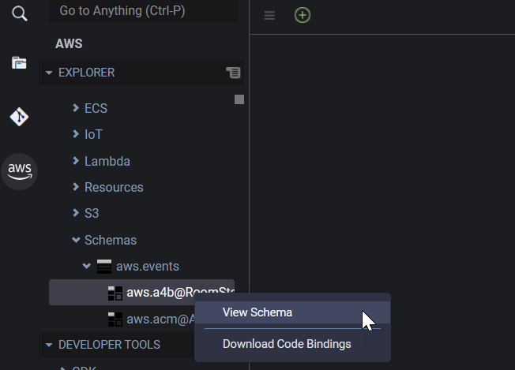

AWS Cloud9 is no longer available to new customers. Existing customers of
AWS Cloud9 can continue to use the service as normal.
[Learn more](https://aws.amazon.com/blogs/devops/how-to-migrate-from-aws-cloud9-to-aws-ide-toolkits-or-aws-cloudshell/ "https://aws.amazon.com/blogs/devops/how-to-migrate-from-aws-cloud9-to-aws-ide-toolkits-or-aws-cloudshell/")

# Working with Amazon EventBridge Schemas

You can use the AWS Toolkit for AWS Cloud9 to perform various operations on [Amazon EventBridge schemas](../../../eventbridge/latest/userguide/eventbridge-schemas.md "../../../eventbridge/latest/userguide/eventbridge-schemas.md").

## Prerequisites

The EventBridge schema that you want to work with must be available in your
AWS account. If it isn't available, create or upload the schema. For more information,
see [Amazon EventBridge Schemas](../../../eventbridge/latest/userguide/eventbridge-schemas.md "../../../eventbridge/latest/userguide/eventbridge-schemas.md") in the
[Amazon EventBridge User Guide](../../../eventbridge/latest/userguide.md "../../../eventbridge/latest/userguide.md").

## View an available Schema

1. In the **AWS Explorer**, expand
   **Schemas**.
2. Expand the name of the registry that contains the schema that you want to
   view. For example, many of the schemas that AWS supplies are in the
   **aws.events** registry.
3. To view a schema in the editor, open the context (right-click) menu for the
   schema, and then choose **View Schema**.

## Find an available Schema

In the **AWS Explorer**, do one or more of the following:

- Start entering the title of the schema that you want to find. The
  **AWS Explorer** highlights the schema titles that
  contain a match. (A registry must be expanded for you to see the highlighted
  titles.)

- Open the context (right-click) menu for **Schemas**, and then
  choose **Search Schemas**. Or, expand
  **Schemas**, open the context (right-click) menu for the
  registry that contains the schema that you want to find, and then choose
  **Search Schemas in Registry**. In the **EventBridge
  Schemas Search** dialog box, start entering the title of the schema
  that you want to find. The dialog box displays the schema titles that contain a
  match.

To display the schema in the dialog box, select the title of the
schema.

## Generate code for an available

Schema

1. In the **AWS Explorer**, expand
   **Schemas**.
2. Expand the name of the registry that contains the Schema that you want to
   generate code for.
3. Open the context (right-click) menu for the title of the Schema, and then
   choose **Download code bindings**.
4. In the resulting wizard pages, choose the following:
   - The **Version** of the schema
   - The code binding language
   - The workspace folder where you want to store the generated code on
     your local development machine
