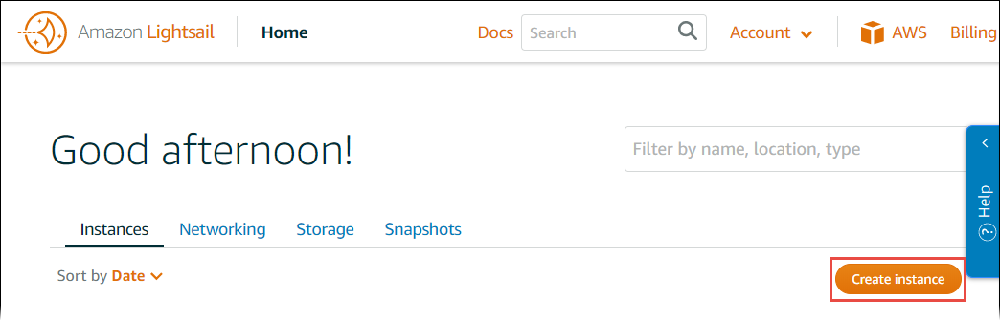
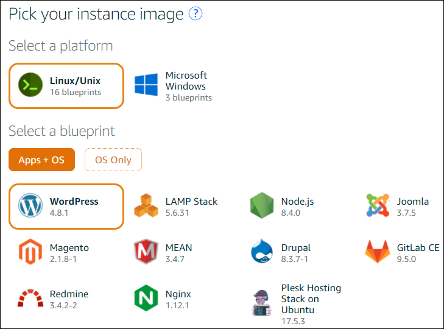
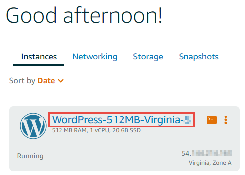
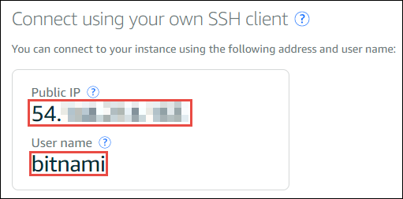
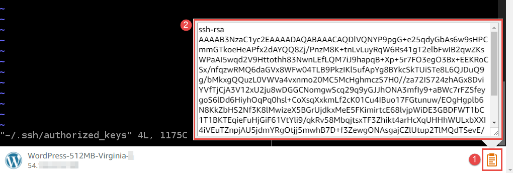

AWS Cloud9 is no longer available to new customers. Existing customers of
AWS Cloud9 can continue to use the service as normal.
[Learn more](https://aws.amazon.com/blogs/devops/how-to-migrate-from-aws-cloud9-to-aws-ide-toolkits-or-aws-cloudshell/ "https://aws.amazon.com/blogs/devops/how-to-migrate-from-aws-cloud9-to-aws-ide-toolkits-or-aws-cloudshell/")

# Working with Amazon Lightsail instances in the

AWS Cloud9 IDE

You can use the AWS Cloud9 IDE to work with code on Amazon Lightsail instances that are
preconfigured with popular applications and frameworks. They include WordPress,
LAMP (Linux, Apache, MySQL, and
PHP), Node.js, NGINX, Drupal,
and Joomla. Linux distributions are included such as Amazon Linux,
Ubuntu, Debian, FreeBSD, and
openSUSE.

Lightsail provide a convenient, quick setup virtual private server solution. Lightsail
provides compute, storage, and networking capacity and the ability to deploy and manage
websites and web applications in the cloud. You can use Lightsail to launch your project
quicklyfor a low, predictable monthly price. For more information, see [Amazon Lightsail Features](https://amazonlightsail.com/features/ "https://amazonlightsail.com/features/").

In this topic, you create and set up a Linux-based Lightsail instance that's compatible
with AWS Cloud9. You then create and connect an AWS Cloud9 SSH development environment to the Lightsail instance.

###### Note

Completing these procedures might result in charges to your AWS account. These include
possible charges for services such as Lightsail. For more information, see [Amazon Lightsail Pricing](https://aws.amazon.com/lightsail/pricing/ "https://aws.amazon.com/lightsail/pricing/").

To use the AWS Cloud9 IDE to work with an Amazon EC2 instance running Amazon Linux or Ubuntu
Server that contains no sample code, see [Getting started: basic
tutorials](tutorials-basic.md "tutorials-basic.md").

- [Step 1: Create a Linux-Based Lightsail Instance](#lightsail-instances-create "#lightsail-instances-create")
- [Step 2: Set up the Instance to Use It with AWS Cloud9](#lightsail-instances-setup "#lightsail-instances-setup")
- [Step 3: Create and Connect to an AWS Cloud9

SSH Development Environment](#lightsail-instances-environment "#lightsail-instances-environment")

- [Step 4: Use the AWS Cloud9

IDE to Change the Code on the Instance](#lightsail-instances-change-code "#lightsail-instances-change-code")

## Step 1: Create a Linux-based Lightsail

instance

In this step, you use the Lightsail console to create an Amazon EC2 instance that runs an
app in a Linux-based distribution. This instance automatically includes the
following:

- A public and private IP address. (You can create a static public IP later.)
- Access to the instance using SSH over port 22, HTTP over port 80, and HTTPS over
  port 443. (You can change these settings.)
- A block storage disk. (You can attach additional disks later.)
- Built-in system reporting.

On the Lightsail console, you can back up, reboot, stop, or delete the instance
later.

1. Open and then sign in to the Lightsail console, at [https://lightsail.aws.amazon.com](https://lightsail.aws.amazon.com "https://lightsail.aws.amazon.com").

We recommend you sign in using credentials for an IAM administrator user in your
AWS account. If you can't sign in as an IAM administrator user, check with your
AWS account administrator. 2. If prompted, choose the language to use in the console, and then choose **Save**. 3. If prompted, choose **Let's get started**. 4. On the home page, with the **Instances** tab already selected, choose **Create instance**.

 5. For **Instance location**, make sure that the location is an
AWS Region AWS Cloud9 is available that you want to create the instance in. For more
information, see [AWS Cloud9](../../../general/latest/gr/rande.md#cloud9_region "../../../general/latest/gr/rande.md#cloud9_region") in
the _Amazon Web Services General Reference_. To change the AWS Region, Availability
Zone, or both, choose **Change AWS Region and Availability Zone**,
and then follow the onscreen instructions. 6. For **Pick your instance image**, with **Linux/Unix** already chosen for **Select a platform**, and
**Apps + OS** already chosen for **Select a blueprint**, choose a blueprint.



###### Note

If you want to create an instance with no app, choose **OS Only** instead of **Apps + OS**, and then choose a distribution.

To learn about the available choices, see [Choosing an Amazon Lightsail instance image](https://lightsail.aws.amazon.com/ls/docs/getting-started/article/compare-options-choose-lightsail-instance-image "https://lightsail.aws.amazon.com/ls/docs/getting-started/article/compare-options-choose-lightsail-instance-image") on the Lightsail website. 7. For **Choose your instance plan**, choose a plan, or leave the selected default plan. 8. For **Name your instance**, enter a name for the instance, or
leave the suggested default name. 9. For the number of instances, enter the number of instances you want to create, or
leave the default of a single instance (**x 1**). 10. Choose **Create**.

## Step 2: Set up the instance to use it with AWS Cloud9

In this step, you connect to the running instance and then set it up so that AWS Cloud9 can use it later.

###### Note

The following instructions assume you chose **Apps + OS** in the previous step. If you chose **OS Only** and a distribution other than
**Ubuntu** instead, you might need to adapt the following instructions accordingly.

1. With the Lightsail console still open from the previous step, on the **Instances** tab, in the card for the instance, choose the instance's name.

 2. On the **Connect** tab, for **Connect using your own SSH
client**, note the **Public IP** and **User
name** values, as you need them later.

 3. Choose **Connect using SSH**. 4. Make sure that the instance has the latest system updates. To do this, in the
terminal session that appears, run the command **`sudo apt update`**. 5. Check to see if Python is installed, and if it is, check to be sure
the version is 2.7. To check the version, run the command **`python --version`**, and note the version number that appears. If no version number appears,
or if the version isn't 2.7, install Python 2.7 on the instance by
running the command **`sudo apt install -y python-minimal`**. 6. Check to see if Node.js is installed, and if it is, check that the
version is 0.6.16 or later. To check the version, run the command **`node --version`**, and note the version number that appears. If no version number appears,
or the version isn't 0.6.16 or later, we recommend you use Node Version
Manager (nvm) to install Node.js on the instance.

To do this, run the following commands one at a time, in the following order, to
update the instance, install Node Version Manager (nvm) on the
instance, activate nvm on the instance, and then install the latest version of
Node.js on the instance.

```
sudo apt update
curl -o- https://raw.githubusercontent.com/creationix/nvm/v0.33.0/install.sh | bash
. ~/.bashrc
nvm install node
```

7. Run the command **`which node`**, and note
   the value that appears. You will need it later.

###### Note

If the output of the command **`which node`** is something like `/usr/sbin/node`, AWS Cloud9 can't find
Node.js in that path. Instead, use `nvm` to install
Node.js, as described in the previous step in this procedure.
Then, run the command `which node` again and note the new value that
appears. 8. [Download and run the AWS Cloud9 Installer](installer.md#installer-download-run "installer.md#installer-download-run") on the instance.

## Step 3: Create and connect to an

AWS Cloud9 SSH Development Environment

In this step, you use the AWS Cloud9 console and the instance's terminal to create an SSH environment and then connect the environment to the running instance.

1. With the terminal session still open from the previous step, sign in to the AWS Cloud9 console, as follows:
   - If you're the only individual using your AWS account or you're an
     IAM user in a single AWS account, go to [https://console.aws.amazon.com/cloud9/](https://console.aws.amazon.com/cloud9/ "https://console.aws.amazon.com/cloud9/").
   - If your organization uses AWS IAM Identity Center, see your AWS account administrator
     for sign-in instructions.

###### Note

For this step, you will work with two different AWS services at the same
time. Now, suppose that you signed in to the Lightsail console as an IAM
administrator user, but you want a different entity to own the new SSH environment. For
this case, we suggest opening a different web browser and signing in to the AWS Cloud9
console as that entity. 2. In the AWS Cloud9 console, choose the AWS Region that matches the one you created the
instance in frameworks.

 3. If a welcome page is displayed, for **New AWS Cloud9 environment**, choose **Create environment**.
Otherwise, choose **Create environment**.


Or:

 4. On the **Name environment** page, for **Name**,
enter a name for your environment. 5. Add a description to your environment in the **Description**
field. 6. For **Environment type** choose **Existing
compute**. This is important as you need to select this option to display
the **User** and **Host** options. 7. For **User**, enter the **User name** value that
you noted earlier. 8. For **Host**, enter the **Public IP** value that
you noted earlier. 9. For **Port**, leave the default value of **22**. 10. Expand **Additional details**. 11. For **Environment path**, enter the path that AWS Cloud9 starts from
after login, which is `~/`. This is the root of the user's home
directory. 12. For **Node.js binary path**, enter the value of the command
**`which node`** that you noted
earlier. 13. Leave **SSH jump host** blank. 14. Store the public SSH key that AWS Cloud9 creates for this environment in your system clipboard. To do this, choose **Copy key to clipboard**.

###### Note

To see the public SSH key value that was copied, expand **View public SSH key**. 15. Save the public SSH key value you just copied to the instance. To do this, use
vi, a popular text editor, which is already installed on the
instance:

    1. In the terminal session for the instance, run the command **`vi ~/.ssh/authorized_keys`**.
    2. In the vi editor that appears, go to the end of the file, and
     switch to insert mode. To do this, press
     `I`,
     then `A`. (**-- INSERT --** appears at the bottom
     of the vi editor.)
    3. Add two carriage returns to the end of the file by pressing `Enter` twice.
    4. Paste the contents of your system clipboard, which contains the public SSH key value you just copied, to the terminal session clipboard. To do this,
    in the bottom corner of the terminal session window, choose the clipboard button, then paste the contents of your system clipboard into the box.


    
    5. Paste the contents of the terminal session clipboard into the vi editor. To do this, at the insertion point in the vi editor, press `Ctrl + Shift + V`.
    6. Save the file. To do this, press `Esc` to enter command mode.
     (**-- INSERT --** disappears from the bottom of the vi
     editor.) Type `:wq` (to `write` the file and then
     `quit` the vi editor), and then press
     `Enter`.

16. Back in the AWS Cloud9 console, choose **Next step**.
17. On the **Review choices** page, choose **Create environment**. Wait while AWS Cloud9 creates your environment and then displays the AWS Cloud9 IDE for the environment.
    This can take several minutes.

After AWS Cloud9 creates your environment, it displays the AWS Cloud9 IDE for the environment.

If AWS Cloud9 doesn't display the IDE after at least five minutes, there might be a problem with your web browser, your AWS access permissions, the instance, or the associated
virtual private cloud (VPC). For possible fixes, see
[Cannot Open an Environment](troubleshooting.md#troubleshooting-env-loading "troubleshooting.md#troubleshooting-env-loading") in _Troubleshooting_.

## Step 4: Use the AWS Cloud9 IDE to change the code on the

instance

Now that the IDE appears for the new environment, you can use the terminal session in the
IDE instead of the Lightsail terminal session. The IDE provides a rich code editing
experience with support for several programming languages and runtime debuggers. The IDE
also includes color themes, shortcut keybindings, programming language-specific syntax
coloring and code formatting.

To learn how to use the IDE, see [Tour
of
the AWS Cloud9 IDE](tour-ide.md "tour-ide.md").

To learn how to change the code on your instance, we recommend the following
resources:

- **All**
  [Getting the application password for your 'powered by Bitnami'
  Lightsail image](https://lightsail.aws.amazon.comls/docs/how-to/article/log-in-to-your-bitnami-application-running-on-amazon-lightsail "https://lightsail.aws.amazon.comls/docs/how-to/article/log-in-to-your-bitnami-application-running-on-amazon-lightsail") on the Lightsail website
- **Drupal**: [BitnamiDrupal For AWS Cloud](https://docs.bitnami.com/aws/apps/drupal/ "https://docs.bitnami.com/aws/apps/drupal/") on the Bitnami
  website, and [Tutorials and site
  recipes](https://www.drupal.org/node/627198 "https://www.drupal.org/node/627198") on the Drupal website
- **GitLab CE**: [BitnamiGitLab CE for AWS Cloud](https://docs.bitnami.com/aws/apps/gitlab/ "https://docs.bitnami.com/aws/apps/gitlab/") on the Bitnami
  website, and [GitLab
  Documentation](https://docs.gitlab.com/ce/ "https://docs.gitlab.com/ce/") on the GitLab website
- **Joomla**: [BitnamiJoomla! For AWS Cloud](https://docs.bitnami.com/aws/apps/joomla/ "https://docs.bitnami.com/aws/apps/joomla/") on the Bitnami
  website, and [Getting Started with Joomla!](https://www.joomla.org/about-joomla/getting-started.html "https://www.joomla.org/about-joomla/getting-started.html") on the Joomla!
  website
- **LAMP Stack**: [BitnamiLAMP for AWS Cloud](https://docs.bitnami.com/aws/infrastructure/lamp/ "https://docs.bitnami.com/aws/infrastructure/lamp/") on the Bitnami
  website
- **Magento**: [BitnamiMagento For AWS Cloud](https://docs.bitnami.com/aws/apps/magento/ "https://docs.bitnami.com/aws/apps/magento/") on the Bitnami
  website, and the [Magento User
  Guide](http://docs.magento.com/m1/ce/user_guide/getting-started.html "http://docs.magento.com/m1/ce/user_guide/getting-started.html") on the Magento website
- **MEAN**: [BitnamiMEAN For AWS Cloud](https://docs.bitnami.com/aws/infrastructure/mean/ "https://docs.bitnami.com/aws/infrastructure/mean/") on the Bitnami
  website
- **NGINX**: [BitnamiNGINX For AWS Cloud](https://docs.bitnami.com/aws/infrastructure/nginx/ "https://docs.bitnami.com/aws/infrastructure/nginx/") on the Bitnami
  website, and the [NGINX Wiki](https://www.nginx.com/resources/wiki/ "https://www.nginx.com/resources/wiki/") on the NGINX website
- **Node.js**: [BitnamiNode.Js For AWS Cloud](https://docs.bitnami.com/aws/infrastructure/nodejs/ "https://docs.bitnami.com/aws/infrastructure/nodejs/") on the Bitnami
  website, and the [Getting Started
  Guide](https://nodejs.org/en/docs/guides/getting-started-guide/ "https://nodejs.org/en/docs/guides/getting-started-guide/") on the Node.js website
- **Plesk Hosting Stack on
  Ubuntu**: [Set up and configure
  Plesk on Amazon Lightsail](https://aws.amazon.com/getting-started/hands-on/plesk-on-aws/ "https://aws.amazon.com/getting-started/hands-on/plesk-on-aws/").
- **Redmine**: [Bitnami Redmine
  For AWS Cloud](https://docs.bitnami.com/aws/apps/redmine/ "https://docs.bitnami.com/aws/apps/redmine/") on the Bitnami website, and [Getting
  Started](http://www.redmine.org/projects/redmine/wiki/Getting_Started "http://www.redmine.org/projects/redmine/wiki/Getting_Started") on the Redmine website
- **WordPress**: [Getting started using WordPress from your Amazon Lightsail
  instance](https://lightsail.aws.amazon.com/ls/docs/en_us/articles/amazon-lightsail-tutorial-launching-and-configuring-wordpress "https://lightsail.aws.amazon.com/ls/docs/en_us/articles/amazon-lightsail-tutorial-launching-and-configuring-wordpress") on the Lightsail website, and [Bitnami
  WordPress For AWS Cloud](https://docs.bitnami.com/aws/apps/wordpress/ "https://docs.bitnami.com/aws/apps/wordpress/") on the Bitnami
  website
