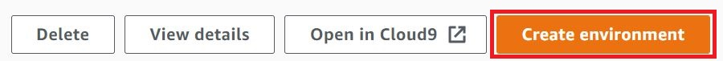

AWS Cloud9 is no longer available to new customers. Existing customers of
AWS Cloud9 can continue to use the service as normal.
[Learn more](https://aws.amazon.com/blogs/devops/how-to-migrate-from-aws-cloud9-to-aws-ide-toolkits-or-aws-cloudshell/ "https://aws.amazon.com/blogs/devops/how-to-migrate-from-aws-cloud9-to-aws-ide-toolkits-or-aws-cloudshell/")

# Opening an environment in AWS Cloud9

This procedure describes how to open an environment in AWS Cloud9.

###### Note

This procedure assumes that you already created an AWS Cloud9 development environment. To create an environment, see
[Creating an Environment](create-environment.md "create-environment.md").

1. Sign in to the AWS Cloud9 console as follows:
   - If you're the only one using your AWS account or you're an IAM user in a
     single AWS account, go to [https://console.aws.amazon.com/cloud9/](https://console.aws.amazon.com/cloud9/ "https://console.aws.amazon.com/cloud9/").
   - If your organization uses AWS IAM Identity Center, ask your AWS account administrator for
     sign-in instructions.

###### Important

If you [sign out of
your AWS account](https://aws.amazon.com/premiumsupport/knowledge-center/sign-out-account/ "https://aws.amazon.com/premiumsupport/knowledge-center/sign-out-account/"), the AWS Cloud9 IDE can still be accessed for up to 5 minutes
afterwards. Access is then denied when the required permissions expire. 2. In the top navigation bar, choose the AWS Region where the environment is located.

 3. In the list of environments, for the environment that you want to open, do one of the
following actions:

    * Inside of the card, choose the **Open in Cloud9** link.
    * Select the card, and then choose the **Open in Cloud9**
     button.

    

If your environment isn't displayed in the console, try doing one or more of the following
actions to have it be displayed.

- In the dropdown menu bar on the **Environments** page, choose one or
  more of the following.
  - Choose **My environments** to display all environments that your
    AWS entity owns within the selected AWS Region and AWS account.
  - Choose **Shared with me** to display all environments your
    AWS entity was invited to within the selected AWS Region and
    AWS account.
  - Choose **All account environments** to display all environments
    within the selected AWS Region and AWS account that your AWS entity has
    permissions to display.

- If you think you are a member of an environment, but the environment isn't displayed in the
  **Shared with you** list, check with the environment owner.
- In the top navigation bar, choose a different AWS Region.
