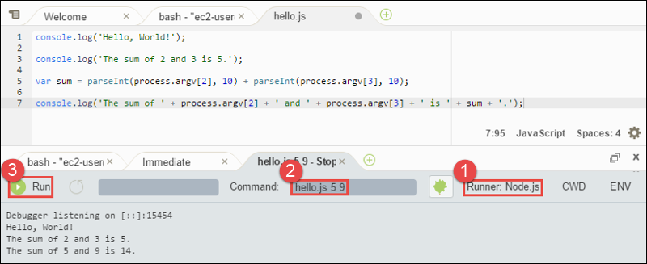

AWS Cloud9 is no longer available to new customers. Existing customers of
AWS Cloud9 can continue to use the service as normal.
[Learn more](https://aws.amazon.com/blogs/devops/how-to-migrate-from-aws-cloud9-to-aws-ide-toolkits-or-aws-cloudshell/ "https://aws.amazon.com/blogs/devops/how-to-migrate-from-aws-cloud9-to-aws-ide-toolkits-or-aws-cloudshell/")

# Node.js tutorial for AWS Cloud9

This tutorial enables you to run some Node.js scripts in an AWS Cloud9 development environment.

Following this tutorial and creating this sample might result in charges to your AWS account. These include possible
charges for services such as Amazon EC2 and Amazon S3. For more information, see [Amazon EC2 Pricing](https://aws.amazon.com/ec2/pricing/ "https://aws.amazon.com/ec2/pricing/") and [Amazon S3 Pricing](https://aws.amazon.com/s3/pricing/ "https://aws.amazon.com/s3/pricing/").

###### Topics

- [Prerequisites](#sample-nodejs-prereqs "#sample-nodejs-prereqs")
- [Step 1: Install required tools](#sample-nodejs-install "#sample-nodejs-install")
- [Step 2: Add code](#sample-nodejs-code "#sample-nodejs-code")
- [Step 3: Run the code](#sample-nodejs-run "#sample-nodejs-run")
- [Step 4: Install and configure the AWS SDK for JavaScript in Node.js](#sample-nodejs-sdk "#sample-nodejs-sdk")
- [Step 5: Add AWS SDK code](#sample-nodejs-sdk-code "#sample-nodejs-sdk-code")
- [Step 6: Run the AWS SDK code](#sample-nodejs-sdk-run "#sample-nodejs-sdk-run")
- [Step 7: Clean up](#sample-nodejs-clean-up "#sample-nodejs-clean-up")

## Prerequisites

Before you use this sample, make sure that your setup meets the following
requirements:

- **You must have an existing AWS Cloud9 EC2 development environment.** This sample
  assumes that you already have an EC2 environment that's connected to an Amazon EC2 instance that
  runs Amazon Linux or Ubuntu Server. If you have a different type of environment or
  operating system, you might need to adapt this sample's instructions to set up related
  tools. For more information, see [Creating an environment in AWS Cloud9](create-environment.md "create-environment.md").
- **You have the AWS Cloud9 IDE for the existing environment already
  open.** When you open an environment, AWS Cloud9 opens the IDE for that environment in your
  web browser. For more information, see [Opening an environment in AWS Cloud9](open-environment.md "open-environment.md").

## Step 1: Install required tools

In this step, you install Node.js, which is required to run this sample.

1. In a terminal session in the AWS Cloud9 IDE, confirm whether Node.js is already
   installed by running the **`node --version`** command. (To start a new terminal session, on the menu bar, choose
   **Window**, **New Terminal**.) If successful,
   the output contains the Node.js version number. If Node.js is installed, skip ahead
   to [Step 2: Add code](#sample-nodejs-code "#sample-nodejs-code").
2. Run the **`yum update`** for (Amazon Linux) or **`apt update`** for (Ubuntu Server) command to help ensure the latest security updates
   and bug fixes are installed.

For Amazon Linux:

```
sudo yum -y update
```

For Ubuntu Server:

```
sudo apt update
```

3. To install Node.js, begin by running this command to download Node Version Manager
   (nvm). (nvm is a simple Bash shell script that is useful for installing and managing
   Node.js versions. For more information, see [Node Version
   Manager](https://github.com/creationix/nvm/blob/master/README.md "https://github.com/creationix/nvm/blob/master/README.md") on the GitHub website.)

```
curl -o- https://raw.githubusercontent.com/nvm-sh/nvm/v0.39.5/install.sh | bash
```

4. To start using nvm, either close the terminal session and start it again, or
   source the `~/.bashrc` file that contains the commands to load
   nvm.

```
. ~/.bashrc
```

5. Run this command to install Node.js 16 on Amazon Linux 2, Amazon Linux 1 and Ubuntu 18.04. Amazon Linux 1 and Ubuntu 18.04 instances
   only support Node.js up to v16.

```
nvm install 16
```

Run this command to install the latest version of Node.js on Amazon Linux 2023 and Ubuntu
22.04:

```
nvm install --lts && nvm alias default lts/*
```

###### Note

The latest AL2023 AWS Cloud9 image has Node.js 20 installed, and the latest
Amazon Linux 2 AWS Cloud9 image has Node.js 18 installed. If you want to install Node.js 18 on
Amazon Linux 2 AWS Cloud9 manually, run the following command in the AWS Cloud9 IDE terminal:

```
C9_NODE_INSTALL_DIR=~/.nvm/versions/node/v18.17.1
C9_NODE_URL=https://d3kgj69l4ph6w4.cloudfront.net/static/node-amazon/node-v18.17.1-linux-x64.tar.gz
mkdir -p $C9_NODE_INSTALL_DIR
curl -fSsl $C9_NODE_URL  | tar xz --strip-components=1 -C "$C9_NODE_INSTALL_DIR"
nvm alias default v18.17.1
nvm use default
echo -e 'nvm use default' >> ~/.bash_profile
```

## Step 2: Add code

In the AWS Cloud9 IDE, create a file with this content, and save the file with the name
`hello.js`. (To create a file, on the menu bar, choose
**File**, **New File**. To save the file, choose
**File**, **Save**.)

```
console.log('Hello, World!');

console.log('The sum of 2 and 3 is 5.');

var sum = parseInt(process.argv[2], 10) + parseInt(process.argv[3], 10);

console.log('The sum of ' + process.argv[2] + ' and ' +
  process.argv[3] + ' is ' + sum + '.');
```

## Step 3: Run the code

1. In the AWS Cloud9 IDE, on the menu bar, choose **Run**, **Run
   Configurations**, **New Run Configuration**.
2. On the **[New] - Idle** tab, choose **Runner:
   Auto**, and then choose **Node.js**.
3. For **Command**, type `hello.js 5 9`. In the code,
   `5` represents `process.argv[2]`, and `9`
   represents `process.argv[3]`. (`process.argv[0]` represents the
   name of the runtime (`node`), and `process.argv[1]` represents
   the name of the file (`hello.js`).)
4. Choose the **Run** button, and compare your output.

```
Hello, World!
The sum of 2 and 3 is 5.
The sum of 5 and 9 is 14.
```



## Step 4: Install and configure the AWS SDK for JavaScript in Node.js

When running Node.js scripts in AWS Cloud9, you can choose between AWS SDK for
JavaScript version 3 (V3) and the older AWS SDK for JavaScript version 2 (V2). As with V2,
V3 enables you to easily work with Amazon Web Services, but has been written in TypeScript
and adds several frequently requested features, such as modularized packages.

AWS SDK for JavaScript (V3)
You can enhance this sample to use the AWS SDK for JavaScript in Node.js to create an Amazon S3 bucket,
list your available buckets, and then delete the bucket you just created.

In this step, you install and configure the Amazon S3 service client module of the
AWS SDK for JavaScript in Node.js, which provides a convenient way to interact with the Amazon S3 AWS
service, from your JavaScript code.

If you want to use other AWS services, you need to install them separately.
For more information on installing AWS modules, see [in the _AWS Developer Guide (V3)_.](../../../sdk-for-javascript/v3/developer-guide/working-with-services.md "../../../sdk-for-javascript/v3/developer-guide/working-with-services.md") For
information on how to get started with Node.js and AWS SDK for JavaScript (V3),
see [Get started with Node.js](../../../sdk-for-javascript/v3/developer-guide/getting-started-nodejs.md#getting-started-nodejs-setup-structure "../../../sdk-for-javascript/v3/developer-guide/getting-started-nodejs.md#getting-started-nodejs-setup-structure") in the _AWS SDK for JavaScript
Developers Guide (V3)_.

After you install the AWS SDK for JavaScript in Node.js, you must set up credentials management in
your environment. The AWS SDK for JavaScript in Node.js needs these credentials to interact with AWS
services.

**To install the AWS SDK for JavaScript in
Node.js**

Use npm to run the **`install`**
command.

```
npm install @aws-sdk/client-s3

```

For more information, see [Installing the SDK for JavaScript](../../../sdk-for-javascript/v3/developer-guide/setting-up.md#installing-jssdk "../../../sdk-for-javascript/v3/developer-guide/setting-up.md#installing-jssdk") in the
_AWS SDK for JavaScript Developer Guide_.

**To set up credentials management in your
environment**

Each time you use the AWS SDK for JavaScript in Node.js to call an AWS service, you must provide a
set of credentials with the call. These credentials determine whether the
AWS SDK for JavaScript in Node.js has the appropriate permissions to make that call. If the credentials
do not cover the appropriate permissions, the call will fail.

In this step, you store your credentials within the environment. To do this, follow
the instructions in [Calling AWS services from an environment in AWS Cloud9](credentials.md "credentials.md"), and
then return to this topic.

For additional information, see [Setting Credentials in
Node.js](../../../sdk-for-javascript/latest/developer-guide/setting-credentials-node.md "../../../sdk-for-javascript/latest/developer-guide/setting-credentials-node.md") in the _AWS SDK for JavaScript Developer Guide_.

AWS SDK for JavaScript (V2)
You can enhance this sample to use the AWS SDK for JavaScript in Node.js to create an Amazon S3 bucket,
list your available buckets, and then delete the bucket you just created.

In this step, you install and configure the AWS SDK for JavaScript in Node.js, which provides a
convenient way to interact with AWS services such as Amazon S3, from your JavaScript
code. After you install the AWS SDK for JavaScript in Node.js, you must set up credentials management in
your environment. The AWS SDK for JavaScript in Node.js needs these credentials to interact with AWS
services.

**To install the AWS SDK for JavaScript in
Node.js**

Use npm to run the **`install`**
command.

```
npm install aws-sdk

```

For more information, see [Installing the SDK for JavaScript](../../../sdk-for-javascript/latest/developer-guide/installing-jssdk.md "../../../sdk-for-javascript/latest/developer-guide/installing-jssdk.md") in the
_AWS SDK for JavaScript Developer Guide_.

**To set up credentials management in your
environment**

Each time you use the AWS SDK for JavaScript in Node.js to call an AWS service, you must provide a
set of credentials with the call. These credentials determine whether the
AWS SDK for JavaScript in Node.js has the appropriate permissions to make that call. If the credentials
do not cover the appropriate permissions, the call will fail.

In this step, you store your credentials within the environment. To do this, follow
the instructions in [Calling AWS services from an environment in AWS Cloud9](credentials.md "credentials.md"), and
then return to this topic.

For additional information, see [Setting Credentials in
Node.js](../../../sdk-for-javascript/latest/developer-guide/setting-credentials-node.md "../../../sdk-for-javascript/latest/developer-guide/setting-credentials-node.md") in the _AWS SDK for JavaScript Developer Guide_.

## Step 5: Add AWS SDK code

AWS SDK for JavaScript (V3)
In this step, you add some more code, this time to interact with Amazon S3 to create
a bucket, list your available buckets, and then delete the bucket you just
created. You will run this code later.

In the AWS Cloud9 IDE, create a file with this content, and save the file with the
name `s3.js`.

```
import {
  CreateBucketCommand,
  DeleteBucketCommand,
  ListBucketsCommand,
  S3Client,
} from "@aws-sdk/client-s3";

const wait = async (milliseconds) => {
  return new Promise((resolve) => setTimeout(resolve, milliseconds));
};

export const main = async () => {
  const client = new S3Client({});
  const now = Date.now();
  const BUCKET_NAME = `easy-bucket-${now.toString()}`;

  const createBucketCommand = new CreateBucketCommand({ Bucket: BUCKET_NAME });
  const listBucketsCommand = new ListBucketsCommand({});
  const deleteBucketCommand = new DeleteBucketCommand({ Bucket: BUCKET_NAME });

  try {
    console.log(`Creating bucket ${BUCKET_NAME}.`);
    await client.send(createBucketCommand);
    console.log(`${BUCKET_NAME} created`);

    await wait(2000);

    console.log(`Here are your buckets:`);
    const { Buckets } = await client.send(listBucketsCommand);
    Buckets.forEach((bucket) => {
      console.log(` • ${bucket.Name}`);
    });

    await wait(2000);

    console.log(`Deleting bucket ${BUCKET_NAME}.`);
    await client.send(deleteBucketCommand);
    console.log(`${BUCKET_NAME} deleted`);
  } catch (err) {
    console.error(err);
  }
};

main();

```

AWS SDK for JavaScript (V2)
In this step, you add some more code, this time to interact with Amazon S3 to create
a bucket, list your available buckets, and then delete the bucket you just
created. You will run this code later.

In the AWS Cloud9 IDE, create a file with this content, and save the file with the
name `s3.js`.

```

if (process.argv.length < 4) {
  console.log(
    "Usage: node s3.js <the bucket name> <the AWS Region to use>\n" +
      "Example: node s3.js my-test-bucket us-east-2"
  );
  process.exit(1);
}

var AWS = require("aws-sdk"); // To set the AWS credentials and region.
var async = require("async"); // To call AWS operations asynchronously.

AWS.config.update({
  region: region,
});

var s3 = new AWS.S3({ apiVersion: "2006-03-01" });
var bucket_name = process.argv[2];
var region = process.argv[3];

var create_bucket_params = {
  Bucket: bucket_name,
  CreateBucketConfiguration: {
    LocationConstraint: region,
  },
};

var delete_bucket_params = { Bucket: bucket_name };

// List all of your available buckets in this AWS Region.
function listMyBuckets(callback) {
  s3.listBuckets(function (err, data) {
    if (err) {
    } else {
      console.log("My buckets now are:\n");

      for (var i = 0; i < data.Buckets.length; i++) {
        console.log(data.Buckets[i].Name);
      }
    }

    callback(err);
  });
}

// Create a bucket in this AWS Region.
function createMyBucket(callback) {
  console.log("\nCreating a bucket named " + bucket_name + "...\n");

  s3.createBucket(create_bucket_params, function (err, data) {
    if (err) {
      console.log(err.code + ": " + err.message);
    }

    callback(err);
  });
}

// Delete the bucket you just created.
function deleteMyBucket(callback) {
  console.log("\nDeleting the bucket named " + bucket_name + "...\n");

  s3.deleteBucket(delete_bucket_params, function (err, data) {
    if (err) {
      console.log(err.code + ": " + err.message);
    }

    callback(err);
  });
}

// Call the AWS operations in the following order.
async.series([
  listMyBuckets,
  createMyBucket,
  listMyBuckets,
  deleteMyBucket,
  listMyBuckets,
]);

```

## Step 6: Run the AWS SDK code

1. Enable the code to call Amazon S3 operations asynchronously by using npm to run the
   **`install`** command.

```
npm install async
```

2. In the AWS Cloud9 IDE, on the menu bar, choose **Run**, **Run
   Configurations**, **New Run Configuration**.
3. On the **[New] - Idle** tab, choose **Runner:
   Auto**, and then choose **Node.js**.
4. If you are using AWS SDK for JavaScript (V3), for **Command** type `s3.js`. If you are using AWS SDK for Javascript (v2), for **Command** type
   `s3.js my-test-bucket us-east-2`, where `my-test-bucket` is the name of the bucket you want to create and then delete, and `us-east-2`
   is the ID of the AWS Region you want to create the bucket in. For more IDs, see [Amazon Simple Storage Service
   (Amazon S3)](../../../general/latest/gr/rande.md#s3_region "../../../general/latest/gr/rande.md#s3_region") in the _Amazon Web Services General Reference_.

###### Note

Amazon S3 bucket names must be unique across AWS—not just your AWS
account. 5. Choose the **Run** button, and compare your output.

```
My buckets now are:

Creating a new bucket named 'my-test-bucket'...

My buckets now are:

my-test-bucket

Deleting the bucket named 'my-test-bucket'...

My buckets now are:
```

## Step 7: Clean up

To prevent ongoing charges to your AWS account after you're done using this sample,
you should delete the environment. For instructions, see [Deleting an environment in AWS Cloud9](delete-environment.md "delete-environment.md").
