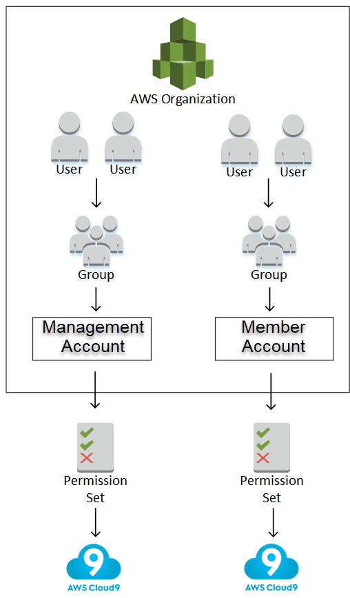

AWS Cloud9 is no longer available to new customers. Existing customers of
AWS Cloud9 can continue to use the service as normal.
[Learn more](https://aws.amazon.com/blogs/devops/how-to-migrate-from-aws-cloud9-to-aws-ide-toolkits-or-aws-cloudshell/ "https://aws.amazon.com/blogs/devops/how-to-migrate-from-aws-cloud9-to-aws-ide-toolkits-or-aws-cloudshell/")

# Enterprise setup for AWS Cloud9

This topic explains how to use [AWS IAM Identity Center](https://aws.amazon.com/iam/identity-center/ "https://aws.amazon.com/iam/identity-center/") to enable one or more AWS accounts to use AWS Cloud9 within an enterprise.
To set up to use AWS Cloud9 for any other usage pattern, see [Setting up AWS Cloud9](setting-up.md "setting-up.md") for the correct instructions.

###### Warning

To avoid security risks, don't use IAM users for authentication when developing purpose-built software
or working with real data. Instead, use federation with an identity provider such as
[AWS IAM Identity Center](../../../singlesignon/latest/userguide/what-is.md "../../../singlesignon/latest/userguide/what-is.md").

These instructions assume that you have or will have administrative access to the
organization in AWS Organizations. If you don't already have administrative access to the organization
in AWS Organizations, see your AWS account administrator. For more information, see the following
resources:

- [Managing access permissions for your AWS Organization](../../../organizations/latest/userguide/orgs_permissions_overview.md "../../../organizations/latest/userguide/orgs_permissions_overview.md") in the
  _AWS Organizations User Guide_ (IAM Identity Center requires the use of
  AWS Organizations)
- [Overview of managing access permissions to your IAM Identity Center Resources](../../../singlesignon/latest/userguide/iam-auth-access-overview.md "../../../singlesignon/latest/userguide/iam-auth-access-overview.md") in the
  _AWS IAM Identity Center User Guide_
- [Using](../../../controltower/latest/userguide/what-is-control-tower.md "../../../controltower/latest/userguide/what-is-control-tower.md") AWS Control Tower, which is a service that you can use to set up and govern
  an AWS multi-account environment. AWS Control Tower engages the capabilities of other
  AWS services, including AWS Organizations, AWS Service Catalog and AWS IAM Identity Center, to build a landing zone in
  less than an hour.
  For introductory information that's related to this topic, see the following
  resources:

- [What
  is AWS Organizations](../../../organizations/latest/userguide/orgs_introduction.md "../../../organizations/latest/userguide/orgs_introduction.md") in the _AWS Organizations User Guide_ (IAM Identity Center
  requires the use of AWS Organizations)
- [What is AWS IAM Identity Center](../../../singlesignon/latest/userguide/what-is.md "../../../singlesignon/latest/userguide/what-is.md") in the _AWS IAM Identity Center User Guide_
- [Getting started with AWS Control Tower](../../../controltower/latest/userguide/getting-started-with-control-tower.md "../../../controltower/latest/userguide/getting-started-with-control-tower.md") in the _AWS Control Tower
  User Guide_
- The 4-minute video [AWS
  Knowledge Center Videos: How do I get started with AWS Organizations](https://www.youtube.com/watch?v=mScBPL8VV48 "https://www.youtube.com/watch?v=mScBPL8VV48") on
  YouTube
- The 7-minute video [Manage
  user access to multiple AWS accounts using AWS IAM Identity Center](https://www.youtube.com/watch?v=bXrsUEI1V38 "https://www.youtube.com/watch?v=bXrsUEI1V38") on YouTube
- The 9-minute video [How to
  set up AWS Single Sign On for your on-premise Active Directory users](https://www.youtube.com/watch?v=nuPjljOVZmU "https://www.youtube.com/watch?v=nuPjljOVZmU") on
  YouTube
  The following conceptual diagram shows what you end up with.

To enable one or more AWS account to start using AWS Cloud9 within an enterprise, follow the
steps according to the AWS resources that you already have.

| **Do you have an AWS account that can or does serve as the management account for the organization in AWS Organizations?** | **Do you have an organization in AWS Organizations for that management account?** | **Are all of the wanted AWS accounts members of that organization?** | **Is that organization set up to use IAM Identity Center?** | **Is that organization set up with all of the wanted groups and users who want to use AWS Cloud9?** | **Start with this step**                                                                                                                                      |
| ----------------------------------------------------------------------------------------------------------------------------- | ------------------------------------------------------------------------------------ | ----------------------------------------------------------------------- | ----------------------------------------------------------- | ------------------------------------------------------------------------------------------------------ | ------------------------------------------------------------------------------------------------------------------------------------------------------------- |
| No                                                                                                                            | —                                                                                    | —                                                                       | —                                                           | —                                                                                                      | [Step 1: Create a management account for the organization](#setup-enterprise-create-account "#setup-enterprise-create-account")                            |
| Yes                                                                                                                           | No                                                                                   | —                                                                       | —                                                           | —                                                                                                      | [Step 2: Create an organization for the management account](#setup-enterprise-create-organization "#setup-enterprise-create-organization")                 |
| Yes                                                                                                                           | Yes                                                                                  | No                                                                      | —                                                           | —                                                                                                      | [Step 3: Add member accounts to the organization](#setup-enterprise-add-to-organization "#setup-enterprise-add-to-organization")                           |
| Yes                                                                                                                           | Yes                                                                                  | Yes                                                                     | No                                                          | —                                                                                                      | [Step 4: Enable IAM Identity Center across the organization](#setup-enterprise-set-up-sso "#setup-enterprise-set-up-sso")                                  |
| Yes                                                                                                                           | Yes                                                                                  | Yes                                                                     | Yes                                                         | No                                                                                                     | [Step 5. Set up groups and users within the organization](#setup-enterprise-set-up-groups-users "#setup-enterprise-set-up-groups-users")                   |
| Yes                                                                                                                           | Yes                                                                                  | Yes                                                                     | Yes                                                         | Yes                                                                                                    | [Step 6. Enable groups and users within the organization to use AWS Cloud9](#setup-enterprise-groups-users-access "#setup-enterprise-groups-users-access") |

## Step 1: Create a management account for

the organization

###### Note

Your enterprise might already have a management account set up for you. If your
enterprise has an AWS account administrator, check with that person before starting
the following procedure. If you already have a management account, skip ahead to [Step 2: Create an Organization for the
management account](#setup-enterprise-create-organization "#setup-enterprise-create-organization").

To use AWS IAM Identity Center (IAM Identity Center), you must have an AWS account. Your AWS account serves as
the management account for an organization in AWS Organizations. For more information, see the
discussion about _management accounts_ in [AWS Organizations terminology and concepts](../../../organizations/latest/userguide/orgs_getting-started_concepts.md "../../../organizations/latest/userguide/orgs_getting-started_concepts.md") in the
_AWS Organizations User Guide_.

To watch a 4-minute video that's related to the following procedure, see [Creating an Amazon Web Services
account](https://www.youtube.com/watch?v=WviHsoz8yHk "https://www.youtube.com/watch?v=WviHsoz8yHk") on YouTube.

To create a management account:

1. Go to [https://aws.amazon.com/](https://aws.amazon.com/ "https://aws.amazon.com/").
2. Choose **Sign In to the Console**.
3. Choose **Create a new** AWS account.
4. Complete the process by following the on-screen directions. This includes giving
   AWS your email address and credit card information. You must also use your phone to
   enter a code that AWS gives you.

After you finish creating the account, AWS will send you a confirmation email. Do not
go to the next step until you get this confirmation.

## Step 2: Create an organization for

the management account

###### Note

Your enterprise might already have AWS Organizations set up to use the management account. If
your enterprise has an AWS account administrator, check with that person before
starting the following procedure. If you already have AWS Organizations set up to use the
management account, skip ahead to [Step 3: Add member accounts to the organization](#setup-enterprise-add-to-organization "#setup-enterprise-add-to-organization").

To use IAM Identity Center, you must have an organization in AWS Organizations that uses the management
account. For more information, see the discussion about _organizations_
in [AWS Organizations terminology and concepts](../../../organizations/latest/userguide/orgs_getting-started_concepts.md "../../../organizations/latest/userguide/orgs_getting-started_concepts.md") in the _AWS
Organizations User Guide_.

To create an organization in AWS Organizations for the management AWS account, follow these
instructions in the _AWS Organizations User Guide_:

1. [Creating an organization](../../../organizations/latest/userguide/orgs_manage_create.md "../../../organizations/latest/userguide/orgs_manage_create.md")
2. [Enabling all features in your organization](../../../organizations/latest/userguide/orgs_manage_org_support-all-features.md "../../../organizations/latest/userguide/orgs_manage_org_support-all-features.md")

To watch a 4-minute video related to these procedures, see [AWS Knowledge Center Videos: How do
I get started with AWS Organizations](https://www.youtube.com/watch?v=mScBPL8VV48 "https://www.youtube.com/watch?v=mScBPL8VV48") on YouTube.

## Step 3: Add member accounts to the

organization

###### Note

Your enterprise might already have AWS Organizations set up with the wanted member accounts.
If your enterprise has an AWS account administrator, check with that person before
starting the following procedure. If you already have AWS Organizations set up with the wanted
member accounts, skip ahead to [Step 4:
Enable IAM Identity Center across the organization](#setup-enterprise-set-up-sso "#setup-enterprise-set-up-sso").

In this step, you add any AWS accounts that will serve as member accounts for the
organization in AWS Organizations. For more information, see the discussion about _member
accounts_ in [AWS Organizations terminology and concepts](../../../organizations/latest/userguide/orgs_getting-started_concepts.md "../../../organizations/latest/userguide/orgs_getting-started_concepts.md") in the
_AWS Organizations User Guide_.

###### Note

You don't have to add any member accounts to the organization. You can use IAM Identity Center with
just the single management account in the organization. Later, you can add member
accounts to the organization, if you want. If you don't want to add any member accounts
now, skip ahead to [Step 4: Enable IAM Identity Center
across the organization](#setup-enterprise-set-up-sso "#setup-enterprise-set-up-sso").

To add member accounts to the organization in AWS Organizations, follow one or both of the
following sets of instructions in the _AWS Organizations User Guide_. Repeat these
instructions as many times as needed until you have all of the AWS accounts that you want
as members of the organization:

- [Creating an AWS account in your organization](../../../organizations/latest/userguide/orgs_manage_accounts_create.md "../../../organizations/latest/userguide/orgs_manage_accounts_create.md")
- [Inviting an AWS account to join your organization](../../../organizations/latest/userguide/orgs_manage_accounts_invites.md "../../../organizations/latest/userguide/orgs_manage_accounts_invites.md")

## Step 4: Enable IAM Identity Center across the

organization

###### Note

Your enterprise might already have AWS Organizations set up to use IAM Identity Center. If your enterprise
has an AWS account administrator, check with that person before starting the following
procedure. If you already have AWS Organizations set up to use IAM Identity Center, skip ahead to [Step 5. Set up groups and users within
the organization](#setup-enterprise-set-up-groups-users "#setup-enterprise-set-up-groups-users").

In this step, you enable the organization in AWS Organizations to use IAM Identity Center. To do this, follow
these sets of instructions in the _AWS IAM Identity Center User
Guide_:

1. [IAM Identity Center
   prerequisites](../../../singlesignon/latest/userguide/get-started-prereqs-considerations.md "../../../singlesignon/latest/userguide/get-started-prereqs-considerations.md")
2. [Enable IAM Identity Center](../../../singlesignon/latest/userguide/get-set-up-for-idc.md "../../../singlesignon/latest/userguide/get-set-up-for-idc.md")

## Step 5. Set up groups and users

within the organization

###### Note

Your enterprise might already have AWS Organizations set up with groups and users from either
an IAM Identity Center directory or an AWS Managed Microsoft AD or AD Connector directory that's managed in
AWS Directory Service. If your enterprise has an AWS account administrator, check with that person
before starting the following procedure. If you already have AWS Organizations set up with groups
and users from either an IAM Identity Center directory or AWS Directory Service, skip ahead to [Step 6. Enable groups and users within
the organization to use AWS Cloud9](#setup-enterprise-groups-users-access "#setup-enterprise-groups-users-access").

In this step, either you create groups and users in an IAM Identity Center directory for the
organization. Or, you connect to an AWS Managed Microsoft AD or AD Connector directory that's managed
in AWS Directory Service for the organization. In a later step, you give groups the necessary access
permissions to use AWS Cloud9.

- If you're using an IAM Identity Center directory for the organization, follow these sets of
  instructions in the _AWS IAM Identity Center User Guide_. Repeat these steps as
  many times as needed until you have all of the groups and users that you want:
  1.  [Add
      groups](../../../singlesignon/latest/userguide/addgroups.md "../../../singlesignon/latest/userguide/addgroups.md"). We recommend creating at least one group for any AWS Cloud9
      administrators across the organization. Then, repeat this step to create
      another group for all AWS Cloud9 users across the organization. Optionally, you
      might also repeat this step to create a third group for all users across the
      organization that you want to share existing AWS Cloud9 development environments with. But,
      don't allow them to create environments on their own. For ease of use, we
      recommend naming these groups `AWSCloud9Administrators`,
      `AWSCloud9Users`, and `AWSCloud9EnvironmentMembers`,
      respectively. For more information, see [AWS managed
      (predefined) policies for AWS Cloud9](security-iam.md#auth-and-access-control-managed-policies "security-iam.md#auth-and-access-control-managed-policies").
  2.  [Add
      users](../../../singlesignon/latest/userguide/addusers.md "../../../singlesignon/latest/userguide/addusers.md").
  3.  [Add users to groups](../../../singlesignon/latest/userguide/adduserstogroups.md "../../../singlesignon/latest/userguide/adduserstogroups.md"). Add any AWS Cloud9 administrators to the
      `AWSCloud9Administrators` group, repeat this step to add AWS Cloud9
      users to the `AWSCloud9Users` group. Optionally, also repeat this
      step to add any remaining users to the `AWSCloud9EnvironmentMembers`
      group. Adding users to groups is an AWS security best practice that can help
      you better control, track, and troubleshoot issues with AWS resource
      access.

- If you're using an AWS Managed Microsoft AD or AD Connector directory that you manage in
  AWS Directory Service for the organization, see [Connect to your Microsoft AD directory](../../../singlesignon/latest/userguide/manage-your-directory-connected.md "../../../singlesignon/latest/userguide/manage-your-directory-connected.md") in the _AWS IAM Identity Center User
  Guide_.

## Step 6. Enable groups and users

within the organization to use AWS Cloud9

By default, most users and groups in an organization in AWS Organizations don't have access to
any AWS services, including AWS Cloud9. In this step, you use IAM Identity Center to allow groups and users
across an organization in AWS Organizations to use AWS Cloud9 within any combination of participating
accounts.

1. In the [IAM Identity Center console](https://console.aws.amazon.com/singlesignon "https://console.aws.amazon.com/singlesignon"), choose
   **AWS accounts** in the service navigation pane.
2. Choose the **Permission sets** tab.
3. Choose **Create permission set** set.
4. Select **Create a custom permission set**.
5. Enter a **Name** for this permission set. We recommend creating
   at least one permission set for any AWS Cloud9 administrators across the organization.
   Then, repeat steps 3 through 10 in this procedure to create another permission set
   for all AWS Cloud9 users across the organization. Optionally, you might also repeat steps
   3 through 10 in this procedure to create a third permission set for all users across
   the organization that you want to share existing AWS Cloud9 development environments with. But,
   don't allow them to create environments on their own. For ease of use, we recommend
   naming these permission sets `AWSCloud9AdministratorsPerms`,
   `AWSCloud9UsersPerms`, and
   `AWSCloud9EnvironmentMembersPerms`, respectively. For more information,
   see [AWS managed
   (predefined) policies for AWS Cloud9](security-iam.md#auth-and-access-control-managed-policies "security-iam.md#auth-and-access-control-managed-policies").
6. Enter an optional **Description** for the permission set.
7. Choose a **Session duration** for the permission set, or leave
   the default session duration of **1 hour**.
8. Select **Attach AWS managed policies**.
9. In the list of policies, select one of the following boxes next to the correct
   **Policy name** entry. (Don't choose the policy name itself. If
   you don't see a policy name in the list, enter the policy name in the
   **Search** box to display it.)
   - For the `AWSCloud9AdministratorsPerms` permission set, select
     **AWSCloud9Administrator**.
   - For the `AWSCloud9UsersPerms` permission set, select
     **AWSCloud9User**.
   - Optionally, for the `AWSCloud9EnvironmentMembersPerms` permission
     set, select **AWSCloud9EnvironmentMember**.

###### Note

To learn about policies that you can add in addition to the policies that are
required by AWS Cloud9, see [Managed policies and inline policies](../../../IAM/latest/UserGuide/access_policies_managed-vs-inline.md "../../../IAM/latest/UserGuide/access_policies_managed-vs-inline.md") and [Understanding permissions granted by a policy](../../../IAM/latest/UserGuide/access_policies_understand.md "../../../IAM/latest/UserGuide/access_policies_understand.md") in the
_IAM User Guide_. 10. Choose **Create**. 11. After you finish creating all of the permission sets that you want, on the
**AWS organization** tab, choose the AWS account that you
want to assign AWS Cloud9 access permissions to. If the **AWS
organization** tab isn't visible, then in the service navigation pane,
choose **AWS accounts**. This displays the **AWS
organization** tab. 12. Choose **Assign users**. 13. On the **Groups** tab, select the box that's next to the name of
the group that you want to assign AWS Cloud9 access permissions to. Don't choose the group
name itself.

    * If you're using an IAM Identity Center directory for the organization, you might have a
     created a group that's named **AWSCloud9Administrators** for
     AWS Cloud9 administrators.
    * If you're using an AWS Managed Microsoft AD or AD Connector directory that you manage
     in AWS Directory Service for the organization, choose the directory's ID. Next, enter part
     or all of the group's name and choose **Search connected
     directory**. Last, select the box next to the name of the group
     that you want to assign AWS Cloud9 access permissions to.

###### Note

We recommend assigning AWS Cloud9 access permissions to groups instead of to
individual users. This AWS security best practice can help you better control,
track, and troubleshoot issues with AWS resource access. 14. Choose **Next: Permission sets**. 15. Select the box next to the name of the permission set that you want to assign to
this group (for example, **AWSCloud9AdministratorsPerms** for a
group of AWS Cloud9 administrators). Don't choose the permission set name itself. 16. Choose **Finish**. 17. Choose **Proceed to AWS accounts**. 18. Repeat steps 11 through 17 in this procedure for any additional AWS Cloud9 access
permissions that you want to assign to AWS accounts across the organization.

## Step 7: Start using AWS Cloud9

After you complete the previous steps in this topic, you and your users are ready to
sign in to IAM Identity Center and start using AWS Cloud9.

1. If you are already signed in to an AWS account or to IAM Identity Center, sign out. To do
   this, see [How do I
   sign out of my AWS account](https://aws.amazon.com/premiumsupport/knowledge-center/sign-out-account/ "https://aws.amazon.com/premiumsupport/knowledge-center/sign-out-account/") on the AWS Support website or [How to sign
   out of the user portal](../../../singlesignon/latest/userguide/howtosignout.md "../../../singlesignon/latest/userguide/howtosignout.md") in the _AWS IAM Identity Center User
   Guide_.
2. To sign in to IAM Identity Center, follow the instructions in [How
   to accept the invitation to join IAM Identity Center](../../../singlesignon/latest/userguide/howtoactivateaccount.md "../../../singlesignon/latest/userguide/howtoactivateaccount.md") in the _AWS IAM Identity Center User
   Guide_. This includes going to a unique sign-in URL and signing in with
   unique sign-in credentials. Your AWS account administrator will either email you
   this information or otherwise provide it to you.

###### Note

Make sure to bookmark the unique sign-in URL that you were provided. This way,
you can easily return to it later. Also, make sure to store the unique sign-in
credentials for this URL in a secure location.

This combination of URL, user name, and password might change depending on
different levels of AWS Cloud9 access permissions that your AWS account administrator
gives you. For example, you might use one URL, user name, and password to get
AWS Cloud9 administrator access to one account. You might use a different URL, user
name, and password that allows only AWS Cloud9 user access to a different
account. 3. After you sign in to IAM Identity Center, choose the **AWS account**
tile. 4. Choose your user's display name from the drop-down list that's displayed. If more
than one name is displayed, choose the name that you want to start using AWS Cloud9. If
you're not sure which of these names to choose, see your AWS account
administrator. 5. Choose the **Management console** link next to your user's
display name. If more than one **Management console** link is
displayed, choose the link that's next to the correct permission set. If you're not
sure which of these links to choose, see your AWS account administrator. 6. From the AWS Management Console, do one of the following:

    * Choose **Cloud9**, if it's already displayed.
    * Expand **All services**, and then choose
     **Cloud9**.
    * In the **Find services** box, type
     **Cloud9**, and then press `Enter`.
    * In the AWS navigation bar, choose **Services**, and then
     choose **Cloud9**.

The AWS Cloud9 console is displayed, and you can begin using AWS Cloud9.

## Next steps

| **Task**                                                                                                                    | **See this topic**                                                                                                            |
| --------------------------------------------------------------------------------------------------------------------------- | ----------------------------------------------------------------------------------------------------------------------------- |
| Create an AWS Cloud9 development environment, and then use the AWS Cloud9 IDE to work with code in your new environment. | [Creating an environment](create-environment.md "create-environment.md")                                                      |
| Learn how to use the AWS Cloud9 IDE.                                                                                        | [Getting started: basic tutorials](tutorials-basic.md "tutorials-basic.md") and [Working with the IDE](ide.md "ide.md") |
| Invite others to use your new environment along with you in real time and with text chat support.                        | [Working with shared environments](share-environment.md "share-environment.md")                                               |
