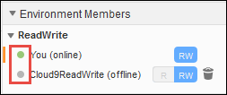

AWS Cloud9 is no longer available to new customers. Existing customers of 
 AWS Cloud9 can continue to use the service as normal. 
 [Learn more](https://aws.amazon.com/blogs/devops/how-to-migrate-from-aws-cloud9-to-aws-ide-toolkits-or-aws-cloudshell/ "https://aws.amazon.com/blogs/devops/how-to-migrate-from-aws-cloud9-to-aws-ide-toolkits-or-aws-cloudshell/")

# See a list of environment members

With the shared environment open, in the **Collaborate** window, expand
 **Environment Members**, if the list of members isn't visible.

A circle next to each member indicates their online status, as follows:

* Active members have a green circle.
* Offline members have a gray circle.
* Idle members have an orange circle.

To use code to get a list of environment members, call the AWS Cloud9 describe environment memberships
 operation, as follows.

|  |  |
| --- | --- |
| AWS CLI | [describe-environment-memberships](https://docs.aws.amazon.com/cli/latest/reference/cloud9/describe-environment-memberships.html "https://docs.aws.amazon.com/cli/latest/reference/cloud9/describe-environment-memberships.html") |
| AWS SDK for C++ | [DescribeEnvironmentMembershipsRequest](https://sdk.amazonaws.com/cpp/api/LATEST/class_aws_1_1_cloud9_1_1_model_1_1_describe_environment_memberships_request.html "https://sdk.amazonaws.com/cpp/api/LATEST/class_aws_1_1_cloud9_1_1_model_1_1_describe_environment_memberships_request.html"), [DescribeEnvironmentMembershipsResult](https://sdk.amazonaws.com/cpp/api/LATEST/class_aws_1_1_cloud9_1_1_model_1_1_describe_environment_memberships_result.html "https://sdk.amazonaws.com/cpp/api/LATEST/class_aws_1_1_cloud9_1_1_model_1_1_describe_environment_memberships_result.html") |
| AWS SDK for Go | [DescribeEnvironmentMemberships](https://docs.aws.amazon.com/sdk-for-go/api/service/cloud9/#Cloud9.DescribeEnvironmentMemberships "https://docs.aws.amazon.com/sdk-for-go/api/service/cloud9/#Cloud9.DescribeEnvironmentMemberships"), [DescribeEnvironmentMembershipsRequest](https://docs.aws.amazon.com/sdk-for-go/api/service/cloud9/#Cloud9.DescribeEnvironmentMembershipsRequest "https://docs.aws.amazon.com/sdk-for-go/api/service/cloud9/#Cloud9.DescribeEnvironmentMembershipsRequest"), [DescribeEnvironmentMembershipsWithContext](https://docs.aws.amazon.com/sdk-for-go/api/service/cloud9/#Cloud9.DescribeEnvironmentMembershipsWithContext "https://docs.aws.amazon.com/sdk-for-go/api/service/cloud9/#Cloud9.DescribeEnvironmentMembershipsWithContext") |
| AWS SDK for Java | [DescribeEnvironmentMembershipsRequest](https://docs.aws.amazon.com/AWSJavaSDK/latest/javadoc/com/amazonaws/services/cloud9/model/DescribeEnvironmentMembershipsRequest.html "https://docs.aws.amazon.com/AWSJavaSDK/latest/javadoc/com/amazonaws/services/cloud9/model/DescribeEnvironmentMembershipsRequest.html"), [DescribeEnvironmentMembershipsResult](https://docs.aws.amazon.com/AWSJavaSDK/latest/javadoc/com/amazonaws/services/cloud9/model/DescribeEnvironmentMembershipsResult.html "https://docs.aws.amazon.com/AWSJavaSDK/latest/javadoc/com/amazonaws/services/cloud9/model/DescribeEnvironmentMembershipsResult.html") |
| AWS SDK for JavaScript | [describeEnvironmentMemberships](https://docs.aws.amazon.com/AWSJavaScriptSDK/latest/AWS/Cloud9.html#describeEnvironmentMemberships-property "https://docs.aws.amazon.com/AWSJavaScriptSDK/latest/AWS/Cloud9.html#describeEnvironmentMemberships-property") |
| AWS SDK for .NET | [DescribeEnvironmentMembershipsRequest](https://docs.aws.amazon.com/sdkfornet/v3/apidocs/items/Cloud9/TDescribeEnvironmentMembershipsRequest.html "https://docs.aws.amazon.com/sdkfornet/v3/apidocs/items/Cloud9/TDescribeEnvironmentMembershipsRequest.html"), [DescribeEnvironmentMembershipsResponse](https://docs.aws.amazon.com/sdkfornet/v3/apidocs/items/Cloud9/TDescribeEnvironmentMembershipsResponse.html "https://docs.aws.amazon.com/sdkfornet/v3/apidocs/items/Cloud9/TDescribeEnvironmentMembershipsResponse.html") |
| AWS SDK for PHP | [describeEnvironmentMemberships](https://docs.aws.amazon.com/aws-sdk-php/v3/api/api-cloud9-2017-09-23.html#describeenvironmentmemberships "https://docs.aws.amazon.com/aws-sdk-php/v3/api/api-cloud9-2017-09-23.html#describeenvironmentmemberships") |
| AWS SDK for Python (Boto) | [describe\_environment\_memberships](https://boto3.readthedocs.io/en/latest/reference/services/cloud9.html#Cloud9.Client.describe_environment_memberships "https://boto3.readthedocs.io/en/latest/reference/services/cloud9.html#Cloud9.Client.describe_environment_memberships") |
| AWS SDK for Ruby | [describe\_environment\_memberships](https://docs.aws.amazon.com/sdk-for-ruby/v3/api/Aws/Cloud9/Client.html#describe_environment_memberships-instance_method "https://docs.aws.amazon.com/sdk-for-ruby/v3/api/Aws/Cloud9/Client.html#describe_environment_memberships-instance_method") |
| AWS Tools for Windows PowerShell | [Get-C9EnvironmentMembershipList](https://docs.aws.amazon.com/powershell/latest/reference/items/Get-C9EnvironmentMembershipList.html "https://docs.aws.amazon.com/powershell/latest/reference/items/Get-C9EnvironmentMembershipList.html") |
| AWS Cloud9 API | [DescribeEnvironmentMemberships](../APIReference/API_DescribeEnvironmentMemberships.md "../APIReference/API_DescribeEnvironmentMemberships.md") |
