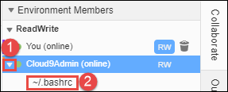

AWS Cloud9 is no longer available to new customers. Existing customers of 
 AWS Cloud9 can continue to use the service as normal. 
 [Learn more](https://aws.amazon.com/blogs/devops/how-to-migrate-from-aws-cloud9-to-aws-ide-toolkits-or-aws-cloudshell/ "https://aws.amazon.com/blogs/devops/how-to-migrate-from-aws-cloud9-to-aws-ide-toolkits-or-aws-cloudshell/")

# Open the open file of an
 environment member

This step shows how you can open the open file of an
 environment member.

1. With the shared environment open, in the **Collaborate** window, expand
 **Environment Members**, if the list of members isn't
 visible.
2. Expand the name of the user whose open file that you want to open in your
 environment.
3. Open (double-click) the name of the file that you want to open.

