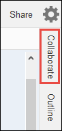

AWS Cloud9 is no longer available to new customers. Existing customers of
AWS Cloud9 can continue to use the service as normal.
[Learn more](https://aws.amazon.com/blogs/devops/how-to-migrate-from-aws-cloud9-to-aws-ide-toolkits-or-aws-cloudshell/ "https://aws.amazon.com/blogs/devops/how-to-migrate-from-aws-cloud9-to-aws-ide-toolkits-or-aws-cloudshell/")

# Open a shared Environment

To open a shared environment, you can use your AWS Cloud9 dashboard. Use the AWS Cloud9 IDE to perform
actions and complete work in a shared environment. Examples are working with files and chatting
with other team members.

1. Make sure the corresponding access policy is attached to the group or role for
   your user. For more information, see [About Environment Member Access Roles](share-environment.md#share-environment-member-roles "share-environment.md#share-environment-member-roles").
2. Sign in to the AWS Cloud9 console as follows:
   - If you're the only individual using your AWS account or you're an IAM
     user in a single AWS account, go to [https://console.aws.amazon.com/cloud9/](https://console.aws.amazon.com/cloud9/ "https://console.aws.amazon.com/cloud9/").
   - If your organization uses IAM Identity Center, see your AWS account administrator for
     sign-in instructions.
   - If you're a student in a classroom, see your instructor for sign-in
     instructions.

3. Open the shared environment from your AWS Cloud9 dashboard. For more information, see [Opening an Environment in AWS Cloud9](open-environment.md "open-environment.md").
   You use the **Collaborate** window to interact with other members, as
   described in the rest of this topic.

###### Note

If the **Collaborate** window isn't visible, choose
**Collaborate**. If the **Collaborate** button
isn't visible, on the menu bar, choose **Window, Collaborate**.

