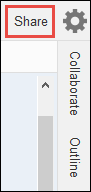

AWS Cloud9 is no longer available to new customers. Existing customers of
AWS Cloud9 can continue to use the service as normal.
[Learn more](https://aws.amazon.com/blogs/devops/how-to-migrate-from-aws-cloud9-to-aws-ide-toolkits-or-aws-cloudshell/ "https://aws.amazon.com/blogs/devops/how-to-migrate-from-aws-cloud9-to-aws-ide-toolkits-or-aws-cloudshell/")

# Working with shared environment in AWS Cloud9

A _shared environment_ is an AWS Cloud9 development environment that multiple users were invited
to participate in. This topic provides instructions for sharing an environment in AWS Cloud9 and how to
participate in a shared environment.

To invite a user to participate in an environment that you own, follow one of these sets of
procedures. Choose based on the type of user that you want to invite.

- If you are a user in the same AWS account as the environment you should [Invite a User in the Same Account
  as the Environment](#share-environment-invite-user "#share-environment-invite-user").
- If you are an AWS Cloud9 administrator in the same AWS account as the environment, specifically
  the AWS account root user, an administrator user or a user with the AWS managed policy
  `AWSCloud9Administrator` attached, then you should invite the AWS Cloud9 administrator yourself, see [Invite a User in the Same Account as
  the Environment](#share-environment-invite-user "#share-environment-invite-user"), or have the AWS Cloud9 administrator invite themself (or others in the same
  AWS account), see [Have an AWS Cloud9
  Administrator in the Same Account as the Environment Invite Themself or
  Others](#share-environment-admin-user "#share-environment-admin-user").

## Shared Environment use cases

A shared environment is good for the following use cases:

- **Pair programming** (**also
  known as _peer programming_**)**:** This is where two users work together on the same code in a single environment.
  In pair programming, typically one user writes code while the other user observes the
  code being written. The observer gives immediate input and feedback to the code
  writer. These positions frequently switch during a project. Without a shared environment,
  teams of pair programmers typically sit in front of a single machine. Only one user
  at a time can write code. With a shared environment, both users can sit in front of their
  own machine. Moreover, they can write code at the same time, even if they are in
  different physical offices.
- **Computer science classes:** This is useful when
  teachers or teaching assistants want to access a student's environment. Doing so can be for
  review a student's homework or fix issues with their environment in real time. Students can
  also work together with their classmates on shared homework projects, writing code
  together in a single environment in real time. They can do this even though they might be
  in different locations using different computer operating systems and web browser
  types.
- Any other situation where multiple users need to collaborate on the same code in
  real time.

## About environment member access roles

Before you share an environment or participate in a shared environment in AWS Cloud9, you should
understand the access permission levels for a shared environment. We call these permission levels
_environment member access roles_.

A shared environment in AWS Cloud9 offers three environment member access roles: _owner_,
_read/write_, and _read-only_.

- An owner has full control over an environment. Each environment has one and only one
  owner, who is the environment creator. An owner can do the following actions.

      + Add, change, and remove members for the environment
      + Open, view, and edit files
      + Run code
      + Change environment settings
      + Chat with other members
      + Delete existing chat messages

  In the AWS Cloud9 IDE, an environment owner is displayed with **Read+Write**
  access.

- A read/write member can do the following actions.

      + Open, view, and edit files
      + Run code
      + Change various environment settings from within the AWS Cloud9 IDE
      + Chat with other members
      + Delete existing chat messages

  In the AWS Cloud9 IDE, read/write members are displayed with
  **Read+Write** access.

- A read-only member can do the following actions.

      + Open and view files
      + Chat with other members
      + Delete existing chat messages

  In the AWS Cloud9 IDE, read-only members are displayed with **Read Only**
  access.

Before a user can become an environment owner or member, that user must meet one of the
following criteria.

- The user is an **AWS account root user**.
- The user is an **administrator user**. For more
  information, see [Creating Your First IAM Admin User and Group](../../../IAM/latest/UserGuide/getting-set-up.md#create-an-admin "../../../IAM/latest/UserGuide/getting-set-up.md#create-an-admin") in the
  _IAM User Guide_.
- The user is a **user who belongs to an IAM group**, a
  **user who assumes a role**, or a **federated user who assumes a role**, _and_
  that group or role has the AWS managed policy `AWSCloud9Administrator` or
  `AWSCloud9User` (or `AWSCloud9EnvironmentMember`, to be a
  member only) attached. For more information, see [AWS Managed (Predefined)
  Policies](security-iam.md#auth-and-access-control-managed-policies "security-iam.md#auth-and-access-control-managed-policies").
  - To attach one of the preceding managed policies to an IAM group, you can
    use the [AWS Management Console](#share-environment-member-roles-console "#share-environment-member-roles-console") or the [AWS
    Command Line Interface (AWS CLI)](#share-environment-member-roles-cli "#share-environment-member-roles-cli") as described in the following
    procedures.
  - You can create a role in IAM with one of the preceding managed policies
    for a user or a federated user to assume. For more information, see [Creating
    Roles](../../../IAM/latest/UserGuide/id_roles_create.md "../../../IAM/latest/UserGuide/id_roles_create.md") in the _IAM User Guide_. To have a user
    or a federated user assume the role, see coverage of assuming roles in [Using IAM
    Roles](../../../IAM/latest/UserGuide/id_roles_use.md "../../../IAM/latest/UserGuide/id_roles_use.md") in the _IAM User Guide_.

### Attach an AWS managed policy

for AWS Cloud9 to a group using the console

The following procedure outlines how to attach an AWS managed policy for AWS Cloud9 to a group using the console.

1. Sign in to the AWS Management Console, if you are not already signed in.

For this step, we recommend you sign in using IAM administrator-level
credentials in your AWS account. If you can't do this, check with your
AWS account administrator. 2. Open the IAM console. To do this, in the console navigation bar, choose
**Services**. Then choose **IAM**. 3. Choose **Groups**. 4. Choose the name of the group. 5. On the **Permissions** tab, for **Managed
Policies**, choose **Attach Policy**. 6. In the list of policy names, choose one of the following boxes.

    * **AWSCloud9User** (preferred) or
     **AWSCloud9Administrator** to enable each user in the
     group to be an environment owner
    * **AWSCloud9EnvironmentMember** to enable each user in the
     group to be a member only

(If you don't see one of these policy names in the list, type the policy name
in the **Search** box to display it.) 7. Choose **Attach policy**.

### Attach an AWS managed policy for

AWS Cloud9 to a group using the AWS CLI

###### Note

If you're using [AWS managed temporary credentials](security-iam.md#auth-and-access-control-temporary-managed-credentials "security-iam.md#auth-and-access-control-temporary-managed-credentials"), you can't use a terminal session in the AWS Cloud9 IDE
to run some or all of the commands in this section. To address AWS security best practices,
AWS managed temporary credentials don’t allow some commands to be run. Instead, you can run those commands
from a separate installation of the AWS Command Line Interface (AWS CLI).

Run the IAM `attach-group-policy` command to attach the AWS managed
policy for AWS Cloud9 to the group. Specify the group name and the Amazon Resource Name (ARN)
of the policy:

```
aws iam attach-group-policy --group-name MyGroup --policy-arn arn:aws:iam::aws:policy/POLICY_NAME
```

In the preceding command, replace `MyGroup` with the name of the group.
Replace `POLICY_NAME` with the name of one of the following AWS managed
policies.

- `AWSCloud9User` (preferred) or `AWSCloud9Administrator` to
  enable each user in the group to be an environment owner
- `AWSCloud9EnvironmentMember` to enable each user in the group to be a
  member only

## Invite a user in the same account as the

Environment

Use the instructions in this section to share an AWS Cloud9 development environment that you own in your
AWS account with a user in that same account.

1. Suppose that the user that you want to invite _isn't_ one of the following types of users. Make sure the user that you
   want to invite already has the corresponding environment member access role. For
   instructions, see [About Environment
   Member Access Roles](#share-environment-member-roles "#share-environment-member-roles").
   - The **AWS account root user**.
   - An **Administrator user**.
   - A **user who belongs to an IAM group**, a
     **user who assumes a role**, or a **federated user who assumes a role**,
     _and_ that group or role has the AWS managed policy
     `AWSCloud9Administrator` attached.

2. Open the environment that you own and want to invite the user to, if the environment isn't
   already open.
3. In the menu bar in the AWS Cloud9 IDE, do one of the following.
   - Choose **Window, Share**.
   - Choose **Share** (located next to the
     **Preferences** gear icon).

   

4. In the **Share this environment** dialog box, for
   **Invite Members**, type one of the following.
   - To invite an **IAM user**, enter the name of
     the user.
   - To invite the **AWS account root user**,
     enter `arn:aws:iam::123456789012:root`. Replace
     `123456789012` with your AWS account ID.
   - To invite a **user with an assumed role** or a
     **federated user with an assumed role**, enter
     `arn:aws:sts::123456789012:assumed-role/MyAssumedRole/MyAssumedRoleSession`.
     Replace `123456789012` with your AWS account ID,
     `MyAssumedRole` with the name of the assumed role. Replace
     `MyAssumedRoleSession` with the session name for the assumed
     role.

5. To make this user a read-only member, choose **R**. To make this
   user read/write, choose **RW**.
6. Choose **Invite**.

###### Note

If you make this user a read/write member, a dialog box is displayed, containing
information about possibly putting your AWS security credentials at risk. The
following information provides more background about this issue.

You should share an environment only with those you trust.

A read/write member may be able to use the AWS CLI, the AWS CloudShell, or AWS SDK code
in your environment to take actions in AWS on your behalf. Furthermore, if you store
your permanent AWS access credentials within the environment, that member could
potentially copy those credentials and use them outside of the environment.

Removing your permanent AWS access credentials from your environment and using
temporary AWS access credentials instead does not fully address this issue. It
lessens the opportunity of the member to copy those temporary credentials and use
them outside of the environment (as those temporary credentials will work only for a
limited time). However, temporary credentials still enable a read/write member to
take actions in AWS from the environment on your behalf. 7. Contact the user to let them know they can open this environment and begin using
it.

## Have an AWS Cloud9 administrator in the same

account as the Environment invite themself or others

###### Note

If you're using [AWS managed temporary credentials](security-iam.md#auth-and-access-control-temporary-managed-credentials "security-iam.md#auth-and-access-control-temporary-managed-credentials"), you can't use a terminal session in the AWS Cloud9 IDE
to run some or all of the commands in this section. To address AWS security best practices,
AWS managed temporary credentials don’t allow some commands to be run. Instead, you can run those commands
from a separate installation of the AWS Command Line Interface (AWS CLI).

The following types of users can invite themselves (or other users in the same
AWS account) to any environment in the same account.

- The **AWS account root user**.
- An **administrator user**.
- A **user who belongs to an IAM group**, a **user who assumes a role**, or a **federated user who assumes a role**, _and_ that group
  or role has the AWS managed policy `AWSCloud9Administrator`
  attached.

Suppose that the invited user _isn't_ one of the
preceding types of users. Make sure that user already has the corresponding environment
member access role. For instructions, see [About Environment Member Access Roles](#share-environment-member-roles "#share-environment-member-roles").

To invite the user, use the AWS CLI or the AWS CloudShell to run the AWS Cloud9
`create-environment-membership` command.

```
aws cloud9 create-environment-membership --environment-id 12a34567b8cd9012345ef67abcd890e1 --user-arn USER_ARN --permissions PERMISSION_LEVEL
```

In the preceding command, replace `12a34567b8cd9012345ef67abcd890e1` with the
ID of the environment. Replace `PERMISSION_LEVEL` with `read-write` or
`read-only`. And, replace `USER_ARN` with one of the
following:

- To invite an **IAM user**, enter
  `arn:aws:iam::123456789012:user/MyUser`. Replace
  `123456789012` with your AWS account ID and replace
  `MyUser` with the name of the user.
- To invite the **AWS account root user**, enter
  `arn:aws:iam::123456789012:root`. Replace `123456789012`
  with your AWS account ID.
- To invite a **user with an assumed role** or a
  **federated user with an assumed role**, enter
  `arn:aws:sts::123456789012:assumed-role/MyAssumedRole/MyAssumedRoleSession`.
  Replace `123456789012` with your AWS account ID. Replace
  `MyAssumedRole` with the name of the assumed role. And, replace
  `MyAssumedRoleSession` with the session name for the assumed
  role.

For example, to invite the AWS account root user for account ID
`123456789012` to an environment with ID
`12a34567b8cd9012345ef67abcd890e1` as a read/write member, run the following
command.

```
aws cloud9 create-environment-membership --environment-id 12a34567b8cd9012345ef67abcd890e1 --user-arn arn:aws:iam::123456789012:root --permissions read-write
```

###### Note

If you're using the AWS CloudShell, omit the `aws` prefix from the preceding
commands.
