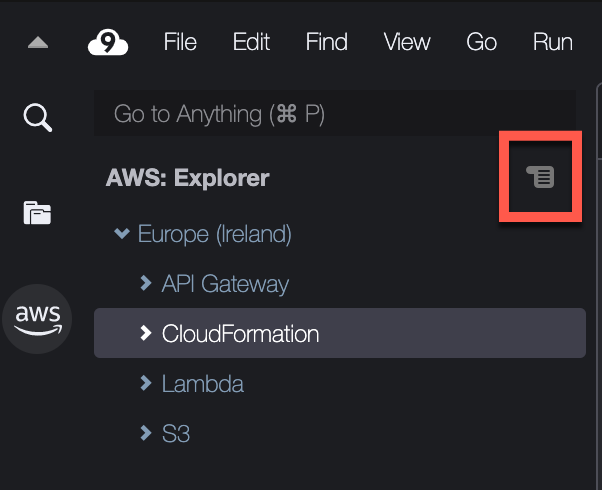
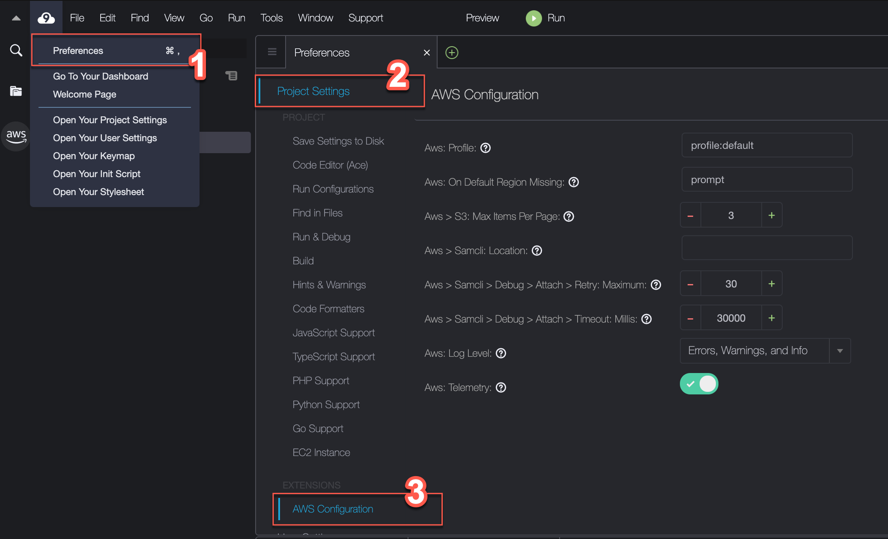

AWS Cloud9 is no longer available to new customers. Existing customers of
AWS Cloud9 can continue to use the service as normal.
[Learn more](https://aws.amazon.com/blogs/devops/how-to-migrate-from-aws-cloud9-to-aws-ide-toolkits-or-aws-cloudshell/ "https://aws.amazon.com/blogs/devops/how-to-migrate-from-aws-cloud9-to-aws-ide-toolkits-or-aws-cloudshell/")

# Navigating and configuring the AWS Toolkit

You can access resources and modify settings through the following AWS Toolkit interface
elements:

- [AWS Explorer
  window](#working-with-aws-explorer "#working-with-aws-explorer"): Access AWS services from different AWS Regions.
- [AWS Toolkit menu](#toolkit-menu "#toolkit-menu"): Create and
  deploy serverless applications, show or hide AWS Regions, access user assistance, and
  interact with Git repositories.
- [AWS Configuration
  pane](#configuration-options "#configuration-options"): Modify settings that affect how you can interact with AWS services in
  AWS Toolkit.

## Using AWS Explorer to work with services and

resources in multiple Regions

With the **AWS Explorer** window, you can select AWS services and
work with specific resources that are associated with that service. In **AWS
Explorer**, choose a service name node (for example, API Gateway or Lambda). Then, choose
a specific resource associated with that service (for example, a REST API or a Lambda
function). When you choose a specific resource, a menu displays available interaction options
such as upload or download, invoke, or copy.

Consider the following example. If your AWS account credentials can access Lambda
functions, expand the Lambda node listed for an AWS Region, and then select a specific Lambda
function to be invoked or uploaded as code to the AWS Cloud9 IDE. You can also open the context
(right-click) menu for the node's title to start creating an application that uses the
AWS Serverless Application Model.

###### Note

If you can't see the option to view the **AWS Explorer** window in
the integrated development environment (IDE), verify that you enabled the AWS Toolkit. Then,
after you verify it's enabled, try again. For more information, see [Enabling AWS Toolkit](toolkit-welcome.md#access-toolkit "toolkit-welcome.md#access-toolkit").

The **AWS Explorer** window can also display services hosted in
multiple AWS Regions.

## To access AWS services from a selected Region

1. In the **AWS Explorer** window, choose the
   **Toolkit** menu, **Show region in the
   Explorer**.
2. From the **Select a region to show in the AWS Explorer** list,
   choose an AWS Region.

The selected Region is added to the **AWS Explorer** window. To
access available services and resources, choose the arrow (>) in front of the Region's
name.

###### Note

You can also hide selected AWS Regions in the **AWS Explorer
window** using the following options:

- Open the context (right-click) menu for the Region and choose **Hide
  region from the Explorer**.
- In the AWS Toolkit menu, choose **Hide region from the
  Explorer** and select a Region to hide.

## Accessing and using the AWS Toolkit menu

The **AWS Toolkit** provides access for options to create and deploy
[serverless applications](serverless-apps-toolkit.md "serverless-apps-toolkit.md"). You can use this
menu to manage connections, update the **AWS: Explorer** window, access
documentation, and interact with GitHub repositories.

To access the **Toolkit** menu, choose the scroll icon opposite the
**AWS: Explorer** title in the **AWS Explorer**
window.

The following tables provides an overview of the options available on the
**Toolkit** menu.

| **Toolkit** menu options                            | Menu option                                                                                                                                                                                                                                                                                                                                                                                                                                                                                      | Description                                                                                                                                                                                                                                                                                                                                                                                                                                                                                       |
| --------------------------------------------------- | ------------------------------------------------------------------------------------------------------------------------------------------------------------------------------------------------------------------------------------------------------------------------------------------------------------------------------------------------------------------------------------------------------------------------------------------------------------------------------------------------ | ------------------------------------------------------------------------------------------------------------------------------------------------------------------------------------------------------------------------------------------------------------------------------------------------------------------------------------------------------------------------------------------------------------------------------------------------------------------------------------------------- |
| **Refresh AWS Explorer**                            | Choose this option to refresh **AWS Explorer** to show any AWS services that were modified since you last opened the window.                                                                                                                                                                                                                                                                                                                                                                     |
| **Connect to AWS**                                  | Connects AWS Toolkit to an AWS account using credentials that are stored in a _profile_. For more information, see [Managing access credentials for AWS Toolkit](toolkit-welcome.md#credentials-for-toolkit "toolkit-welcome.md#credentials-for-toolkit").                                                                                                                                                                                                                                       |
| **Show region in the Explorer**                     | Displays an AWS Region in the **AWS Explorer** window. For more information, see [Using AWS Explorer to work with services and resources in multiple Regions](#working-with-aws-explorer "#working-with-aws-explorer").                                                                                                                                                                                                                                                                          |
| **Hide region from the Explorer**                   | Hides an AWS Region in the **AWS Explorer** window. For more information, see [Using AWS Explorer to work with services and resources in multiple Regions](#working-with-aws-explorer "#working-with-aws-explorer")                                                                                                                                                                                                                                                                              |
| **Create new SAM Application**                      | Generates a set of code files for a new AWS serverless application. For more information about how to create and deploy SAM applications, see [Working with AWS SAM using the AWS Toolkit](serverless-apps-toolkit.md "serverless-apps-toolkit.md").                                                                                                                                                                                                                                             |
| **Deploy SAM Application**                          | Deploys a serverless application to AWS. For more information about how to create and deploy SAM applications, see [Working with AWS SAM using the AWS Toolkit](serverless-apps-toolkit.md "serverless-apps-toolkit.md").                                                                                                                                                                                                                                                                        |
| **View Quick Start**                                | Opens the Quick Start guide.                                                                                                                                                                                                                                                                                                                                                                                                                                                                     |
| **View Toolkit Documentation**                      | Opens the user guide for AWS Toolkit.                                                                                                                                                                                                                                                                                                                                                                                                                                                            |
| **View Source on GitHub**                           | Opens the GitHub repository for the AWS Toolkit.                                                                                                                                                                                                                                                                                                                                                                                                                                                 |
| **Create a New Issue on GitHub**                    | Opens the AWS Toolkit's New Issue page on Github                                                                                                                                                                                                                                                                                                                                                                                                                                                 |
| **Submit Quick Feedback**                           | Submit private, one-way feedback to the AWS Toolkit development team. For issues that require conversations or bug fixes, submit an issue in Github by selecting the **Create a New Issue on Github** menu option.                                                                                                                                                                                                                                                                               |
| **About AWS Toolkit**                               | Displays information about the version of the Toolkit running and the Amazon operating system that it's configured for.                                                                                                                                                                                                                                                                                                                                                                          | ## Modifying AWS Toolkit settings using the AWS Configuration pane To access the **AWS Configuration** pane, choose **AWS Cloud9**, **Preferences**. Next, in the **Preferences** window, under **Project Settings**, choose **AWS Configuration.**  The following table provides an overview of the options available on the **AWS Configuration** pane. |
| Menu option                                         | Description                                                                                                                                                                                                                                                                                                                                                                                                                                                                                      |
| ---                                                 | ---                                                                                                                                                                                                                                                                                                                                                                                                                                                                                              |
| **AWS: Profile**                                    | Sets the name of the credentials profile to obtain credentials from.                                                                                                                                                                                                                                                                                                                                                                                                                             |
| **AWS: On Default Region Missing**                  | Indicates the action to take if the default AWS Region for the selected credentials profile isn't available in the **AWS Explorer** window. You can select from three options:  • **prompt**(default): You're asked what you want to do.  • **add**: The Region is shown in the **AWS Explorer** window.  • **ignore**: No action is taken.                                                                                                                                             |
| **AWS > S3: Max Items Per Page**                    | Specifies how many Amazon S3 objects or folders are displayed at one time in the **AWS Explorer** window. When the maximum number is displayed, you can choose **Load More** to display the next batch. The range of accepted values for this field is between 3 and 1000. This setting applies only to the number of objects or folders displayed at one time. All the buckets you've created are displayed at once. By default, you can create up to 100 buckets in each of your AWS accounts. |
| **AWS > Samcli: Location**                          | Indicates the location of the SAM CLI that's used to create, build, package, and deploy [serverless applications](serverless-apps-toolkit.md "serverless-apps-toolkit.md").                                                                                                                                                                                                                                                                                                                      |
| **AWS > Samcli > Debug > Attach> Retry: Maximum:**  | Specifies how many times the Toolkit tries to attach the SAM CLI debugger before giving up. The default quota is 30 tries. When you locally invoke a Lambda function in debug mode within the AWS SAMCLI, you can then attach a debugger to it.                                                                                                                                                                                                                                                  |
| **AWS > Samcli > Debug > Attach> Timeout: Millis:** | Specifies how long the Toolkit tries to attach the SAM CLI debugger before giving up. The default timeout is 30,000 milliseconds (30 seconds). When you locally invoke a Lambda function in debug mode within the AWS SAMCLI, you can then attach a debugger to it.                                                                                                                                                                                                                              |
| **AWS : Log Level:**                                | Sets the category of workflow events that are logged. The following are the available levels:  • **Errors Only**  • **Errors and Warnings**  • **Errors, Warnings, and Info** (default option)  • **Errors, Warnings, and Info, Verbose, and Debug**                                                                                                                                                                                                                                 |
| **AWS : Telemetry**                                 | Enables or disables the sending of usage data to AWS. Enabled by default                                                                                                                                                                                                                                                                                                                                                                                                                         |
