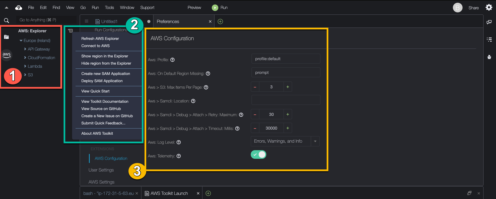

AWS Cloud9 is no longer available to new customers. Existing customers of
AWS Cloud9 can continue to use the service as normal.
[Learn more](https://aws.amazon.com/blogs/devops/how-to-migrate-from-aws-cloud9-to-aws-ide-toolkits-or-aws-cloudshell/ "https://aws.amazon.com/blogs/devops/how-to-migrate-from-aws-cloud9-to-aws-ide-toolkits-or-aws-cloudshell/")

# Working with

AWS Toolkit

You can
navigate and interact with AWS services using the AWS Toolkit through the AWS Explorer
window.

## Why use the AWS Toolkit?

The AWS Toolkit is an extension for the AWS Cloud9 integrated development environment (IDE).
You can access and work with a wide range of AWS services through this extension. The
AWS Toolkit replaces the functionality that's provided by the Lambda plugin for AWS Cloud9. For more
information, see [Disabling AWS Toolkit](#disable-toolkit "#disable-toolkit").

###### Important

AWS Toolkit support is an integrated feature of AWS Cloud9. Currently, you can't customize
the AWS Cloud9 IDE with third-party extensions.

###### Warning

If you are using Mozilla Firefox as your preferred browser with AWS Cloud9 IDE, there is a 3rd party cookie setting which prevents AWS Cloud9 webview and
AWS Toolkits from working correctly in the browser. As a workaround to this issue, you must ensure that you have not blocked
_Cookies_ in the _Privacy & Security_ section of your browser settings, as displayed in the
image below.


At present, the following AWS services and resources can be accessed through the
AWS Toolkit extension:

- [AWS App Runner](using-apprunner.md "using-apprunner.md")
- [API Gateway](api-gateway-toolkit.md "api-gateway-toolkit.md")
- [AWS CloudFormation stacks](cloudformation-toolkit.md "cloudformation-toolkit.md")
- [CloudWatch Logs](cloudwatch-logs-toolkit.md "cloudwatch-logs-toolkit.md")
- [AWS Lambda](lambda-toolkit.md "lambda-toolkit.md")
- [Resources](more-resources.md "more-resources.md")
- [Amazon S3 buckets and objects](s3-toolkit.md "s3-toolkit.md")
- [AWS Serverless Application Model applications](serverless-apps-toolkit.md "serverless-apps-toolkit.md")
- [Step Functions and state machines](bulding-stepfunctions.md "bulding-stepfunctions.md")
- [Systems Manager automation documents](systems-manager-automation-docs.md "systems-manager-automation-docs.md")
- [Working with Amazon ECR in AWS Cloud9 IDE](ecr.md "ecr.md")
- [AWS IoT](iot-start.md "iot-start.md")
- [Working with Amazon Elastic Container Service](ecs.md "ecs.md")
- [Amazon EventBridge](eventbridge.md "eventbridge.md")
- [Working with AWS Cloud Development Kit (AWS CDK)](cdk-explorer.md "cdk-explorer.md")

## Enabling AWS Toolkit

If the AWS Toolkit isn't available in your environment, you can enable it in the
**Preferences** tab.

###### To enable the AWS Toolkit

1. Choose **AWS Cloud9**, **Preferences** on the
   menu bar.
2. On the **Preferences** tab, in the side navigation pane, choose
   **AWS Settings**.
3. In the **AWS Resources** pane, enable
   **AWS Toolkit** so that it displays a check mark on a green
   background.

When you enable the AWS Toolkit, the integrated development environment (IDE)
refreshes to show the updated **Enable AWS Toolkit** setting. The
AWS Toolkit option at the side of the IDE below the **Environment**
option also appears.

###### Important

If your AWS Cloud9 environment's EC2 instance doesn't have access to the internet (that is,
no outbound traffic allowed), a message might display after you enable AWS Toolkit and
relaunch the IDE. This message states that the dependencies that are required by
AWS Toolkit couldn't be downloaded. If this is the case, you also can't use the AWS Toolkit.

To fix this issue, create a VPC endpoint for Amazon S3. This grants access to an Amazon S3 bucket
in your AWS Region that contains the dependencies that are required to keep your IDE up
to date.

For more information, see [Configuring VPC endpoints for Amazon S3 to download
dependencies](ec2-ssm.md#configure-s3-endpoint "ec2-ssm.md#configure-s3-endpoint").

## Managing access credentials for AWS Toolkit

AWS Toolkit interacts with a wide range of AWS services. To manage access control, make
sure that the IAM entity for your AWS Toolkit service has the necessary permissions for this
range of services. As a quick start, use [AWS managed temporary credentials](security-iam.md#auth-and-access-control-temporary-managed-credentials "security-iam.md#auth-and-access-control-temporary-managed-credentials") to
obtain the necessary permission. These managed credentials work by granting your EC2
environment access to AWS services on behalf of an AWS entity, such as an
IAM user.

However, if you've launched your development environment's EC2 instance into a **private subnet**, AWS managed temporary credentials aren't available to you. So, as an
alternative, you can allow AWS Toolkit to access your AWS services by manually creating your
own set of credentials. This set is called a _profile_. Profiles feature
long-term credentials called access keys. You can get these access keys from the IAM
console.

###### Create a profile to provide access credential for

AWS Toolkit

1. To get your access keys (consisting of an _access key ID_ and
   _secret access key_), go to the IAM console at [https://console.aws.amazon.com/iam](https://console.aws.amazon.com/iam "https://console.aws.amazon.com/iam").
2. Choose **Users** from the navigation bar and then choose your AWS
   user name (not the check box).
3. Choose the **Security credentials** tab, and then choose
   **Create access key**.

###### Note

If you already have an access key but you can't access your secret key, make the old
key inactive and create a new one. 4. In the dialog box that shows your access key ID and secret access key, choose
**Download .csv file** to store this information in a secure
location. 5. After you downloaded your access keys, launch an AWS Cloud9 environment and start a
terminal session by choosing **Window**, **New
Terminal**. 6. In the terminal window, run the following command.

```
aws configure --profile toolkituser
```

In this case, `toolkituser` is the profile name being used, but you can
choose your own. 7. At the command line, enter the `AWS Access Key ID` and `AWS Secret
 Access Key` that you previously downloaded from the IAM console.

    * For `Default region name`, specify an AWS Region (for example,
     `us-east-1`).
    * For `Default output format`, specify a file format (for example,
     `json`).

###### Note

For information about the options for configuring a profile, see [Configuration basics](../../../cli/latest/userguide/cli-chap-configure.md "../../../cli/latest/userguide/cli-chap-configure.md") in the
_AWS Command Line Interface User Guide_. 8. After you created your profile, launch the AWS Toolkit, go to the [AWS Toolkit menu](toolkit-navigation.md#toolkit-menu "toolkit-navigation.md#toolkit-menu"), and choose
**Connect to AWS**. 9. For the **Select an AWS credential profile** field, choose the
profile that you just created in the terminal (for example,
`profile:toolkituser`).

If the selected profile contains valid access credentials, the **AWS
Explorer** pane refreshes to display the AWS services that you can now
access.

### Using IAM roles to grant permissions to applications

on EC2 instances

You can also use an IAM role to manage temporary credentials for applications that run
on an EC2 instance. The role supplies temporary permissions that applications can use when
they make calls to other AWS resources. When you launch an EC2 instance, you specify an
IAM role to associate with the instance. Applications that run on the instance can then
use the role-supplied temporary credentials when making API requests against
AWS services.

After you created the role, assign this role and its associated permission to the
instance by creating an _instance profile_. The instance profile is
attached to the instance and can provide the role's temporary credentials to an application
that runs on the instance.

For more information, see [Using an IAM role to grant permissions to applications running on Amazon EC2
instances](../../../IAM/latest/UserGuide/id_roles_use_switch-role-ec2.md#roles-usingrole-ec2instance-get-started "../../../IAM/latest/UserGuide/id_roles_use_switch-role-ec2.md#roles-usingrole-ec2instance-get-started") in the _IAM User Guide_.

## Identifying AWS Toolkit components

The following screenshot shows three key UI components of the AWS Toolkit.



1. **AWS Explorer** window: Used to interact with the AWS services
   that are accessible through the Toolkit. You can toggle between showing and hiding the
   **AWS Explorer** using the AWS option at the left side of the
   integrated development environment (IDE). For more about using this interface component
   and accessing AWS services for different AWS Regions, see [Using AWS Explorer to work with services and
   resources in multiple Regions](toolkit-navigation.md#working-with-aws-explorer "toolkit-navigation.md#working-with-aws-explorer").
2. **Toolkit** menu: Used to manage connections to AWS, customize the
   display of the **AWS Explorer** window, create and deploy serverless
   applications, work with GitHub repositories, and access documentation. For more
   information, see [Accessing and using the AWS Toolkit menu](toolkit-navigation.md#toolkit-menu "toolkit-navigation.md#toolkit-menu").
3. **AWS Configuration** pane: Used to customize the behavior of
   AWS services that you interact with using the Toolkit. For more information, see [Modifying AWS Toolkit settings using the AWS
   Configuration pane](toolkit-navigation.md#configuration-options "toolkit-navigation.md#configuration-options").

## Disabling AWS Toolkit

You can disable the AWS Toolkit in the **Preferences** tab.

###### To disable the AWS Toolkit

1. Choose **AWS Cloud9**, **Preferences** on the
   menu bar.
2. On the **Preferences** tab, in the side navigation pane, choose
   **AWS Settings**.
3. In the **AWS Resources** pane, turn off **AWS
   AWS Toolkit**.

When you disable the AWS Toolkit, the integrated development environment (IDE)
refreshes to remove the AWS Toolkit option at the side of the IDE below the
**Environment** option.

## AWS Toolkit topics

- [Navigating and configuring the AWS Toolkit](toolkit-navigation.md "toolkit-navigation.md")
- [Using AWS App Runner with AWS Toolkit](using-apprunner.md "using-apprunner.md")
- [Working with API Gateway using the AWS Toolkit](api-gateway-toolkit.md "api-gateway-toolkit.md")
- [Working with AWS CloudFormation stacks using AWS Toolkit](cloudformation-toolkit.md "cloudformation-toolkit.md")
- [Working with AWS Lambda functions using the AWS Toolkit](lambda-toolkit.md "lambda-toolkit.md")
- [Working with resources](more-resources.md "more-resources.md")
- [Working with Amazon S3 using AWS Toolkit](s3-toolkit.md "s3-toolkit.md")
- [Working with AWS SAM using the AWS Toolkit](serverless-apps-toolkit.md "serverless-apps-toolkit.md")
- [Working with Amazon CodeCatalyst](ide-toolkits-cloud9.md "ide-toolkits-cloud9.md")
-
