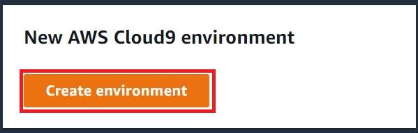
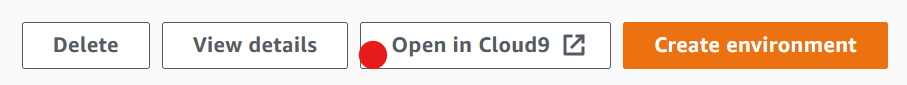
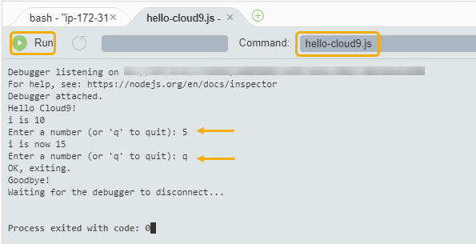
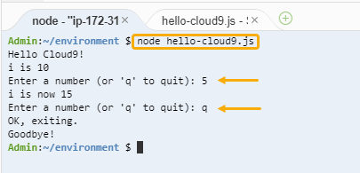
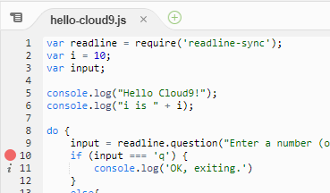
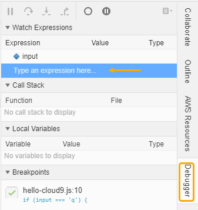
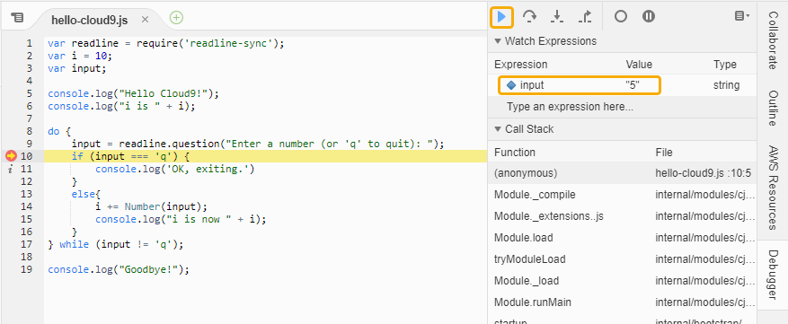
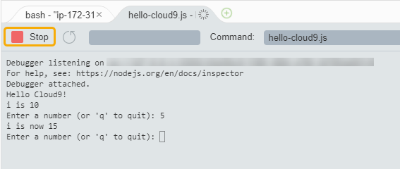

AWS Cloud9 is no longer available to new customers. Existing customers of
AWS Cloud9 can continue to use the service as normal.
[Learn more](https://aws.amazon.com/blogs/devops/how-to-migrate-from-aws-cloud9-to-aws-ide-toolkits-or-aws-cloudshell/ "https://aws.amazon.com/blogs/devops/how-to-migrate-from-aws-cloud9-to-aws-ide-toolkits-or-aws-cloudshell/")

# Getting started with

AWS Cloud9

Use this tutorial to get started with AWS Cloud9.
You can use AWS Cloud9
console or [AWS Command Line Interface (AWS CLI)](../../../cli/latest/userguide.md "../../../cli/latest/userguide.md") to use the AWS Cloud9 IDE.
In
this tutorial, you'll learn how to set up an AWS Cloud9 development environment, and then use
the AWS Cloud9 IDE to code, run, and debug your first application. For more
information about AWS Cloud9, see [What is AWS Cloud9](welcome.md "welcome.md").

To learn more
about AWS Cloud9 IDE, see [Tour
of
the AWS Cloud9 IDE](tour-ide.md "tour-ide.md").

This tutorial takes approximately one hour to complete.

###### Warning

Completing this tutorial might result in charges to your AWS account. These include
possible charges for Amazon EC2. For more information, see [Amazon EC2 Pricing](https://aws.amazon.com/ec2/pricing/ "https://aws.amazon.com/ec2/pricing/").

## Prerequisites

To successfully complete this tutorial, you must first complete the steps in [Setting up AWS Cloud9](setting-up.md "setting-up.md").

## Step 1: Create an environment

In this step, you can use the AWS Cloud9 console or the AWS CLI to create an AWS Cloud9 development environment.

###### Note

If you already created the environment that you want to use for this tutorial, open
that environment and skip ahead to [Step 2: Basic tour of the IDE](#tutorial-tour-ide "#tutorial-tour-ide").

In AWS Cloud9, a _development environment_, or _environment_,
is somewhere where you store your development project's files and run the tools to develop
your applications. In this tutorial, you create an _EC2 environment_, and work
with the files and tools in that environment.

Create an EC2 Environment with the
console

1. Sign in to the AWS Cloud9 console:
   - If you're the only one that using your AWS account or you're an IAM user
     in a single AWS account, go to [https://console.aws.amazon.com/cloud9/](https://console.aws.amazon.com/cloud9/ "https://console.aws.amazon.com/cloud9/").
   - If your organization uses AWS IAM Identity Center, ask your AWS account administrator for
     sign-in instructions.
   - If you're a student in a classroom, ask your instructor for sign-in
     instructions.

2. After you sign in to the AWS Cloud9 console, in the top navigation bar choose an
   AWS Region to create the environment in. For a list of available AWS Regions, see [AWS Cloud9](../../../general/latest/gr/rande.md#cloud9_region "../../../general/latest/gr/rande.md#cloud9_region") in the
   _AWS General Reference_.

 3. Choose the large **Create environment** button in one of the locations
shown.

If you don't already have AWS Cloud9 environments, the button is shown on a welcome
page.



If you already have AWS Cloud9 environments, the button is shown as follows.

 4. On the **Create environment** page, for **Name**,
enter a name for your environment. 5. For **Description**, enter something about your environment. For
this tutorial, use `This environment is for the AWS Cloud9 tutorial.` 6. For **Environment type**, choose **New EC2 instance** to
create an Amazon EC2 environment:

    * **New EC2 instance** – Launches a new Amazon EC2 instance that
     AWS Cloud9 can connect to directly over SSH. You can use the Systems Manager to interact with new Amazon EC2
     instances, for more information, see [Accessing no-ingress EC2 instances with AWS Systems Manager](ec2-ssm.md "ec2-ssm.md").


    * **Existing compute**  – Launches an existing Amazon EC2 instance
     that requires SSH login details for which the Amazon EC2 instance must have an inbound security
     group
     rule.


    	+ If you select the **Existing compute** option, a service role is
    	 automatically created.

    	 You can view the name of the service role in a note at the bottom of the setup screen.

###### Note

Automatic shutdown will not be available for AWS Cloud9 environments created using an Amazon EC2 instance using existing compute.

###### Warning

Creating an Amazon EC2 instance for your environment might result in possible charges to your
AWS account for Amazon EC2. There's no additional cost to use Systems Manager to manage connections to
your EC2 instance. 7. On the New EC2 instance panel for **Instance type**, keep the default
choice. This option might have less RAM and fewer vCPUs. However, this amount of memory
is sufficient for this tutorial.

###### Warning

Choosing instance types with more RAM and vCPUs might result in additional charges
to your AWS account for Amazon EC2. 8. For **Platform**, choose the type of Amazon EC2 instance that you want:
**Amazon Linux 2023**, **Amazon Linux 2** or **Ubuntu 22.04 LTS**. AWS Cloud9 creates
the instance and then connects the environment to it.

###### Important

We recommend that you choose the **Amazon Linux 2023** option for your
EC2 environment. In addition to providing a secure, stable, and high-performance runtime
environment, Amazon Linux 2023 AMI includes long-term support through 2024.

For more information, see the [AL2023
page](https://aws.amazon.com/linux/amazon-linux-2023/ "https://aws.amazon.com/linux/amazon-linux-2023/"). 9. Choose a time period for **Timeout**. This option determines how long
AWS Cloud9 is inactive before auto-hibernating. When all web browser instances that are
connected to the IDE for the environment are closed, AWS Cloud9 waits the amount of time
specified and then shuts down the Amazon EC2 instance for the environment.

###### Warning

Choosing a longer time period might result in more charges to your
AWS account. 10. On the **Network settings** panel, choose how your environment is
accessed from the two following options:

    * **AWS System Manager (SSM)** – This method
     accesses the environment using SSM without opening inbound ports.


    * **Secure Shell (SSH)** – This method accesses the
     environment using SSH and requires open inbound ports.

11. Choose **VPC Settings** to display the Amazon Virtual Private Cloud and Subnet
    for your environment. AWS Cloud9 uses Amazon Virtual Private Cloud (Amazon VPC) to communicate with the newly
    created Amazon EC2 instance. For this tutorial, we recommend that you don't change the
    preselected default settings. With the default settings, AWS Cloud9 attempts to
    automatically use the default VPC with its single subnet in the same AWS account
    and Region as the new environment.

You can find more information about Amazon VPC choices in [Create an EC2 Environment with the
Console](create-environment-main.md#create-environment-vpc-step "create-environment-main.md#create-environment-vpc-step"), and in [VPC settings for AWS Cloud9 Development Environments](vpc-settings.md "vpc-settings.md"). 12. Add up to 50 tags by supplying a **Key** and **Value**
for each tag. Do so by selecting **Add new tag**. The tags are attached to
the AWS Cloud9 environment as resource tags, and are propagated to the following underlying
resources: the AWS CloudFormation stack, the Amazon EC2 instance, and Amazon EC2 security groups. To learn more about
tags, see [Control Access Using AWS Resource
Tags](../../../IAM/latest/UserGuide/access_tags.md "../../../IAM/latest/UserGuide/access_tags.md") in the _[IAM User Guide](../../../IAM/latest/UserGuide.md "../../../IAM/latest/UserGuide.md")_ and [advanced
information](tags.md "tags.md") in this guide.

###### Warning

If you update these tags after you create them, the changes aren't propagated to the
underlying resources. For more information, see [Propagating tag updates to underlying resources](tags.md#tags-propagate "tags.md#tags-propagate") in the advanced information about [tags](tags.md "tags.md"). 13. Choose **Create** to create your environment, and then you're redirected
to the home page. If the account is successfully created, a green flash bar appears at the top
of the AWS Cloud9 console. You can select the new environment and choose **Open in
Cloud9** to launch the IDE.



If the account fails to create, a red flash bar appears at the top of the AWS Cloud9 console.
Your account might fail to create because of a problem with your web browser, your AWS
access permissions, the instance, or the associated network. You can find information about
possible fixes in the [AWS Cloud9 Troubleshooting section.](troubleshooting.md#troubleshooting-env-loading "troubleshooting.md#troubleshooting-env-loading")

###### Note

AWS Cloud9 supports both IMDSv1 and IMDSv2. We recommend adopting IMDSv2 as it provides an
enhanced level of security compared to IMDSv1. For more information on the benefits of
IMDSv2, see [AWS Security Blog](https://aws.amazon.com/blogs/security/defense-in-depth-open-firewalls-reverse-proxies-ssrf-vulnerabilities-ec2-instance-metadata-service/ "https://aws.amazon.com/blogs/security/defense-in-depth-open-firewalls-reverse-proxies-ssrf-vulnerabilities-ec2-instance-metadata-service/"). For information on how to transition to IMDSv2 from
IMDSv1,
see [Transition to using Instance Metadata Service Version 2](../../../AWSEC2/latest/UserGuide/instance-metadata-transition-to-version-2.md "../../../AWSEC2/latest/UserGuide/instance-metadata-transition-to-version-2.md") in the _Amazon EC2
User Guide for Linux Instances_.

###### Note

If your environment is using a proxy to access the internet, you must provide
proxy details to AWS Cloud9 so it can install dependencies. For more information, see
[Failed to install dependencies](troubleshooting.md#proxy-failed-dependencies "troubleshooting.md#proxy-failed-dependencies").

Create an EC2 environment with the
AWS CLI

1.  Install and configure the AWS CLI, if you have not done so already. To do this,
    see the following in the _AWS Command Line Interface User Guide_:

        * [Installing the AWS
         Command Line Interface](../../../cli/latest/userguide/cli-chap-getting-started.md "../../../cli/latest/userguide/cli-chap-getting-started.md")
        * [Quick configuration](../../../cli/latest/userguide/cli-chap-getting-started.md#cli-quick-configuration "../../../cli/latest/userguide/cli-chap-getting-started.md#cli-quick-configuration")

    You can configure the AWS CLI using credentials for one of the following:

        * The IAM user you created in [Setting up Team for AWS Cloud9](setup.md "setup.md").
        * An IAM administrator in your AWS account, if you will be working
         regularly with AWS Cloud9 resources for multiple users across the account. If you
         cannot configure the AWS CLI as an IAM administrator, check with your AWS
         account administrator. For more information, see [Creating your
         first IAM admin user and group](../../../IAM/latest/UserGuide/getting-set-up.md#create-an-admin "../../../IAM/latest/UserGuide/getting-set-up.md#create-an-admin") in the
         *IAM User Guide*.
        * An
         AWS account root user, but only if you will always be the only one using
         your own AWS account, and you don't need to share your environments with
         anyone else. We don't recommend this option as it isn't an AWS security
         best practice. For more information, see [Creating, Disabling, and Deleting Access Keys for Your AWS
         Account](../../../general/latest/gr/managing-aws-access-keys.md#create-aws-access-key "../../../general/latest/gr/managing-aws-access-keys.md#create-aws-access-key") in the *Amazon Web Services General Reference*.
        * For other options, see your AWS account administrator or classroom
         instructor.

2.  In the following AWS Cloud9 command, provide a value for `--region` and
    `--subnet-id`. Then run the command and make a note of the
    `"environmentId"` value for later cleanup.

```
aws cloud9 create-environment-ec2 --name my-demo-environment --description "This environment is for the AWS Cloud9 tutorial." --instance-type t2.micro --image-id resolve:ssm:/aws/service/cloud9/amis/amazonlinux-2-x86_64 --region MY-REGION --connection-type CONNECT_SSM --subnet-id subnet-12a3456b
```

In the preceding command:

    * `--name` represents the name of the environment. In this tutorial, we
     use the name `my-demo-environment`.
    * `--description` represents an optional description for the
     environment.
    * `--instance-type` represents the type of Amazon EC2 instance AWS Cloud9
     will launch and connect to the new environment. This example specifies
     `t2.micro`, which has relatively low RAM and vCPUs and is
     sufficient for this tutorial. Specifying instance types with more RAM and
     vCPUs might result in additional charges to your AWS account for Amazon EC2.
     For a list of available instance types, see the create environment wizard in
     the AWS Cloud9 console.
    * `--image-id` specifies the identifier for the Amazon Machine
     Image (AMI) that's used to create the EC2 instance. To choose an AMI for the
     instance, you must specify a valid AMI alias or a valid AWS Systems
     Manager (SSM) path. In the example above, an SSM path for an Amazon Linux 2 AMI is
     specified.


    For more information, see [create-environment-ec2](../../../cli/latest/reference/cloud9/create-environment-ec2.md "../../../cli/latest/reference/cloud9/create-environment-ec2.md") in the
     *AWS CLI Command Reference*.
    * `--region` represents the ID of the AWS Region for AWS Cloud9 to
     create the environment in. For a list of available AWS Regions, see [AWS Cloud9](../../../general/latest/gr/rande.md#cloud9_region "../../../general/latest/gr/rande.md#cloud9_region") in the
     *Amazon Web Services General Reference*.
    * `--connection-type CONNECT_SSM` specifies that AWS Cloud9 connects to
     its Amazon EC2 instance through Systems Manager. This option ensures no inbound traffic to
     the instance is allowed. For more information, see [Accessing no-ingress EC2 instances with AWS Systems Manager](ec2-ssm.md "ec2-ssm.md").


    ###### Note

    When using this option, you need to create the
     `AWSCloud9SSMAccessRole` service role and
     `AWSCloud9SSMInstanceProfile` if they aren't already
     created. For more information, see [Managing instance profiles for Systems Manager
     with the AWS CLI](ec2-ssm.md#aws-cli-instance-profiles "ec2-ssm.md#aws-cli-instance-profiles").
    * `--subnet-id` represents the subnet you want AWS Cloud9 to use.
     Replace `subnet-12a3456b` with the ID of the subnet of an
     Amazon Virtual Private Cloud (VPC), which must be compatible with AWS Cloud9. For more information,
     see [Create a VPC plus other VPC resources](vpc-settings.md#vpc-settings-create-vpc "vpc-settings.md#vpc-settings-create-vpc") in *[VPC settings for AWS Cloud9 Development Environments](vpc-settings.md "vpc-settings.md")*.
    * AWS Cloud9 shuts down the Amazon EC2 instance for the environment after all web browser
     instances that are connected to the IDE for the environment have been closed. To
     configure this time period, add `--automatic-stop-time-minutes`
     and the number of minutes. A shorter time period might result in fewer
     charges to your AWS account. Likewise, a longer time might result in more
     charges.
    * By default, the entity that calls this command owns the environment. To change
     this, add `--owner-id` and the Amazon Resource Name (ARN) of the
     owning entity.

3. After you successfully run this command, open the AWS Cloud9 IDE for the newly
   created environment. To do this, see [Opening an environment in AWS Cloud9](open-environment.md "open-environment.md"). Then return to this topic and continue with
   [Step 2: Basic tour of the IDE](#tutorial-tour-ide "#tutorial-tour-ide") to learn
   how to use the AWS Cloud9 IDE to work with your new environment.

If you try to open the environment, but AWS Cloud9 doesn't display the IDE after at
least five minutes, there might be a problem with your web browser, your AWS
access permissions, the instance, or the associated VPC. For possible fixes, see
[Can't open an environment](troubleshooting.md#troubleshooting-env-loading "troubleshooting.md#troubleshooting-env-loading").

## Step 2: Basic tour of the IDE

This part of the tutorial introduces some of the ways that you can use the AWS Cloud9 IDE to
create and test applications.

- You can use an **editor** window to create and edit code.
- You can use a **terminal** window or a **Run
  Configuration** window to run your code without debugging it.
- You can use the **Debugger** window to debug your code.

Perform these three tasks using JavaScript and the Node.js engine. For instructions on
using other programming languages, see [Tutorials for AWS Cloud9](tutorials.md "tutorials.md").

### Get your environment ready

Most of the tools that you need to run and debug JavaScript code are already installed
for you. However, you need one additional Node.js package for this tutorial. Install it
as follows.

1. On the menu bar at the top of the AWS Cloud9 IDE, choose
   **Window**, **New Terminal** or use an
   existing terminal window.
2. In the terminal window, which is one of the tabs in the bottom portion of the
   IDE, enter the following.

```
npm install readline-sync
```

Verify that the result is similar to the following. If `npm WARN`
messages are also displayed, you can ignore them.

```
+ readline-sync@1.4.10
added 1 package from 1 contributor and audited 5 packages in 0.565s
found 0 vulnerabilities
```

### Write code

Begin by writing some code.

1. On the menu bar, choose **File**, **New
   File**.
2. Add the following JavaScript to the new file.

```
var readline = require('readline-sync');
var i = 10;
var input;

console.log("Hello Cloud9!");
console.log("i is " + i);

do {
    input = readline.question("Enter a number (or 'q' to quit): ");
    if (input === 'q') {
        console.log('OK, exiting.')
    }
    else{
        i += Number(input);
        console.log("i is now " + i);
    }
} while (input != 'q');

console.log("Goodbye!");
```

3. Choose **File**, **Save**, and then save the
   file as `hello-cloud9.js`.

### Run your code

Next, you can run your code.

Depending on the programming language that you're using, there might be multiple ways
that you can run code. This tutorial uses JavaScript, which you can run using a terminal
window or a **Run Configuration** window.

###### To run the code using a Run Configuration window

1. On the menu bar, choose **Run**, **Run
   Configurations**, **New Run
   Configuration**.
2. In the new **Run Configuration** window (one of the tabs in
   the bottom portion of the IDE), enter `hello-cloud9.js` in the
   **Command** field, and then choose
   **Run**.
3. Make sure that the **Run Configuration** prompt is active,
   and then interact with the application by entering a number at the
   prompt.
4. View the output from your code in the **Run Configuration**
   window. It is similar to the following.



###### To run the code using a terminal window

1. Go to the terminal window that you used earlier (or open a new one).
2. In the terminal window, enter `ls` at the terminal prompt, and
   verify that your code file is in the list of files.
3. Enter `node hello-cloud9.js` at the prompt to start the
   application.
4. Interact with the application by entering a number at the prompt.
5. View the output from your code in the terminal window. It is similar to the
   following.



### Debug your code

Finally, you can debug your code by using the **Debugger**
window.

1. Add a breakpoint to your code at line 10 (`if (input === 'q')`) by
   choosing the margin next to line 10. A red circle is displayed next to that line
   number, as follows.

 2. Open the **Debugger** window by choosing the
**Debugger** button on the right side of the IDE.
Alternatively, choose **Window**, **Debugger**
on the menu bar.

Then, put a watch on the `input` variable by choosing
**Type an expression here** in the **Watch
Expressions** section of the **Debugger**
window.

 3. Go to the **Run Configuration** window that you used earlier
to run the code. Choose **Run**.

Alternately, you can open a new **Run Configuration** window
and start running the code. Do so by choosing **Run**,
**Run With**, **Node.js** from the menu
bar. 4. Enter a number at the **Run Configuration** prompt and see
that the code pauses at line 10. The **Debugger** window shows
the value that you entered in **Watch Expressions**.

 5. In the **Debugger** window, choose
**Resume**. This is the blue arrow icon that's highlighted
in the previous screenshot. 6. Select **Stop** in the **Run Configuration**
window to stop the debugger.



## Step 3: Clean up

To prevent ongoing charges to your AWS account that are related to this tutorial,
delete the environment.

###### Warning

You cannot restore your environment after you delete it.

Delete the Environment by using the AWS Cloud9
console

1. To open the dashboard, on the menu bar in the IDE, choose
   **AWS Cloud9**, **Go To Your Dashboard**.
2. Do one of the following:
   - Choose the title inside of the **my-demo-environment** card,
     and then choose **Delete**.

   
   - Select the **my-demo-environment** card, and then choose
     **Delete**.

   

3. In the **Delete** dialog box, enter `Delete`, and
   then choose **Delete**. The delete operation takes a few
   minutes.

###### Note

If you followed this tutorial exactly, then the environment was an EC2 environment and AWS Cloud9
also terminates the Amazon EC2 instance that was connected to that environment.

However, if you used an SSH environment instead of following the tutorial, and that environment
was connected to an Amazon EC2 instance, AWS Cloud9 doesn't terminate that instance. If you
don't terminate that instance later, your AWS account might continue to have
ongoing charges for Amazon EC2 that are related to that instance.

Delete the Environment with the AWS CLI

1. Run the AWS Cloud9 `delete-environment` command, specifying the ID of the
   environment to delete.

```
aws cloud9 delete-environment --region MY-REGION --environment-id 12a34567b8cd9012345ef67abcd890e1
```

In the preceding command, replace `MY-REGION` with the AWS Region
in which the environment was created and `12a34567b8cd9012345ef67abcd890e1`
with the ID of the environment to delete.

If you didn't save the ID when you created the environment, the ID can be found
by using the AWS Cloud9 console. Select the name of the environment in the console,
then find the last part of the **Environment ARN**. 2. If you created an Amazon VPC for this tutorial and you no longer need it, delete the
VPC using the Amazon VPC console at [https://console.aws.amazon.com/vpc](https://console.aws.amazon.com/vpc "https://console.aws.amazon.com/vpc").

## Related information

The following is additional information for [Getting
started with AWS Cloud9 Console](tutorials-basic.md "tutorials-basic.md").

- When you create an EC2 environment, the environment doesn't contain any sample code by default.
  To create an environment with sample code, see
  the
  following
  topic:
  - [Working with Amazon Lightsail instances in the
    AWS Cloud9 IDE](lightsail-instances.md "lightsail-instances.md")

- While the AWS Cloud9 development environment is being created, you're directed AWS Cloud9 to create an Amazon EC2
  instance. AWS Cloud9 created the instance and then connected the environment to it. You can
  alternatively use an existing cloud compute instance or your own server, which is
  called an _SSH environment_. For more information, see [Creating an environment in AWS Cloud9](create-environment.md "create-environment.md").

**Optional next steps**

Explore any or all of the following topics to continue getting familiar with AWS Cloud9.

| **Task**                                                                                                                                                                                             | **See this topic**                                                                                                                                                |
| ---------------------------------------------------------------------------------------------------------------------------------------------------------------------------------------------------- | ----------------------------------------------------------------------------------------------------------------------------------------------------------------- |
| Learn more about what you can do with an environment.                                                                                                                                                | [Working with environments in AWS Cloud9](environments.md "environments.md")                                                                                      |
| Try other computer languages.                                                                                                                                                                        | [Tutorials for AWS Cloud9](tutorials.md "tutorials.md")                                                                                                           |
| Learn more about the AWS Cloud9 IDE.                                                                                                                                                                 | [Tour<br>of<br>the AWS Cloud9 IDE](tour-ide.md "tour-ide.md") in [Working with the IDE](ide.md "ide.md")                                                          |
| Invite others to use your new environment in real time and with text chat<br>support.                                                                                                                | [Working with shared environment in AWS Cloud9](share-environment.md "share-environment.md")                                                                      |
| Create SSH environments. These are environments that use cloud compute<br>instances or servers that you create, instead of an Amazon EC2 instance that<br>AWS Cloud9 creates for you.                | [Creating an environment in AWS Cloud9](create-environment.md "create-environment.md") and [SSH environment host requirements](ssh-settings.md "ssh-settings.md") |
| Create, run, and debug code in AWS Lambda functions and serverless applications using the AWS Toolkit.                                                                                               | [Working with AWS Lambda functions using the AWS Toolkit](lambda-toolkit.md "lambda-toolkit.md")                                                                  |
| Use AWS Cloud9 with Amazon Lightsail.                                                                                                                                                                | [Working with Amazon Lightsail instances in the<br>AWS Cloud9 IDE](lightsail-instances.md "lightsail-instances.md")                                               |
| Use AWS Cloud9 with AWS CodePipeline.                                                                                                                                                                | [Working with AWS CodePipeline in the AWS Cloud9 IDE](codepipeline-repos.md "codepipeline-repos.md")                                                              |
| Use AWS Cloud9 with the AWS CLI, the AWS CloudShell, AWS CodeCommit, the AWS Cloud<br>Development Kit (AWS CDK), GitHub, or Amazon DynamoDB, and Node.js, Python,<br>or other programming languages. | [Tutorials for AWS Cloud9](tutorials.md "tutorials.md")                                                                                                           |
| Work with code for intelligent robotics applications in AWS<br>RoboMaker.                                                                                                                            | [Developing with<br>AWS Cloud9](../../../robomaker/latest/dg/cloud9.md "../../../robomaker/latest/dg/cloud9.md") in the _AWS RoboMaker Developer Guide_           |

To get help with AWS Cloud9 from the community, see the [AWS Cloud9 Discussion Forum](https://forums.aws.amazon.com/forum.jspa?forumID=268 "https://forums.aws.amazon.com/forum.jspa?forumID=268"). (When you
enter this forum, AWS might require you to sign in.)

To get help with AWS Cloud9 directly from AWS, see the support options on the [AWS Support](https://aws.amazon.com/premiumsupport/ "https://aws.amazon.com/premiumsupport/") page.
