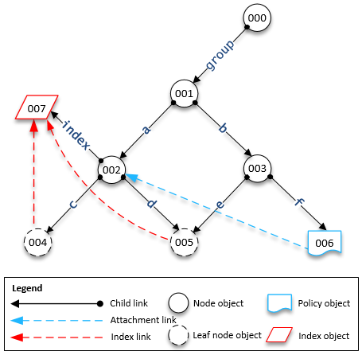

Amazon Cloud Directory will no longer be open to new customers starting on November 7, 2025. For alternatives to Cloud Directory, explore [Amazon DynamoDB](https://aws.amazon.com/dynamodb/ "https://aws.amazon.com/dynamodb/") and [Amazon Neptune](https://aws.amazon.com/neptune/ "https://aws.amazon.com/neptune/"). If you need help choosing the right alternative for your use case, or for any other questions, contact [AWS Support](https://aws.amazon.com/support/ "https://aws.amazon.com/support/").

# Access Objects

Objects in a directory can be accessed either by path or by
`objectIdentifier`.

**Path** – Every object in a Cloud Directory tree can be identified and
found by the pathname that describes how to reach it. The path starts from the root of the
directory (Node `000` in the previous figure). The path notation begins with
the link labeled with a slash (/) and follows the child links separated by path separator (also
a slash) until reaching the last part of the path. For example, object `005`
in the previous figure can be identified using the path `/group/a/d`.
Multiple paths may identify an object, since objects that are leaf nodes can have multiple
parents. The following path can also be used to identify object `005` :
/group/b/e

**ObjectIdentifier** – Every object in the directory has a
unique global identifier, which is the `ObjectIdentifier`.
`ObjectIdentifier` is returned as part of the [`CreateObject`](../APIReference/API_CreateObject.md "../APIReference/API_CreateObject.md") API call. You can also fetch the
`ObjectIdentifier` by using [`GetObjectInformation`](../APIReference/API_GetObjectInformation.md "../APIReference/API_GetObjectInformation.md") API call. For example, to fetch the object
identifier of object `005`, you can call `GetObjectInformation`
with object reference as the path that leads to the object, which is group/b/e or
group/a/d.

```
GetObjectInformationRequest request = new GetObjectInformationRequest()
    .withDirectoryArn(directoryArn)
    .withObjectReference("/group/b/e")
    .withConsistencyLevel(level)
GetObjectInformationResult result = cdClient.getObjectInformation(request)
String objectIdentifier = result.getObjectIdentifier()
```

## Populating Objects

New facets can be added to an object using [`AddFacetToObject`](../APIReference/API_AddFacetToObject.md "../APIReference/API_AddFacetToObject.md") API call. The type of the object is determined
based on the facets attached to the object. Object attachment in a directory works based
on the type of the object. When attaching an object, remember these rules:

- A leaf node object cannot have children.
- A node object can have multiple children.
- An object of the policy type cannot have children and can have zero or one
  parent.

## Updating Objects

You can update an object in multiple ways:

1. Use the [`UpdateObjectAttributes`](../APIReference/API_UpdateObjectAttributes.md "../APIReference/API_UpdateObjectAttributes.md") operation to update individual facet
   attributes on an object.
2. Use the [`AddFacetToObject`](../APIReference/API_AddFacetToObject.md "../APIReference/API_AddFacetToObject.md") operation to add new facets to an
   object.
3. Use the [`RemoveFacetFromObject`](../APIReference/API_RemoveFacetFromObject.md "../APIReference/API_RemoveFacetFromObject.md") operation to delete existing facets
   from an object.

## Deleting Objects

An attached object must meet certain conditions before you can delete it from a
directory:

1. You must detach the object from the tree. You can detach an object only when it
   doesn’t have any children. If the object has children, you must detach all the
   children first.
2. You can delete a detached object only if all the attributes on that object are
   deleted. You can delete attributes on an object by deleting each facet attached to
   that object. You can fetch a list of facets attached to an object by calling [`GetObjectInformation`](../APIReference/API_GetObjectInformation.md "../APIReference/API_GetObjectInformation.md").
3. An object must also have no parent, no policy attachments, and no index
   attachments.

Because an object must be fully detached from the tree to be deleted, you must use the
object identifier to delete it.

## Querying Objects

This section discusses various elements relevant for querying objects in a
directory.

### Directory Traversal

Because Cloud Directory is a tree, you can query objects from the top down using the
[`ListObjectChildren`](../APIReference/API_ListObjectChildren.md "../APIReference/API_ListObjectChildren.md") API operation or from the bottom up using
the [`ListObjectParents`](../APIReference/API_ListObjectParents.md "../APIReference/API_ListObjectParents.md") API operation.

### Policy Lookup

Given an object reference, the [`LookupPolicy`](../APIReference/API_LookupPolicy.md "../APIReference/API_LookupPolicy.md") API operation returns all the policies that are
attached along its path (or paths) to the root in a top-down fashion. Any of the paths
that are not leading up to the root are ignored. All policy type objects are
returned.

If the object is a leaf node, it can have multiple paths to the root. This call
returns only one path for each call. To fetch additional paths, use the pagination
token.

### Index Querying

Cloud Directory supports rich index querying functionality with the use of the
following ranges:

- **FIRST -** Starts from the first indexed attribute
  value. The start attribute value is optional.
- **LAST -** Returns attribute values up to the end
  of the index, including the missing values. The end attribute value is
  optional.
- **LAST_BEFORE_MISSING_VALUES -** Returns attribute
  values up to the end of index, excluding missing values.
- **INCLUSIVE -** Includes the attribute value being
  specified.
- **EXCLUSIVE -** Excludes the attribute value being
  specified.

### Parent Path Listing

Using the [`ListObjectParentPaths`](../APIReference/API_ListObjectParentPaths.md "../APIReference/API_ListObjectParentPaths.md") API call, you can retrieve all available
parent paths for any type of object (node, leaf node, policy node, index node). This API
operation can be helpful when you need to evaluate all parents for an object. The call
returns all the objects from the directory root until the requested object. It also
returns the number of paths based on user-defined `MaxResults`, in case of
multiple paths to the parent. The order of the paths and nodes returned is consistent
among multiple API calls unless the objects are deleted or moved. Paths not leading to
the directory root are ignored from the target object.

For an example on how this works, let's say a directory has an object hierarchy
similar to the illustration shown below.



The numbered shapes represent the different objects. The number of arrows between
that object and the directory root (`000`) represent the complete
path and would be expressed in the output. The following table shows requests and
responses from queries made to specific leaf node objects in the hierarchy.

| Example queries on objects                              | Request                                                                                                                                                                                                                                                            | Response |
| ------------------------------------------------------- | ------------------------------------------------------------------------------------------------------------------------------------------------------------------------------------------------------------------------------------------------------------------ | -------- |
| `004, PageToken: null, MaxResults: 1`                   | `[{/group/a/c], [000, 001, 002, 004]}], PageToken: null`                                                                                                                                                                                                           |
| `005, PageToken: null, MaxResults: 2`                   | `[{/group/a/d, [000, 001, 002, 005]}, { /group/b/e, [000, 001, 003, 005]}], PageToken: null`NoteIn this example, object `005` has both nodes `002` and `003` as parents. Also, since `MaxResults` is 2, both paths display objects in a list.                      |
| `005, PageToken: null, MaxResults: 1`                   | `[{/group/a/d, [000, 001, 002, 005]}], PageToken: <encrypted_next_token>`                                                                                                                                                                                          |
| `005, PageToken: <encrypted_next_token>, MaxResults: 1` | `[{/group/b/e, [000, 001, 003, 005]}], PageToken: null`NoteIn this example, object `005` has both nodes `002` and `003` as parents. Also, since `MaxResults` is 1, multiple paginated calls with page tokens will be made to get all paths with a list of objects. |
| `006, PageToken: null, MaxResults: 1`                   | `[{/group/b/f, [000, 001, 003, 006]}], PageToken: null`                                                                                                                                                                                                            |
| `007, PageToken: null, MaxResults: 1`                   | `[{/group/a/index, [000, 001, 002, 007]}], PageToken: null`                                                                                                                                                                                                        |
