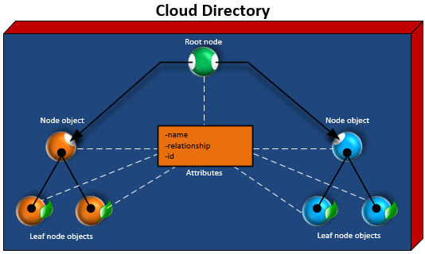

Amazon Cloud Directory will no longer be open to new customers starting on November 7, 2025. For alternatives to Cloud Directory, explore [Amazon DynamoDB](https://aws.amazon.com/dynamodb/ "https://aws.amazon.com/dynamodb/") and [Amazon Neptune](https://aws.amazon.com/neptune/ "https://aws.amazon.com/neptune/"). If you need help choosing the right alternative for your use case, or for any other questions, contact [AWS Support](https://aws.amazon.com/support/ "https://aws.amazon.com/support/").
 

# Directory Structure

Data in a directory is structured hierarchically in a tree pattern consisting of nodes,
 leaf nodes, and links between the nodes, as shown in the following illustration. This is
 useful in application development to model, store, and quickly traverse hierarchical
 data.

## Root Node

The root is the top node in a directory that is used to organize the parent and child
 nodes in the hierarchy. This is similar to how folders in a file system can contain
 subfolders and files.

## Node

A node represents an object that can have child objects. For example, a node can
 logically represent a group of managers whereby various user objects are the children, or
 leaf nodes. A node object can only have one parent.

## Leaf Node

A leaf node represents an object with no children that may or may not be directly
 connected to a parent node. For example, a user or device object. A leaf node object can
 have multiple parents. While leaf node objects are not required to be connected to a parent
 node, it is strongly recommended that you do so, since without a path from the root, the
 object can only be accessed by it’s `NodeId`. If you misplace the id of such an
 Object, you will have no way to locate it again.

## Node Link

The connection between one node and another. Cloud Directory supports a variety of link
 types between nodes, including parent-child links, policy links, and index attribute
 links.
