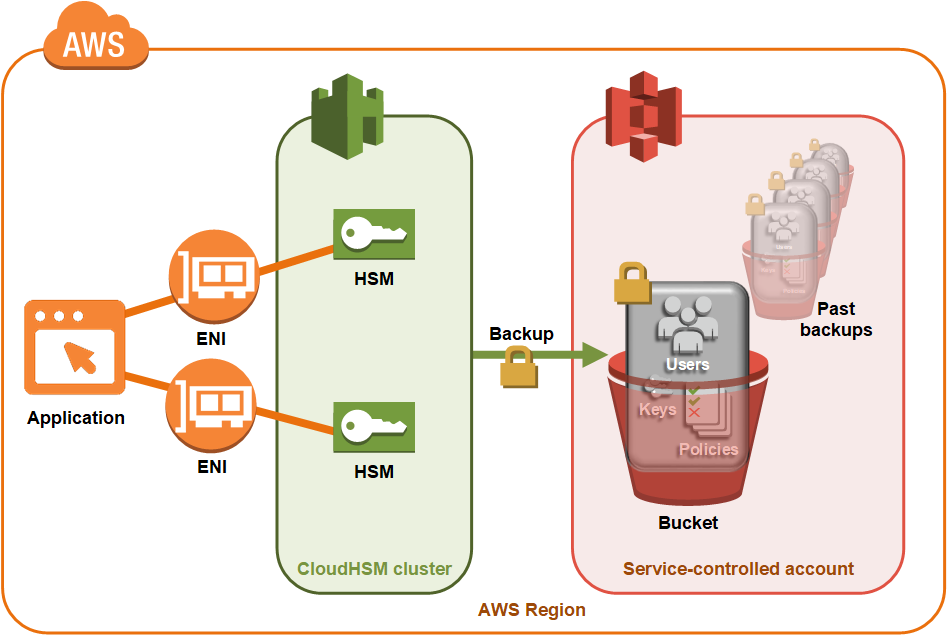

# AWS CloudHSM cluster backups

AWS CloudHSM makes periodic backups of the users, keys, and policies in the cluster.
Backups are secure, durable, and updated on a predictable schedule. The following illustration shows the relationship of your backups to the cluster.

For more information
about working with backups, see [Cluster backups](manage-backups.md "manage-backups.md").

**Security**
When AWS CloudHSM makes a backup from the HSM, the HSM encrypts all of its data before sending it
to AWS CloudHSM. The data never leaves the HSM in plaintext form. Additionally, backups cannot be decrypted by AWS because AWS doesn’t have access to key used to decrypt the backups. For more information, see [Security of cluster backups](data-protection-backup-security.md "data-protection-backup-security.md")

**Durability**
AWS CloudHSM stores backups in a service-controlled Amazon Simple Storage Service (Amazon S3) bucket in the same region
as your cluster. Backups have a 99.999999999% durability level, the same as any object stored in Amazon S3.
