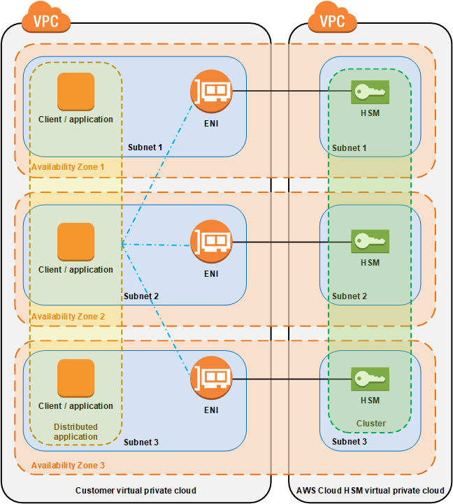

# AWS CloudHSM cluster architecture

When you create a cluster, you specify an Amazon Virtual Private Cloud (VPC) in your AWS account and one or
 more subnets in that VPC. We recommend that you create one subnet in each Availability Zone
 (AZ) in your chosen AWS Region. You can create private subnets when you create a VPC. To learn more, see 
 [Create a virtual private cloud (VPC) for AWS CloudHSM](create-vpc.md "create-vpc.md").

Each time you create an HSM, you specify the cluster and Availability Zone for the HSM. By
 putting the HSMs in different Availability Zones, you achieve redundancy and high availability
 in case one Availability Zone is unavailable.

When you create an HSM, AWS CloudHSM puts an elastic network interface (ENI) in the specified
 subnet in your AWS account. The elastic network interface is the interface for interacting
 with the HSM. The HSM resides in a separate VPC in an AWS account that is owned by AWS CloudHSM.
 The HSM and its corresponding network interface are in the same Availability Zone.

To interact with the HSMs in a cluster, you need the AWS CloudHSM client software. Typically you
 install the client on Amazon EC2 instances, known as *client instances*, that
 reside in the same VPC as the HSM ENIs, as shown in the following figure. That's not
 technically required though; you can install the client on any compatible computer, as long as
 it can connect to the HSM ENIs. The client communicates with the individual HSMs in your
 cluster through their ENIs.

The following figure represents an AWS CloudHSM cluster with three HSMs, each in a different
 Availability Zone in the VPC.

