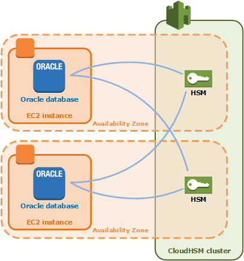

# AWS CloudHSM cluster high availability and load
 balancing

When you create an AWS CloudHSM cluster with more than one HSM, you automatically get load
 balancing. Load balancing means that the [AWS CloudHSM
 client](client-tools-and-libraries.md "client-tools-and-libraries.md") distributes cryptographic operations across all HSMs in the cluster based on
 each HSM's capacity for additional processing.

When you create the HSMs in different AWS Availability Zones, you automatically get high
 availability. High availability means that you get higher reliability because no individual
 HSM is a single point of failure. We recommend that you have a minimum of two HSMs in each
 cluster, with each HSM in different Availability Zones within an AWS Region.

For example, the following figure shows an Oracle database application that is distributed
 to two different Availability Zones. The database instances store their master keys in a
 cluster that includes an HSM in each Availability Zone. AWS CloudHSM automatically synchronizes the
 keys to both HSMs so that they are immediately accessible and redundant.

