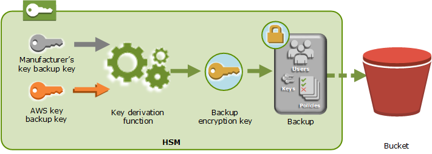

# Security of cluster backups

When AWS CloudHSM makes a backup from the HSM, the HSM encrypts all of its data before sending it
to AWS CloudHSM. The data never leaves the HSM in plaintext form. Additionally, backups cannot be decrypted by AWS because AWS doesn’t have access to key used to decrypt the backups.

To encrypt its data, the HSM uses a unique, ephemeral encryption key known as the
ephemeral backup key (EBK). The EBK is an AES 256-bit encryption key generated inside the HSM
when AWS CloudHSM makes a backup. The HSM generates the EBK, then uses it to encrypt the HSM's data
with a FIPS-approved AES key wrapping method that complies with [NIST special
publication 800-38F](http://nvlpubs.nist.gov/nistpubs/SpecialPublications/NIST.SP.800-38F.pdf "http://nvlpubs.nist.gov/nistpubs/SpecialPublications/NIST.SP.800-38F.pdf"). Then the HSM gives the encrypted data to AWS CloudHSM. The encrypted
data includes an encrypted copy of the EBK.

To encrypt the EBK, the HSM uses another encryption key known as the persistent backup key
(PBK). The PBK is also an AES 256-bit encryption key. To generate the PBK, the HSM uses a
FIPS-approved key derivation function (KDF) in counter mode that complies with [NIST
special publication 800-108](http://nvlpubs.nist.gov/nistpubs/Legacy/SP/nistspecialpublication800-108.pdf "http://nvlpubs.nist.gov/nistpubs/Legacy/SP/nistspecialpublication800-108.pdf"). The inputs to this KDF include the following:

- A manufacturer key backup key (MKBK), permanently embedded in the HSM hardware by the
  hardware manufacturer.
- An AWS key backup key (AKBK), securely installed in the HSM when it's initially
  configured by AWS CloudHSM.
  The encryption processes are summarized in the following figure. The backup encryption key
  represents the persistent backup key (PBK) and the ephemeral backup key (EBK).

AWS CloudHSM can restore backups onto only AWS-owned HSMs made by the same manufacturer.
Because each backup contains all users, keys, and configuration from the original HSM, the
restored HSM contains the same protections and access controls as the original. The restored
data overwrites all other data that might have been on the HSM prior to restoration.

A backup consists of only encrypted data. Before the service stores a backup in Amazon S3, the
service encrypts the backup again using AWS Key Management Service (AWS KMS).
