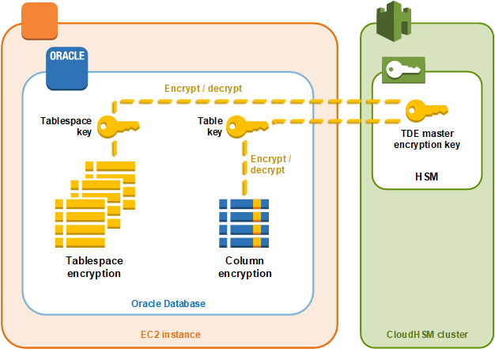

# Oracle database transparent data encryption (TDE) with

AWS CloudHSM

Transparent Data Encryption (TDE) is used to encrypt database files. Using TDE, database software encrypts data before storing it on disk.
The data in the database's table columns or tablespaces are encrypted with a table key or tablespace key. Some versions of Oracle's database software offer TDE.
In Oracle TDE, these keys are encrypted with a TDE master encryption key. You can achieve greater security by storing the TDE master encryption key in the HSMs in your AWS CloudHSM cluster.


In this solution, you use Oracle Database installed on an Amazon EC2 instance. Oracle Database
integrates with the [AWS CloudHSM software library for PKCS #11](pkcs11-library.md "pkcs11-library.md") to
store the TDE master key in the HSMs in your cluster.

###### Important

- We recommend installing Oracle Database on an Amazon EC2 instance.
  Complete the following steps to accomplish Oracle TDE integration with AWS CloudHSM.

###### Topics

- [Step 1. Set up the prerequisites](#oracle-tde-prerequisites "#oracle-tde-prerequisites")
- [Step 3: Generate the Oracle TDE master encryption key](#oracle-tde-generate-master-key "#oracle-tde-generate-master-key")

## Step 1. Set up the prerequisites

To accomplish Oracle TDE integration with AWS CloudHSM, you need the following:

- An active AWS CloudHSM cluster with at least one HSM.
- An Amazon EC2 instance running the Amazon Linux operating system with the following software installed:
  - The AWS CloudHSM client and command line tools.
  - The AWS CloudHSM software library for PKCS #11.
  - Oracle Database. AWS CloudHSM supports Oracle TDE integration. Client SDK 5.6 and higher support Oracle TDE for Oracle Database 19c.
    Client SDK 3 supports Oracle TDE for Oracle Database versions 11g and 12c.

- A cryptographic user (CU) to own and manage the TDE master encryption key on the HSMs in your cluster.

Complete the following steps to set up all of the prerequisites.

###### To set up the prerequisites for Oracle TDE integration with AWS CloudHSM

1. Complete the steps in [Getting started](getting-started.md "getting-started.md"). After
   you do so, you'll have an active cluster with one HSM. You will also have an Amazon EC2 instance running the
   Amazon Linux operating system. The AWS CloudHSM client and command line tools will also be installed and configured.
2. (Optional) Add more HSMs to your cluster. For more information, see
   [Adding an HSM to an AWS CloudHSM cluster](add-hsm.md "add-hsm.md").
3. Connect to your Amazon EC2 client instance and do the following:
   1. [Install the AWS CloudHSM software library for PKCS #11](pkcs11-library-install.md "pkcs11-library-install.md").
   2. Install Oracle Database. For more information, see the
      [Oracle Database documentation](https://docs.oracle.com/en/database/ "https://docs.oracle.com/en/database/").
      Client SDK 5.6 and higher support Oracle TDE for Oracle Database 19c.
      Client SDK 3 supports Oracle TDE for Oracle Database versions 11g and 12c.
   3. Use the cloudhsm_mgmt_util command line tool to create a cryptographic user (CU) on
      your cluster. For more information about creating a CU, see [How to Manage HSM Users with CMU](create-users-cmu.md "create-users-cmu.md") and [HSM users](manage-hsm-users.md "manage-hsm-users.md").

## Step 3: Generate the Oracle TDE master encryption key

To generate the Oracle TDE master key on the HSMs in your cluster, complete the steps in
the following procedure.

###### To generate the master key

1. Use the following command to open Oracle SQL\*Plus. When prompted,
   type the system password that you set when you installed Oracle Database.

```
`sqlplus / as sysdba`
```

###### Note

For Client SDK 3, you must set the `CLOUDHSM_IGNORE_CKA_MODIFIABLE_FALSE` environment
variable each time you generate a master key. This variable is only needed for master
key generation. For more information, see "Issue: Oracle sets the PCKS #11 attribute
`CKA_MODIFIABLE` during master key generation, but the HSM does not support
it" in [Known Issues for Integrating Third-Party
Applications](ki-third-party.md "ki-third-party.md"). 2. Run the SQL statement that creates the master encryption key, as shown in the following
examples. Use the statement that corresponds to your version of Oracle Database. Replace
`<CU user name>` with the user name of the cryptographic user
(CU). Replace `<password>` with the CU password.

###### Important

Run the following command only once. Each time the command is run, it creates a new
master encryption key.

    * For Oracle Database version 11, run the following SQL statement.


    ```
    `SQL>` `alter system set encryption key identified by "`<CU user name>`:`<password>`";`
    ```
    * For Oracle Database version 12 and version 19c, run the following SQL statement.


    ```
    `SQL>` `administer key management set key identified by "`<CU user name>`:`<password>`";`
    ```If the response is `System altered` or `keystore altered`, then you

successfully generated and set the master key for Oracle TDE. 3. (Optional) Run the following command to verify the status of the _Oracle wallet_.

```
`SQL>` `select * from v$encryption_wallet;`
```

If the wallet is not open, use one of the following commands to open it. Replace
`<CU user name>` with the name of the cryptographic user (CU). Replace
`<password>` with the CU password.

    * For Oracle 11, run the following command to open the wallet.


    ```
    `SQL>` `alter system set encryption wallet open identified by "`<CU user name>`:`<password>`";`
    ```

    To manually close the wallet, run the following command.


    ```
    `SQL>` `alter system set encryption wallet close identified by "`<CU user name>`:`<password>`";`
    ```
    * For Oracle 12 and Oracle 19c, run the following command to open the wallet.


    ```
    `SQL>` `administer key management set keystore open identified by "`<CU user name>`:`<password>`";`
    ```

    To manually close the wallet, run the following command.


    ```
    `SQL>` `administer key management set keystore close identified by "`<CU user name>`:`<password>`";`
    ```
