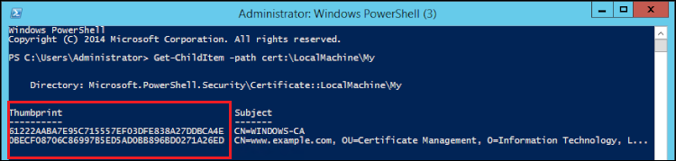
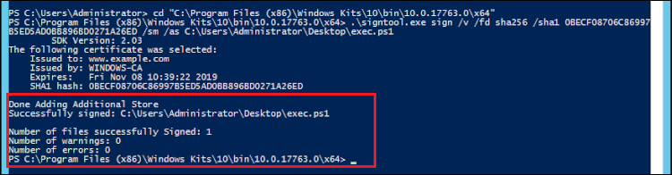

# Use Microsoft SignTool with Client SDK 3 to sign files

In cryptography and public key infrastructure (PKI), digital signatures are used to
 confirm that data has been sent by a trusted entity. Signatures also indicate that the data has
 not been tampered with in transit. A signature is an encrypted hash that is generated with the
 sender's private key. The receiver can verify the data integrity by decrypting its hash
 signature with the sender's public key. In turn, it is the sender's responsibility to maintain a
 digital certificate. The digital certificate demonstrates the sender's ownership of the private
 key and provides the recipient with the public key that is needed for decryption. As long as the
 private key is owned by the sender, the signature can be trusted. AWS CloudHSM provides secure FIPS
 140-2 level 3 validated hardware for you to secure these keys with exclusive single-tenant
 access.

Many organizations use Microsoft SignTool, a command line tool that signs, verifies, and
 timestamps files to simplify the code signing process. You can use AWS CloudHSM to securely store your
 key pairs until they are needed by SignTool, thus creating an easily automatable workflow for
 signing data.

The following topics provide an overview of how to use SignTool with AWS CloudHSM.

###### Topics

* [Step 1: Set up the prerequisites](#signtool-sdk3-prereqs "#signtool-sdk3-prereqs")
* [Step 2: Create a signing
 certificate](#signtool-sdk3-csr "#signtool-sdk3-csr")
* [Step 3: Sign a file](#signtool-sdk3-sign "#signtool-sdk3-sign")

## Step 1: Set up the prerequisites


To use Microsoft SignTool with AWS CloudHSM, you need the following:


* An Amazon EC2 client instance running a Windows operating system.
* A certificate authority (CA), either self-maintained or established by a
 third-party provider.
* An active AWS CloudHSM cluster in the same virtual public cloud (VPC) as your EC2
 instance. The cluster must contain at least one HSM.
* A crypto user (CU) to own and manage keys in the AWS CloudHSM cluster.
* An unsigned file or executable.
* The Microsoft Windows Software Development Kit (SDK).

###### To set up the prerequisites for using AWS CloudHSM with Windows SignTool

1. Follow the instructions in the [Getting
 Started](getting-started.md "getting-started.md") section of this guide to launch a Windows EC2 instance and an
 AWS CloudHSM cluster.
2. If you would like to host your own Windows Server CA, follow steps 1 and 2 in
 [Configuring Windows Server as a Certificate
 Authority with AWS CloudHSM](win-ca-overview-sdk3.md "win-ca-overview-sdk3.md"). Otherwise, continue to use your publicly trusted
 third-party CA.
3. Download and install one of the following versions of the Microsoft Windows SDK on
 your Windows EC2 instance:


	* [Microsoft Windows SDK 10](https://developer.microsoft.com/en-us/windows/downloads/windows-10-sdk "https://developer.microsoft.com/en-us/windows/downloads/windows-10-sdk")
	* [Microsoft Windows SDK 8.1](https://developer.microsoft.com/en-us/windows/downloads/windows-8-1-sdk "https://developer.microsoft.com/en-us/windows/downloads/windows-8-1-sdk")
	* [Microsoft Windows SDK 7](https://www.microsoft.com/en-us/download/details.aspx?id=8279 "https://www.microsoft.com/en-us/download/details.aspx?id=8279")
The `SignTool` executable is part of the Windows SDK Signing Tools for
 Desktop Apps installation feature. You can omit the other features to be installed
 if you don’t need them. The default installation location is:


```
C:\Program Files (x86)\Windows Kits\`<SDK version>`\bin\`<version number>`\`<CPU architecture>`\signtool.exe
```

You can now use the Microsoft Windows SDK, your AWS CloudHSM cluster, and your CA to [Create a Signing Certificate](#signtool-sdk3-csr "#signtool-sdk3-csr").


## Step 2: Create a signing
 certificate


Now that you've downloaded the Windows SDK on to your EC2 instance, you can use it to
 generate a certificate signing request (CSR). The CSR is an unsigned certificate that is
 eventually passed to your CA for signing. In this example, we use the `certreq`
 executable that's included with the Windows SDK to generate the CSR.


###### To generate a CSR using the `certreq` executable

1. If you haven't already done so, connect to your Windows EC2 instance. For more
 information, see [Connect to Your Instance](https://docs.aws.amazon.com/AWSEC2/latest/WindowsGuide/EC2_GetStarted.html#ec2-connect-to-instance-windows "https://docs.aws.amazon.com/AWSEC2/latest/WindowsGuide/EC2_GetStarted.html#ec2-connect-to-instance-windows") in the
 *Amazon EC2 User Guide*.
2. Create a file called `request.inf` that contains the lines below.
 Replace the `Subject` information with that of your organization. For an
 explanation of each parameter, see [Microsoft's documentation](https://docs.microsoft.com/en-us/windows-server/administration/windows-commands/certreq_1#BKMK_New "https://docs.microsoft.com/en-us/windows-server/administration/windows-commands/certreq_1#BKMK_New").


```
[Version]
Signature= $Windows NT$
[NewRequest]
Subject = "C=`<Country>`,CN=`<www.website.com>`,O=`<Organization>`,OU=`<Organizational-Unit>`,L=`<City>`,S=`<State>`"
RequestType=PKCS10
HashAlgorithm = SHA256
KeyAlgorithm = RSA
KeyLength = 2048
ProviderName = "Cavium Key Storage Provider"
KeyUsage = "CERT_DIGITAL_SIGNATURE_KEY_USAGE"
MachineKeySet = True
Exportable = False
```
3. Run `certreq.exe`. For this example, we save the CSR as
 `request.csr`.


```
certreq.exe -new request.inf request.csr
```

Internally, a new key pair is generated on your AWS CloudHSM cluster, and the pair's
 private key is used to create the CSR.
4. Submit the CSR to your CA. If you are using a Windows Server CA, follow these
 steps:


	1. Enter the following command to open the CA tool:
	
	
	
	```
	certsrv.msc
	```
	2. In the new window, right-click the CA server's name. Choose **All
	 Tasks**, and then choose **Submit new
	 request**.
	3. Navigate to `request.csr`'s location and choose
	 **Open**.
	4. Navigate to the **Pending Requests** folder by expanding
	 the **Server CA** menu. Right-click on the request you just
	 created, and under **All Tasks** choose
	 **Issue**.
	5. Now navigate to the **Issued Certificates** folder (above
	 the **Pending Requests** folder).
	6. Choose **Open** to view the certificate, and then choose
	 the **Details** tab.
	7. Choose **Copy to File** to start the Certificate Export
	 Wizard. Save the DER-encoded X.509 file to a secure location as
	 `signedCertificate.cer`.
	8. Exit the CA tool and use the following command, which moves the
	 certificate file to the Personal Certificate Store in Windows. It can then
	 be used by other applications.
	
	
	
	```
	certreq.exe -accept signedCertificate.cer
	```

You can now use your imported certificate to [Sign a File](#signtool-sdk3-sign "#signtool-sdk3-sign") .


## Step 3: Sign a file


You are now ready to use SignTool and your imported certificate to sign your example file.
 In order to do so, you need to know the certificate's SHA-1 hash, or *thumbprint*. The thumbprint is used to ensure that SignTool
 only uses certificates that are verified by AWS CloudHSM. In this example, we use PowerShell to get
 the certificate's hash. You can also use the CA's GUI or the Windows SDK's
 `certutil` executable. 


###### To obtain a certificate's thumbprint and use it to sign a file

1. Open PowerShell as an administrator and run the following command:


```
Get-ChildItem -path cert:\LocalMachine\My
```

Copy the `Thumbprint` that is returned.



2. Navigate to the directory within PowerShell that contains
 `SignTool.exe`. The default location is `C:\Program Files
 (x86)\Windows Kits\10\bin\10.0.17763.0\x64`.
3. Finally, sign your file by running the following command. If the command is
 successful, PowerShell returns a success message.


```
signtool.exe sign /v /fd sha256 /sha1 `<thumbprint>` /sm C:\Users\Administrator\Desktop\`<test>`.ps1
```



4. (Optional) To verify the signature on the file, use the following command:


```
signtool.exe verify /v /pa C:\Users\Administrator\Desktop\`<test>`.ps1
```
