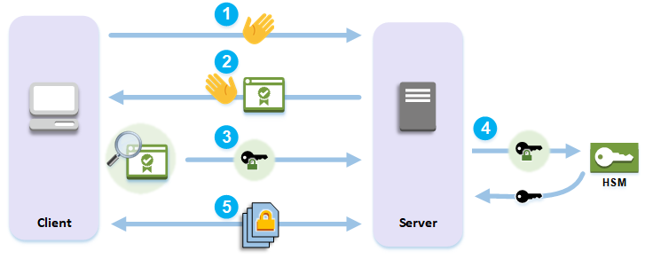

# How SSL/TLS offload with AWS CloudHSM works

To establish an HTTPS connection, your web server performs a handshake process with clients.
 As part of this process, the server offloads some of the cryptographic processing to the
 HSMs in the AWS CloudHSM cluster, as shown in the following figure. Each step of the process is
 explained below the figure. 

###### Note

The following image and process assumes that RSA is used for server verification and key
 exchange. The process is slightly different when Diffie–Hellman is used instead of RSA.
 

1. The client sends a hello message to the server.
2. The server responds with a hello message and sends the server's certificate.
3. The client performs the following actions:

	1. Verifies that the SSL/TLS server certificate is signed by a root certificate that
	 the client trusts.
	2. Extracts the public key from the server certificate.
	3. Generates a pre-master secret and encrypts it with the server's public key.
	4. Sends the encrypted pre-master secret to the server.
4. To decrypt the client's pre-master secret, the server sends it to the HSM. The HSM uses
 the private key in the HSM to decrypt the pre-master secret and then it sends the pre-master
 secret to the server. Independently, the client and server each use the pre-master secret and
 some information from the hello messages to calculate a master secret.
5. The handshake process ends. For the rest of the session, all messages sent between the
 client and the server are encrypted with derivatives of the master secret.
To learn how to configure SSL/TLS offload with AWS CloudHSM, see one of the following
 topics:

* [AWS CloudHSM SSL/TLS offload on Linux using NGINX or
 Apache with OpenSSL](third-offload-linux-openssl.md "third-offload-linux-openssl.md")
* [AWS CloudHSM SSL/TLS offload on Linux using Tomcat with JSSE](third-offload-linux-jsse.md "third-offload-linux-jsse.md")
* [AWS CloudHSM SSL/TLS offload on Windows using IIS with KSP](ssl-offload-windows.md "ssl-offload-windows.md")
