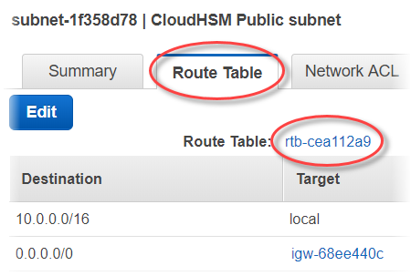
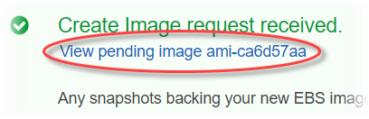
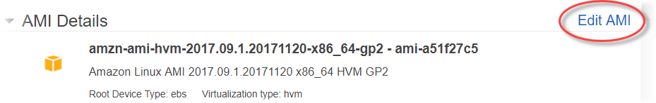

# Add a load balancer with ELB for AWS CloudHSM(optional)

After you set up SSL/TLS offload with one web server, you can create more web servers and an
ELB load balancer that routes HTTPS traffic to the web servers. A load balancer can reduce the
load on your individual web servers by balancing traffic across two or more servers. It can also
increase the availability of your website because the load balancer monitors the health of your
web servers and only routes traffic to healthy servers. If a web server fails, the load balancer
automatically stops routing traffic to it.

###### Topics

- [Step 1. Create a subnet for a
  second web server](#ssl-offload-load-balancer-create-new-subnet "#ssl-offload-load-balancer-create-new-subnet")
- [Step 2. Create the second web
  server](#ssl-offload-load-balancer-create-web-server "#ssl-offload-load-balancer-create-web-server")
- [Step 3. Create the load
  balancer](#ssl-offload-load-balancer-create-load-balancer "#ssl-offload-load-balancer-create-load-balancer")

## Step 1. Create a subnet for a

second web server

Before you can create another web server, you need to create a new subnet in the same VPC
that contains your existing web server and AWS CloudHSM cluster.

###### To create a new subnet

1. Open the [**Subnets** section of the Amazon VPC console](https://console.aws.amazon.com/vpc/home#subnets: "https://console.aws.amazon.com/vpc/home#subnets:").
2. Choose **Create Subnet**.
3. In the **Create Subnet** dialog box, do the following:
   1. For **Name tag**, type a name for your subnet.
   2. For **VPC**, choose the AWS CloudHSM VPC that contains your existing web
      server and AWS CloudHSM cluster.
   3. For **Availability Zone**, choose an Availability Zone that is
      different from the one that contains your existing web server.
   4. For **IPv4 CIDR block**, type the CIDR block to use for the
      subnet. For example, type `10.0.10.0/24`.
   5. Choose **Yes, Create**.

4. Select the check box next to the public subnet that contains your existing web server.
   This is different from the public subnet that you created in the previous step.
5. In the content pane, choose the **Route Table** tab. Then choose the
   link for the route table.

 6. Select the check box next to the route table. 7. Choose the **Subnet Associations** tab. Then choose
**Edit**. 8. Select the check box next to the public subnet that you created earlier in this
procedure. Then choose **Save**.

## Step 2. Create the second web

server

Complete the following steps to create a second web server with the same configuration as
your existing web server.

###### To create a second web server

1. Open the [**Instances**](https://console.aws.amazon.com/ec2/v2/home#Instances: "https://console.aws.amazon.com/ec2/v2/home#Instances:") section of the Amazon EC2 console at.
2. Select the check box next to your existing web server instance.
3. Choose **Actions**, **Image**, and then
   **Create Image**.
4. In the **Create Image** dialog box, do the following:
   1. For **Image name**, type a name for the image.
   2. For **Image description**, type a description for the
      image.
   3. Choose **Create Image**. This action reboots your existing web
      server.
   4. Choose the **View pending image ami-`<AMI
ID>`** link.

   

   In the **Status** column, note your image status. When your image
   status is **available** (this might take several minutes), go to the
   next step.

5. In the navigation pane, choose **Instances**.
6. Select the check box next to your existing web server.
7. Choose **Actions** and choose **Launch More Like
   This**.
8. Choose **Edit AMI**.

 9. In the left navigation pane, choose **My AMIs**. Then clear the text
in the search box. 10. Next to your web server image, choose **Select**. 11. Choose **Yes, I want to continue with this AMI (`<image
 name>` - ami-`<AMI ID>`)**. 12. Choose **Next**. 13. Select an instance type, and then choose **Next: Configure Instance
Details**. 14. For **Step 3: Configure Instance Details**, do the following:

    1. For **Network**, choose the VPC that contains your existing web
     server.
    2. For **Subnet**, choose the public subnet that you created for the
     second web server.
    3. For **Auto-assign Public IP**,
     choose**Enable**.
    4. Change the remaining instance details as preferred. Then choose **Next:
     Add Storage**.

15. Change the storage settings as preferred. Then choose **Next: Add
    Tags**.
16. Add or edit tags as preferred. Then choose **Next: Configure Security
    Group**.
17. For **Step 6: Configure Security Group**, do the following:
    1.  For **Assign a security group**, choose **Select an
        existing security group**.
    2.  Select the check box next to the security group named
        **cloudhsm-`<cluster ID>`-sg**. AWS CloudHSM
        created this security group on your behalf when you [created the cluster](create-cluster.md "create-cluster.md"). You must choose this security group to allow the web
        server instance to connect to the HSMs in the cluster.
    3.  Select the check box next to the security group that allows inbound HTTPS traffic.
        You [created
        this security group previously](ssl-offload-windows.md#ssl-offload-add-security-group-windows "ssl-offload-windows.md#ssl-offload-add-security-group-windows").
    4.  (Optional) Select the check box next to a security group that allows inbound SSH
        (for Linux) or RDP (for Windows) traffic from your network. That is, the security
        group must allow inbound TCP traffic on port 22 (for SSH on Linux) or port 3389 (for
        RDP on Windows). Otherwise, you cannot connect to your client instance. If you don't
        have a security group like this, you must create one and then assign it to your client
        instance later.Choose **Review and Launch**.

18. Review your instance details, and then choose **Launch**.
19. Choose whether to launch your instance with an existing key pair, create a new key
    pair, or launch your instance without a key pair.

        * To use an existing key pair, do the following:


        	1. Choose **Choose an existing key pair**.
        	2. For **Select a key pair**, choose the key pair to use.
        	3. Select the check box next to **I acknowledge that I have access to the
        	 selected private key file (`<private key file
        	 name>`.pem), and that without this file, I won't be able to log
        	 into my instance.**
        * To create a new key pair, do the following:


        	1. Choose **Create a new key pair**.
        	2. For **Key pair name**, type a key pair name.
        	3. Choose **Download Key Pair** and save the private key file in
        	 a secure and accessible location.


        	###### Warning

        	You cannot download the private key file again after this point. If you do
        	 not download the private key file now, you will be unable to access the client
        	 instance.
        * To launch your instance without a key pair, do the following:


        	1. Choose **Proceed without a key pair**.
        	2. Select the check box next to **I acknowledge that I will not be able
        	 to connect to this instance unless I already know the password built into this
        	 AMI.**

    Choose **Launch Instances**.

## Step 3. Create the load

balancer

Complete the following steps to create an ELB load balancer that routes HTTPS traffic to
your web servers.

###### To create a load balancer

1. Open the [**Load balancers**](https://console.aws.amazon.com/ec2/v2/home#LoadBalancers: " https://console.aws.amazon.com/ec2/v2/home#LoadBalancers:") section of the Amazon EC2 console.
2. Choose **Create Load Balancer**.
3. In the **Network Load Balancer** section, choose
   **Create**.
4. For **Step 1: Configure Load Balancer**, do the following:
   1. For **Name**, type a name for the load balancer that you are
      creating.
   2. In the **Listeners** section, for **Load Balancer
      Port**, change the value to `443`.
   3. In the **Availability Zones** section, for
      **VPC**, choose the VPC that contains your web servers.
   4. In the **Availability Zones** section, choose the subnets that
      contain your web servers.
   5. Choose **Next: Configure Routing**.

5. For **Step 2: Configure Routing**, do the following:
   1. For **Name**, type a name for the target group that you are
      creating.
   2. For **Port**, change the value to
      `443`.
   3. Choose **Next: Register Targets**.

6. For **Step 3: Register Targets**, do the following:
   1. In the **Instances** section, select the check boxes next to your
      web server instances. Then choose **Add to registered**.
   2. Choose **Next: Review**.

7. Review your load balancer details, then choose **Create**.
8. When the load balancer has been successfully created, choose
   **Close**.

After you complete the preceding steps, the Amazon EC2 console shows your ELB load
balancer.

When your load balancer's state is active, you can verify that the load balancer is
working. That is, you can verify that it's sending HTTPS traffic to your web servers with
SSL/TLS offload with AWS CloudHSM. You can do this with a web browser or a tool such as [OpenSSL s_client](https://www.openssl.org/docs/manmaster/man1/s_client.html "https://www.openssl.org/docs/manmaster/man1/s_client.html").

###### To verify that your load balancer is working with a web browser

1. In the Amazon EC2 console, find the **DNS name** for the load balancer
   that you just created. Then select the DNS name and copy it.
2. Use a web browser such as Mozilla Firefox or Google Chrome to connect to your load
   balancer using the load balancer's DNS name. Ensure that the URL in the address bar begins
   with https://.

###### Tip

You can use a DNS service such as Amazon Route 53 to route your website's domain name
(for example, https://www.example.com/) to your web server. For more information, see
[Routing Traffic to an Amazon EC2
Instance](../../../Route53/latest/DeveloperGuide/routing-to-ec2-instance.md "../../../Route53/latest/DeveloperGuide/routing-to-ec2-instance.md") in the _Amazon Route 53 Developer Guide_ or in the documentation for
your DNS service. 3. Use your web browser to view the web server certificate. For more information, see the
following:

    * For Mozilla Firefox, see [View a Certificate](https://support.mozilla.org/en-US/kb/secure-website-certificate#w_view-a-certificate "https://support.mozilla.org/en-US/kb/secure-website-certificate#w_view-a-certificate") on the Mozilla Support website.
    * For Google Chrome, see [Understand
     Security Issues](https://developers.google.com/web/tools/chrome-devtools/security "https://developers.google.com/web/tools/chrome-devtools/security") on the Google Tools for Web Developers website.

Other web browsers might have similar features that you can use to view the web server
certificate. 4. Ensure that the certificate is the one that you configured the web server to
use.

###### To verify that your load balancer is working with OpenSSL s_client

1. Use the following OpenSSL command to connect to your load balancer using HTTPS.
   Replace `<DNS name>` with the DNS name of your load
   balancer.

```
`openssl s_client -connect `<DNS name>`:443`
```

###### Tip

You can use a DNS service such as Amazon Route 53 to route your website's domain name
(for example, https://www.example.com/) to your web server. For more information, see
[Routing Traffic to an Amazon EC2
Instance](../../../Route53/latest/DeveloperGuide/routing-to-ec2-instance.md "../../../Route53/latest/DeveloperGuide/routing-to-ec2-instance.md") in the _Amazon Route 53 Developer Guide_ or in the documentation for
your DNS service. 2. Ensure that the certificate is the one that you configured the web server to
use.

You now have a website that is secured with HTTPS, with the web server's private key stored
in an HSM in your AWS CloudHSM cluster. Your website has two web servers and a load balancer to help
improve efficiency and availability.
