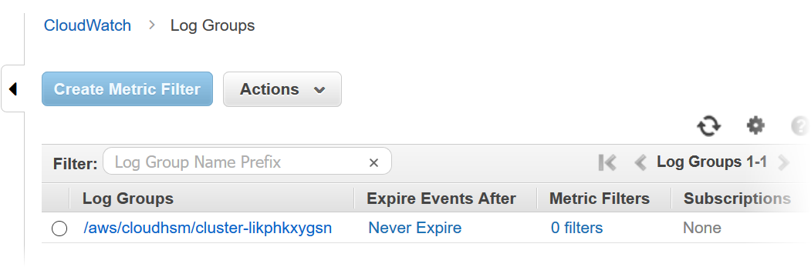
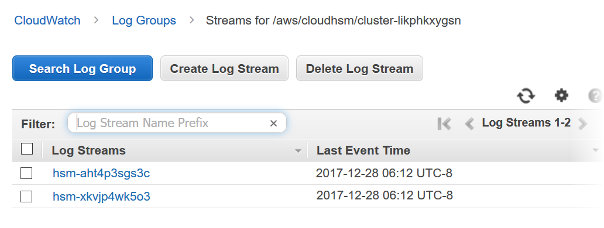
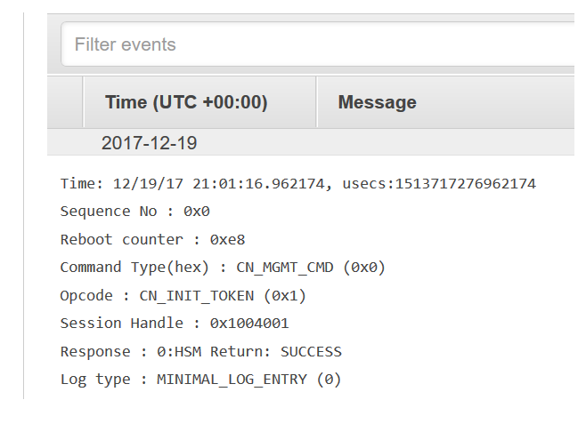
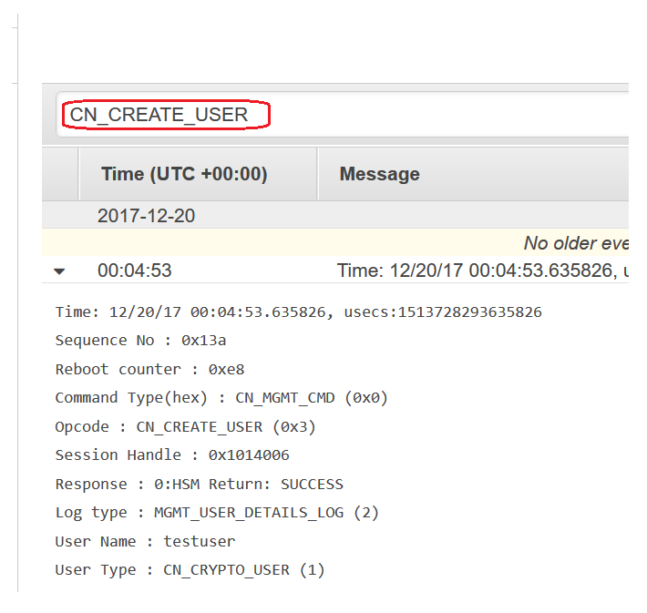

# Viewing AWS CloudHSM audit logs in CloudWatch Logs

Amazon CloudWatch Logs organizes the audit logs into _log groups_ and,
within a log group, into _log streams_. Each log entry is an
_event_. AWS CloudHSM creates one _log
group_ for each cluster and one _log stream_ for
each HSM in the cluster. You do not have to create any CloudWatch Logs components or change any
settings.

- The _log group_ name is
  `/aws/cloudhsm/`<cluster ID>``; for example
`/aws/cloudhsm/cluster-likphkxygsn`. When you use the log group name in a
  AWS CLI or PowerShell command, be sure to enclose it in double quotation marks.
- The _log stream_ name is the HSM ID; for example,
  `hsm-nwbbiqbj4jk`.

In general, there is one log stream for each HSM. However, any action that changes the
HSM ID, such as when an HSM fails and is replaced, creates a new log stream.
For more information about CloudWatch Logs concepts, see [Concepts](../../../AmazonCloudWatch/latest/logs/CloudWatchLogsConcepts.md "../../../AmazonCloudWatch/latest/logs/CloudWatchLogsConcepts.md") in the
_Amazon CloudWatch Logs User Guide_.

You can view the audit logs for an HSM from the CloudWatch Logs page in the AWS Management Console, the [CloudWatch Logs commands](../../../cli/latest/reference/logs/index.md#cli-aws-logs "../../../cli/latest/reference/logs/index.md#cli-aws-logs") in the AWS CLI, the
[CloudWatch Logs PowerShell
cmdlets](../../../powershell/latest/reference/items/Amazon_CloudWatch_Logs_cmdlets.md "../../../powershell/latest/reference/items/Amazon_CloudWatch_Logs_cmdlets.md"), or the [CloudWatch Logs SDKs](../../../AmazonCloudWatchLogs/latest/APIReference.md "../../../AmazonCloudWatchLogs/latest/APIReference.md"). For instructions,
see [View
Log Data](../../../AmazonCloudWatch/latest/logs/Working-with-log-groups-and-streams.md#ViewingLogData "../../../AmazonCloudWatch/latest/logs/Working-with-log-groups-and-streams.md#ViewingLogData") in the _Amazon CloudWatch Logs User Guide_.

For example, the following image shows the log group for the
`cluster-likphkxygsn` cluster in the AWS Management Console.

When you choose the cluster log group name, you can view the log stream for each of the
HSMs in the cluster. The following image shows the log streams for the HSMs in the
`cluster-likphkxygsn` cluster.

When you choose an HSM log stream name, you can view the events in the audit log. For
example, this event, which has a sequence number of 0x0 and an `Opcode` of
`CN_INIT_TOKEN`, is typically the first event for the first HSM in each cluster.
It records the initialization of the HSM in the cluster.

You can use all the many features in CloudWatch Logs to manage your audit logs. For example, you can
use the **Filter events** feature to find particular text in an event, such
as the `CN_CREATE_USER`
`Opcode`.

To find all events that do not include the specified text, add a minus sign (-) before the
text. For example, to find events that do not include `CN_CREATE_USER`, enter
**-CN_CREATE_USER**.

