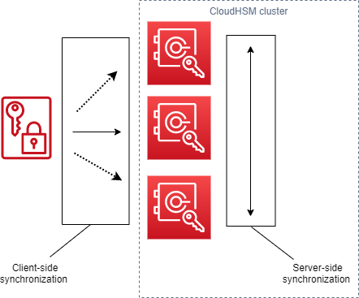

# Understanding AWS CloudHSM key
 synchronization

AWS CloudHSM uses key synchronization to clone token keys across all the hardware security
 modules (HSM) in a cluster. You create token keys as persistent keys during key
 generation, import, or unwrap operations. To distribute these keys across the cluster,
 CloudHSM offers both client-side and server-side key synchronization.

The goal with key synchronization—both server side and client side—is to distribute
 new keys across the cluster as quickly as possible after you create them. This is
 important because the subsequent calls you make to use new keys can get routed to any
 available HSM in the cluster. If the call you make routes to an HSM without the key, then
 the call fails. You can mitigate these type failures by specifying that your
 applications retry subsequent calls made after key creation operations. The time
 required to synchronize can vary, depending on the workload of your cluster and other
 intangibles. Use CloudWatch metrics to determine the timing your application should
 employ in this type situation. For more information, see [CloudWatch Metrics](hsm-metrics-cw.md "hsm-metrics-cw.md").

The challenge with key synchronization in a cloud environment is key durability. You
 create keys on a single HSM and often begin using those keys immediately. If the HSM on
 which you create keys should fail before the keys have been cloned to another HSM in the
 cluster, you lose the keys *and* access to anything
 encrypted by the keys. To mitigate this risk, we offer *client-side synchronization*. Client side synchronization is a
 client-side process that clones the keys you create during key generate, import, or
 unwrap operations. Cloning keys as you create them makes keys more durable. Of course,
 you can't clone keys in a cluster with a single HSM. To make keys more durable, we also
 recommend you configure your cluster to use a minimum of two HSMs. With client-side
 synchronization and a cluster with two HSMs, you can meet the challenge of key
 durability in a cloud environment.
