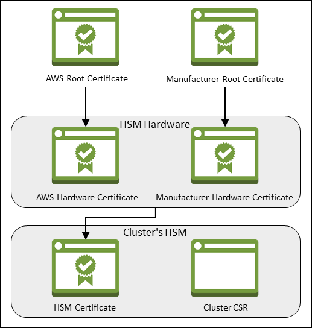
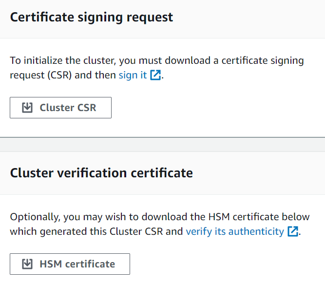

# Verify the identity and authenticity of your cluster's HSM

in AWS CloudHSM (optional)

To initialize your cluster in AWS CloudHSM, you sign a certificate signing request (CSR) generated
by the cluster's first hardware security module (HSM). Before you do this, you might want to
verify the identity and authenticity of the HSM.

###### Note

This process is optional. However, it works only until a cluster is initialized. After the
cluster is initialized, you cannot use this process to get the certificates or verify the
HSMs.

To verify the identity of your cluster's first HSM, complete the following steps:

1. [Get the certificates and CSR](#get-certificates "#get-certificates") – In this
   step, you get three certificates and a CSR from the HSM. You also get two root
   certificates, one from AWS CloudHSM and one from the HSM hardware manufacturer.
2. [Verify the certificate chains](#verify-certificate-chains "#verify-certificate-chains")
   – In this step, you construct two certificate chains, one to the AWS CloudHSM root
   certificate and one to the manufacturer root certificate. Then you verify the HSM
   certificate with these certificate chains to determine that AWS CloudHSM and the hardware
   manufacturer both attest to the identity and authenticity of the HSM.
3. [Compare public keys](#compare-public-keys "#compare-public-keys") – In this step,
   you extract and compare the public keys in the HSM certificate and the cluster CSR, to
   ensure that they are the same. This should give you confidence that the CSR was generated
   by an authentic, trusted HSM.
   The following diagram shows the CSR, the certificates, and their relationship to each
   other. The subsequent list defines each certificate.



**AWS Root Certificate**

This is AWS CloudHSM's root certificate.

**Manufacturer Root Certificate**

This is the hardware manufacturer's root certificate.

**AWS Hardware Certificate**

AWS CloudHSM created this certificate when the HSM hardware was added to the fleet. This
certificate asserts that AWS CloudHSM owns the hardware.

**Manufacturer Hardware Certificate**

The HSM hardware manufacturer created this certificate when it manufactured the HSM
hardware. This certificate asserts that the manufacturer created the hardware.

**HSM Certificate**

The HSM certificate is generated by the FIPS-validated hardware when you create the
first HSM in the cluster. This certificate asserts that the HSM hardware created the
HSM.

**Cluster CSR**

The first HSM creates the cluster CSR. When you [sign the
cluster CSR](initialize-cluster.md#sign-csr "initialize-cluster.md#sign-csr"), you claim the cluster. Then, you can use the signed CSR to [initialize the cluster](initialize-cluster.md#initialize "initialize-cluster.md#initialize").

## Step 1. Get certificates from the HSM

To verify the identity and authenticity of your HSM, start by getting a CSR and five
certificates. You get three of the certificates from the HSM, which you can do with the [AWS CloudHSM console](https://console.aws.amazon.com/cloudhsm/ "https://console.aws.amazon.com/cloudhsm/"), the [AWS Command Line Interface (AWS CLI)](https://aws.amazon.com/cli/ "https://aws.amazon.com/cli/"), or the AWS CloudHSM API.

Console###### To get the CSR and HSM certificates (console)

1. Open the AWS CloudHSM console at
   [https://console.aws.amazon.com/cloudhsm/home](https://console.aws.amazon.com/cloudhsm/home "https://console.aws.amazon.com/cloudhsm/home").
2. Select the radio button next to the cluster ID with the HSM you want to verify.
3. Select **Actions**. From the drop down menu, choose **Initialize**.
4. If you did not complete the [previous step](create-hsm.md "create-hsm.md") to create an HSM, choose an Availability Zone (AZ) for the HSM that you are creating. Then select
   **Create**.
5. When the certificates and CSR are ready, you see links to download them.

 6. Choose each link to download and save the CSR and certificates. To simplify the
subsequent steps, save all of the files to the same directory and use the default file
names.

AWS CLI###### To get the CSR and HSM certificates ([AWS CLI](../../../cli/latest/userguide.md "../../../cli/latest/userguide.md"))

- At a command prompt, run the **[describe-clusters](../../../cli/latest/reference/cloudhsmv2/describe-clusters.md "../../../cli/latest/reference/cloudhsmv2/describe-clusters.md")**
  command four times, extracting the CSR and different certificates each time and saving
  them to files.
  1.  Issue the following command to extract the cluster CSR. Replace
      `<cluster ID>` with the ID of the cluster that you created
      previously.

  ```
  `$` `aws cloudhsmv2 describe-clusters --filters clusterIds=`<cluster ID>` \
   --output text \
   --query 'Clusters[].Certificates.ClusterCsr' \
   > `<cluster ID>`_ClusterCsr.csr`
  ```

  2.  Issue the following command to extract the HSM certificate. Replace
      `<cluster ID>` with the ID of the cluster that you created
      previously.

  ```
  `$` `aws cloudhsmv2 describe-clusters --filters clusterIds=`<cluster ID>` \
   --output text \
   --query 'Clusters[].Certificates.HsmCertificate' \
   > `<cluster ID>`_HsmCertificate.crt`
  ```

  3.  Issue the following command to extract the AWS hardware certificate. Replace
      `<cluster ID>` with the ID of the cluster that you created
      previously.

  ```
  `$` `aws cloudhsmv2 describe-clusters --filters clusterIds=`<cluster ID>` \
   --output text \
   --query 'Clusters[].Certificates.AwsHardwareCertificate' \
   > `<cluster ID>`_AwsHardwareCertificate.crt`
  ```

  4.  Issue the following command to extract the manufacturer hardware certificate.
      Replace `<cluster ID>` with the ID of the cluster that you
      created previously.

  ```
  `$` `aws cloudhsmv2 describe-clusters --filters clusterIds=`<cluster ID>` \
   --output text \
   --query 'Clusters[].Certificates.ManufacturerHardwareCertificate' \
   > `<cluster ID>`_ManufacturerHardwareCertificate.crt`
  ```

AWS CloudHSM API###### To get the CSR and HSM certificates (AWS CloudHSM API)

- Send a [DescribeClusters](../APIReference/API_DescribeClusters.md "../APIReference/API_DescribeClusters.md") request, then extract and save the CSR and
  certificates from the response.

## Step 2. Get the root certificates

Follow these steps to get the root certificates for AWS CloudHSM and the manufacturer. Save the
root certificate files to the directory that contains the CSR and HSM certificate
files.

###### To get the AWS CloudHSM and manufacturer root certificates

1. Download the AWS CloudHSM root certificate: [AWS_CloudHSM_Root-G1.zip](samples/AWS_CloudHSM_Root-G1.md "samples/AWS_CloudHSM_Root-G1.md")
2. Download the right manufacturer root certificate for your HSM type:
   - hsm1.medium manufacturer root certificate: [liquid_security_certificate.zip](https://www.marvell.com/content/dam/marvell/en/public-collateral/security-solutions/liquid_security_certificate.zip "https://www.marvell.com/content/dam/marvell/en/public-collateral/security-solutions/liquid_security_certificate.zip")
   - hsm2m.medium manufacturer root certificate: [liquid_security_certificate.zip](https://www.marvell.com/content/dam/marvell/en/public-collateral/security-solutions/liquidsecurity2_ar_v1.zip "https://www.marvell.com/content/dam/marvell/en/public-collateral/security-solutions/liquidsecurity2_ar_v1.zip")

###### Note

To download each certificate from its landing page, use the following links:

    * Landing page for hsm1.medium's [manufacturer root certificate](https://www.marvell.com/products/security-solutions/liquid-security-hsm-adapters-and-appliances/liquidsecurity-certificate.html "https://www.marvell.com/products/security-solutions/liquid-security-hsm-adapters-and-appliances/liquidsecurity-certificate.html")
    * Landing page for hsm2m.medium's [manufacturer root certificate](https://www.marvell.com/products/security-solutions/nitrox-hs-adapters/liquidsecurity2-certificate-ls2-g-axxx-ar-f-bo-v1.html "https://www.marvell.com/products/security-solutions/nitrox-hs-adapters/liquidsecurity2-certificate-ls2-g-axxx-ar-f-bo-v1.html")You might need to right-click the **Download Certificate** link and

then choose **Save Link As...** to save the certificate file. 3. After you download the files, extract (unzip) the contents.

## Step 3. Verify certificate chains

In this step, you construct two certificate chains, one to the AWS CloudHSM root certificate and
one to the manufacturer root certificate. Then use OpenSSL to verify the HSM certificate with
each certificate chain.

To create the certificate chains, open a Linux shell. You need OpenSSL, which is available
in most Linux shells, and you need the [root
certificate](#get-root-certificates "#get-root-certificates") and [HSM certificate files](#get-certificates "#get-certificates") that you
downloaded. However, you do not need the AWS CLI for this step, and the shell does not need to
be associated with your AWS account.

###### To verify the HSM certificate with the AWS CloudHSM root certificate

1. Navigate to the directory where you saved the [root certificate](#get-root-certificates "#get-root-certificates") and [HSM certificate files](#get-certificates "#get-certificates")
   that you downloaded. The following commands assume that all of the certificates are in the
   current directory and use the default file names.

Use the following command to create a certificate chain that includes the AWS
hardware certificate and the AWS CloudHSM root certificate, in that order. Replace
`<cluster ID>` with the ID of the cluster that you created
previously.

```
`$` `cat `<cluster ID>`_AwsHardwareCertificate.crt \
 AWS_CloudHSM_Root-G1.crt \
 > `<cluster ID>`_AWS_chain.crt`
```

2. Use the following OpenSSL command to verify the HSM certificate with the AWS
   certificate chain. Replace `<cluster ID>` with the ID of the
   cluster that you created previously.

````
`$` `openssl verify -CAfile `<cluster ID>`_AWS_chain.crt `<cluster ID>`_HsmCertificate.crt```<cluster ID>`_HsmCertificate.crt: OK`
````

###### To verify the HSM certificate with the manufacturer root certificate

1. Use the following command to create a certificate chain that includes the manufacturer
   hardware certificate and the manufacturer root certificate, in that order. Replace
   `<cluster ID>` with the ID of the cluster that you created
   previously.

```
`$` `cat `<cluster ID>`_ManufacturerHardwareCertificate.crt \
 liquid_security_certificate.crt \
 > `<cluster ID>`_manufacturer_chain.crt`
```

2. Use the following OpenSSL command to verify the HSM certificate with the manufacturer
   certificate chain. Replace `<cluster ID>` with the ID of the
   cluster that you created previously.

````
`$` `openssl verify -CAfile `<cluster ID>`_manufacturer_chain.crt `<cluster ID>`_HsmCertificate.crt```<cluster ID>`_HsmCertificate.crt: OK`
````

## Step 4. Extract and compare public keys

Use OpenSSL to extract and compare the public keys in the HSM certificate and the cluster
CSR, to ensure that they are the same.

To compare the public keys, use your Linux shell. You need OpenSSL, which is available in
most Linux shells, but you do not need the AWS CLI for this step. The shell does not need to be
associated with your AWS account.

###### To extract and compare the public keys

1. Use the following command to extract the public key from the HSM certificate.

```
`$` `openssl x509 -in `<cluster ID>`_HsmCertificate.crt -pubkey -noout > `<cluster ID>`_HsmCertificate.pub`
```

2. Use the following command to extract the public key from the cluster CSR.

```
`$` `openssl req -in `<cluster ID>`_ClusterCsr.csr -pubkey -noout > `<cluster ID>`_ClusterCsr.pub`
```

3. Use the following command to compare the public keys. If the public keys are
   identical, the following command produces no output.

```
`$` `diff `<cluster ID>`_HsmCertificate.pub `<cluster ID>`_ClusterCsr.pub`
```

After you verify the identity and authenticity of the HSM, proceed to [Initialize the cluster](initialize-cluster.md "initialize-cluster.md").
