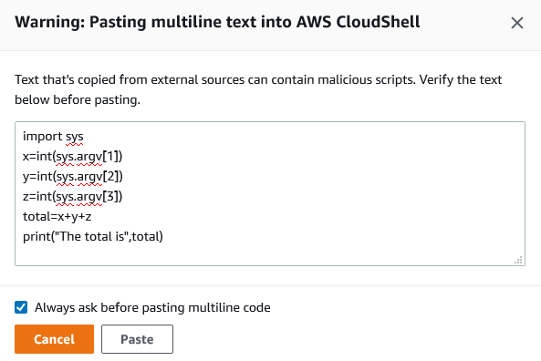

# Customizing your AWS CloudShell experience

You can customize the following aspects of your AWS CloudShell experience:

- [Tabs layout](#tabs-layout "#tabs-layout"): Split the command line interface into
  multiple columns and rows.
- [Font size](#font-size "#font-size"): Adjust the size of the command line
  text.
- [Color theme](#color-theme "#color-theme"): Toggle between light and dark
  theme.
- [Safe Paste](#safe-paste-enable "#safe-paste-enable"): Switch a feature on or off that
  requires you to verify multiline text before it's pasted.
- [Tmux to session restore](#tmux_to_session_restore "#tmux_to_session_restore"): Using tmux
  restores your session until the session becomes inactive.
- [Amazon Q CLI](#enable-disable-q-cli-preference "#enable-disable-q-cli-preference"):
  Using
  Amazon Q CLI allows you to use the Amazon Q CLI features.
  You can also extend your shell environment by [installing your own software](vm-specs.md#installing-software "vm-specs.md#installing-software") and
  [modifying your shell with
  scripts](vm-specs.md#modifying-shell-scripts "vm-specs.md#modifying-shell-scripts").

## Splitting the command line display into multiple tabs

Run multiple commands by splitting your command line interface into several
panes.

###### Note

After opening multiple tabs, you can select one that you want to work in by clicking
anywhere in the pane of your choosing. You can close a tab by choosing the
**x** symbol, which is next to the Region name.

- Choose **Actions** and one of the following options from
  **Tabs layout**:

      + **New tab**: Add a new tab that's next to the
       currently active one.
      + **Split into rows**: Add a new tab in a row that's
       below the currently active one.
      + **Split into columns**: Add a new tab in a column
       that's next to the currently active one.

  If there's not enough space to completely display each tab, scroll to see the
  entire tab. You can also select the split bars that separate panes and drag them by
  using the pointer to increase or reduce the pane size.

## Changing font size

Increase or decrease the size of the text that's displayed in the command line
interface.

1. To change the AWS CloudShell terminal settings, go to **Settings**,
   **Preferences**.
2. Choose a text size. Your options are **Smallest**,
   **Small**, **Medium**, **Large**, and
   **Largest**.

## Changing the interface theme

Toggle between light and dark theme for the command line interface.

1. To change the AWS CloudShell theme, go to **Settings**,
   **Preferences**.
2. Choose **Light** or **Dark**.

## Using Safe Paste for multiline text

Safe Paste is a security feature that prompts you to verify that the multiline text that
you're about to paste into the shell doesn't contain malicious scripts. Text that's copied
from third-party sites can contain hidden code that triggers unexpected behaviors in your
shell environment.

The Safe Paste dialog displays the complete text that you copied to your clipboard. If
you're satisfied that there's no security risk, choose **Paste**.

We recommend that you enable Safe Paste to catch potential security risks in scripts.
You can switch this feature on or off by choosing **Preferences**,
**Enable Safe Paste** and **Disable Safe
Paste**.

## Using tmux to session

restore

AWS CloudShell uses tmux to restore the sessions across single or multiple browser tabs. If
you refresh the browser tabs, it resumes your session until the session becomes inactive.
For more information, see [Session restore](welcome.md#session-restore "welcome.md#session-restore").

## Using Amazon Q

CLI

You can enable or disable Amazon Q CLI by choosing **Preferences**,
**Enable Amazon Q CLI** and **Disable Amazon Q CLI**. For
more information, see [Enable/disable Amazon Q
CLI](q-cli-features-in-cloudshell.md#enable-disable-q-cli "q-cli-features-in-cloudshell.md#enable-disable-q-cli").
