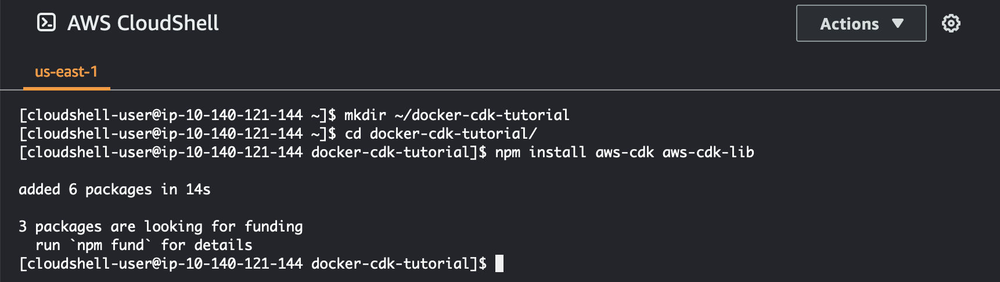
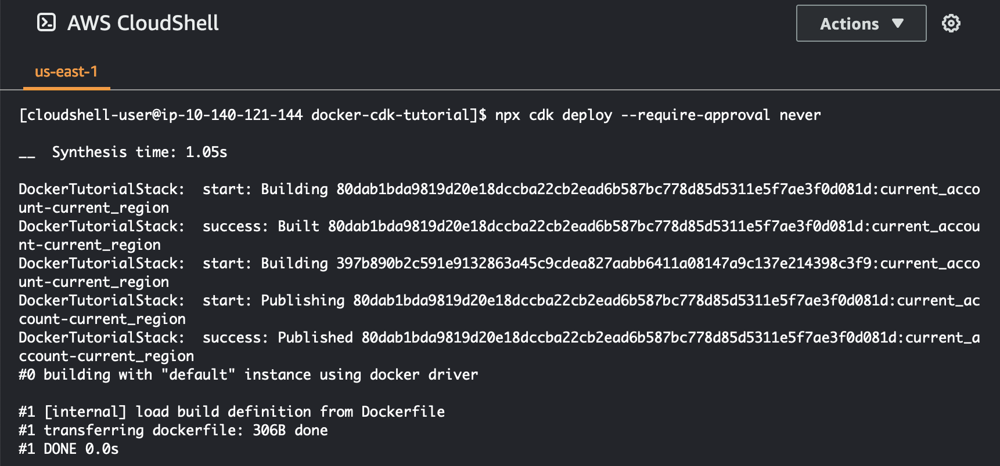
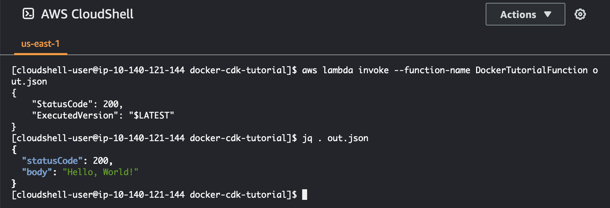

# Deploying a Lambda function using the AWS CDK in
 CloudShell

This tutorial shows you how to deploy a Lambda function to your account using the
 AWS Cloud Development Kit (AWS CDK) in CloudShell.


## Prerequisites


* Bootstrap your account for use with the AWS CDK. For information about bootstrapping with AWS CDK,
 see [Bootstrapping](https://docs.aws.amazon.com/cdk/v2/guide/bootstrapping.html "https://docs.aws.amazon.com/cdk/v2/guide/bootstrapping.html") in the *AWS CDK v2 Developer Guide*.
 If you haven't bootstrapped the account, you can run `cdk bootstrap`
 in CloudShell.


* Make sure you have the appropriate permissions to deploy resources to your account.
 Administrator permissions are recommended.

## Tutorial procedure


The following tutorial outlines how to deploy a Docker container-based Lambda function
 using the AWS CDK in CloudShell.


1. Create a new folder in your home directory.


```
mkdir ~/docker-cdk-tutorial
```
2. Navigate to the folder you created.


```
cd ~/docker-cdk-tutorial
```
3. Install the AWS CDK dependencies locally.


```
npm install aws-cdk aws-cdk-lib
```



4. Create a skeleton AWS CDK project in the folder that you created.


```
touch cdk.json
mkdir lib
touch lib/docker-tutorial.js lib/Dockerfile lib/hello.js
```
5. Using a text editor, for example `nano cdk.json`, open the file and paste the
 following content into it.


```
{
  "app": "node lib/docker-tutorial.js"
}
```
6. Open the `lib/docker-tutorial.js` file and paste the following content into it.


```
// this file defines the CDK constructs we want to deploy

const { App, Stack } = require('aws-cdk-lib');
const { DockerImageFunction, DockerImageCode } = require('aws-cdk-lib/aws-lambda');
const path = require('path');

// create an application
const app = new App();

// define stack
class DockerTutorialStack extends Stack {
  constructor(scope, id, props) {
    super(scope, id, props);

    // define lambda that uses a Docker container
    const dockerfileDir = path.join(__dirname);
    new DockerImageFunction(this, 'DockerTutorialFunction', {
      code: DockerImageCode.fromImageAsset(dockerfileDir),
      functionName: 'DockerTutorialFunction',
    });
  }
}

// instantiate stack
new DockerTutorialStack(app, 'DockerTutorialStack');
```
7. Open the `lib/Dockerfile` and paste the following content into it.


```
# Use a NodeJS 20.x runtime
FROM public.ecr.aws/lambda/nodejs:20

# Copy the function code to the LAMBDA_TASK_ROOT directory
# This environment variable is provided by the lambda base image
COPY hello.js ${LAMBDA_TASK_ROOT}

# Set the CMD to the function handler
CMD [ "hello.handler" ]
```
8. Open the `lib/hello.js` file and paste the following content into it.


```
// define the handler
exports.handler = async (event) => {
  // simply return a friendly success response
  const response = {
    statusCode: 200,
    body: JSON.stringify('Hello, World!'),
  };
  return response;
};
```
9. Use the AWS CDK CLI to synthesize the project and deploy the resources. You must bootstrap your
 account.


```
npx cdk synth
npx cdk deploy --require-approval never
```



10. Invoke the Lambda function to confirm and verify it.


```
aws lambda invoke --function-name DockerTutorialFunction out.json
jq . out.json
```




You have now successfully deployed a Docker container-based Lambda function using the AWS CDK.
 For more information on AWS CDK, see the [AWS CDKv2
 Developer Guide](https://docs.aws.amazon.com/cdk/v2/guide/hello_world.html "https://docs.aws.amazon.com/cdk/v2/guide/hello_world.html"). If you encounter errors or run into issues when
 trying to complete this tutorial, see the [Troubleshooting](troubleshooting.md "troubleshooting.md") section of this guide for help.

## Clean up


You have now successfully deployed a Docker container-based Lambda function using
 the AWS CDK. Inside the AWS CDK project, run the following command to delete the associated
 resources. You will be prompted to confirm the deletion.


* ```
npx cdk destroy DockerTutorialStack
```
* To remove the files and resources you created in this tutorial from your AWS CloudShell environment, run the following command.


```
cd ~
rm -rf ~/docker-cli-tutorial
```
